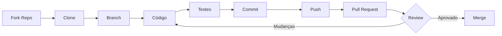
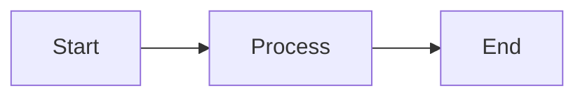

# Guia de Contribuição para a Comunidade BorgStack

> **Como contribuir com código, documentação e ideias**

Obrigado pelo interesse em contribuir com o BorgStack! Este guia explica como você pode ajudar a melhorar o projeto.

---

## Índice

1. [Bem-vindo à Comunidade](#bem-vindo-à-comunidade)
2. [Formas de Contribuir](#formas-de-contribuir)
3. [Reportar Bugs](#reportar-bugs)
4. [Sugerir Funcionalidades](#sugerir-funcionalidades)
5. [Contribuir com Código](#contribuir-com-código)
6. [Contribuir com Documentação](#contribuir-com-documentação)
7. [Desenvolvimento Local](#desenvolvimento-local)
8. [Padrões e Convenções](#padrões-e-convenções)
9. [Processo de Review](#processo-de-review)

---

## Bem-vindo à Comunidade

O BorgStack é **construído pela comunidade, para a comunidade**. Seja você desenvolvedor, usuário ou curioso, sua contribuição é valiosa!

### Código de Conduta

Todos os contribuidores devem seguir nosso [Código de Conduta](#código-de-conduta-resumido):

- **Respeito**: Trate todos com respeito
- **Inclusão**: Ambiente acolhedor para todos
- **Colaboração**: Foco em resolver problemas juntos
- **Profissionalismo**: Mantenha discussões construtivas

---

## Formas de Contribuir

Você não precisa ser desenvolvedor para contribuir! Veja as opções:

| Tipo | Exemplos | Dificuldade |
|------|----------|-------------|
| 🐛 **Bug Reports** | Relatar erros, problemas de instalação | Fácil |
| 💡 **Sugestões** | Ideias de funcionalidades, melhorias | Fácil |
| 📖 **Documentação** | Corrigir typos, adicionar exemplos, traduzir | Fácil-Média |
| 🔧 **Código** | Correções, novas funcionalidades | Média-Difícil |
| 🧪 **Testes** | Testar em diferentes ambientes, benchmarks | Média |
| 💬 **Suporte** | Ajudar outros usuários em Discussions/Issues | Fácil |
| 🎨 **Design** | Melhorar interface, criar diagramas | Média |

---

## Reportar Bugs

### Onde Reportar

**GitHub Issues:** https://github.com/docg1701/borgstack/issues

### Template de Bug Report

```markdown
**Descrição do Bug**
Descrição clara do que aconteceu.

**Passos para Reproduzir**
1. Execute comando X
2. Acesse URL Y
3. Veja erro Z

**Comportamento Esperado**
O que deveria acontecer.

**Ambiente**
- OS: GNU/Linux
- BorgStack Version: v1.0.0
- Docker Version: 27.3.1
- Docker Compose Version: v2.29.7

**Logs**
```bash
docker compose logs serviço --tail 50
```
```

### Boas Práticas

✅ **Faça:**
- Busque issues existentes antes de criar nova
- Inclua logs relevantes
- Descreva passos para reproduzir
- Especifique versões (OS, Docker, BorgStack)

❌ **Evite:**
- Issues vagas sem detalhes
- Múltiplos problemas em uma issue
- Postar senhas ou dados sensíveis

---

## Sugerir Funcionalidades

### Onde Sugerir

**GitHub Discussions:** https://github.com/docg1701/borgstack/discussions (categoria "Ideas")

### Template de Feature Request

```markdown
**Problema a Resolver**
Qual problema esta funcionalidade resolve?
Exemplo: "Como usuário, não consigo X porque Y"

**Solução Proposta**
Como você imagina que isso funcionaria?
Seja específico mas flexível para alternativas.

**Alternativas Consideradas**
Que outras abordagens você pensou?

**Impacto**
- Quem se beneficia? (desenvolvedores, usuários finais, ambos)
- Quantas pessoas isso ajudaria?
- É crítico ou nice-to-have?

**Implementação** (opcional)
Se tiver ideias técnicas, compartilhe!
```

### Processo RFC (Funcionalidades Grandes)

Para mudanças significativas (nova arquitetura, novos serviços):

1. Criar Discussion com tag `[RFC]`
2. Discussão comunitária (mínimo 7 dias)
3. Consenso e aprovação de maintainers
4. Criar Issue vinculada ao RFC
5. Implementação via PR

---

## Contribuir com Código

### Workflow



### Passo a Passo

**1. Fork e Clone**

```bash
# Fork via GitHub interface
# Clone seu fork
git clone https://github.com/docg1701/borgstack.git
cd borgstack

# Adicionar remote upstream
git remote add upstream https://github.com/docg1701/borgstack.git
```

**2. Criar Branch**

```bash
# Branch naming:
# feature/nome-da-funcionalidade
# fix/descricao-do-bug
# docs/topico-da-documentacao

git checkout -b feature/minha-funcionalidade
```

**3. Fazer Mudanças**

Siga os [padrões de código](#padrões-de-código) (abaixo).

**4. Testar**

```bash
# Validar docker-compose.yml
docker compose config --quiet

# Rodar testes de integração
./tests/run-all-tests.sh

# Testar manualmente
docker compose up -d
docker compose ps  # Verificar health
```

**5. Commit**

```bash
# Mensagem descritiva, imperativo, < 72 caracteres
git add .
git commit -m "add health check to caddy service"

# Commits devem ser atômicos (uma mudança lógica por commit)
```

**6. Push e PR**

```bash
# Push para seu fork
git push origin feature/minha-funcionalidade

# Criar Pull Request via GitHub interface
```

### Pull Request Template

```markdown
## Descrição
O que este PR faz? Por quê?

## Issue Relacionada
Closes #123

## Tipo de Mudança
- [ ] Bug fix
- [ ] Nova funcionalidade
- [ ] Breaking change
- [ ] Documentação

## Checklist
- [ ] Código segue padrões do projeto
- [ ] Testes passam localmente
- [ ] Documentação atualizada
- [ ] CHANGELOG.md atualizado (se relevante)

## Testes Realizados
Descreva como testou as mudanças.
```

### Padrões de Código

**Docker Compose:**
```yaml
# Sempre especificar versão exata da imagem
services:
  meu-servico:
    image: postgres:18.0-alpine  # ✅ Versão exata
    # image: postgres:latest     # ❌ Never use 'latest'

    # Prefixo 'borgstack_' para volumes
    volumes:
      - borgstack_meu_volume:/data  # ✅
      # - meu_volume:/data          # ❌

    # Health checks obrigatórios
    healthcheck:
      test: ["CMD", "pg_isready"]
      interval: 10s
      timeout: 5s
      retries: 5

    # Rede interna para serviços backend
    networks:
      - borgstack_internal  # Serviços de dados
      # - borgstack_external  # Apenas serviços com UI web
```

**Environment Variables:**
```bash
# Naming: UPPERCASE_SNAKE_CASE
POSTGRES_PASSWORD=secure123  # ✅
postgres_password=secure123  # ❌

# Nunca commit .env
# Sempre usar .env.example como template
```

**Documentação:**
```markdown
# Naming: kebab-case.md (root) or numbered (in docs/)
INSTALL.md  # ✅ Root level
docs/02-example.md  # ✅ Numbered in docs/
Installation.md   # ❌ Wrong case

# Sempre especificar linguagem em code blocks
```bash  # ✅
comando aqui
```

```
comando aqui  # ❌ sem linguagem
```
```

---

## Contribuir com Documentação

### Tipos de Documentação

Seguimos o framework **Diátaxis**:

| Tipo | Propósito | Exemplo |
|------|-----------|---------|
| **Tutorial** | Aprender fazendo | `INSTALL.md` |
| **How-to** | Resolver problema específico | `docs/services.md` |
| **Reference** | Informação técnica | API docs, variáveis de ambiente |
| **Explanation** | Entender conceitos | `docs/architecture/*.md` |

### Padrões de Documentação

**Estrutura de Arquivo:**
```markdown
# Título Principal

> **Descrição breve**

Parágrafo introdutório.

---

## Índice
(gerado automaticamente ou manual)

## Seção 1
Conteúdo...

## Seção 2
Conteúdo...

---

## Navegação
- [← Anterior](link.md)
- [→ Próximo](link.md)
- [↑ Hub](README.md)
```

**Code Blocks:**
```bash
# Sempre adicione comentários explicativos
docker compose ps  # Verificar status dos serviços

# Use prompts para clareza
$ comando-do-usuario
output-esperado
```

**Diagramas Mermaid:**
```markdown

```

**Tradução:**
- Termos técnicos: use português quando natural (`configuração`, `instalação`)
- Comandos: mantenha em inglês (`docker compose up`)
- Nomes próprios: mantenha originais (`PostgreSQL`, `n8n`)
- Contexto: brasileiro (LGPD ao invés de GDPR)

### Onde Documentar

| Conteúdo | Localização |
|----------|-------------|
| Instalação | `INSTALL.md` |
| Configuração | `CONFIGURATION.md` |
| Serviços | `docs/services.md` |
| Integrações | `docs/integrations.md` |
| Manutenção | `docs/maintenance.md` |
| Arquitetura | `docs/architecture/*.md` |
| README principal | `README.md` (root) |

---

## Desenvolvimento Local

### Setup Inicial

```bash
# 1. Clonar repositório
git clone https://github.com/docg1701/borgstack.git
cd borgstack

# 2. Copiar .env.example
cp .env.example .env

# 3. Editar .env com suas configurações
nano .env

# 4. Executar bootstrap (ou docker compose up manual)
./scripts/bootstrap.sh
```

### Comandos Úteis

```bash
# Ver logs de um serviço
docker compose logs <service> --tail 100 -f

# Reiniciar serviço específico
docker compose restart <service>

# Validar docker-compose.yml
docker compose config --quiet

# Rodar testes de integração
./tests/run-all-tests.sh

# Verificar health checks
docker compose ps

# Limpar tudo (cuidado!)
docker compose down -v  # Remove volumes também
```

### Debugging

```bash
# Entrar em container
docker compose exec <service> sh

# Ver variáveis de ambiente
docker compose exec <service> env

# Testar conectividade entre serviços
docker compose exec n8n ping postgresql

# Ver uso de recursos
docker stats
```

---

## Padrões e Convenções

### Git Commit Messages

**Formato:** `<tipo>: <descrição>`

**Tipos:**
- `feat`: Nova funcionalidade
- `fix`: Correção de bug
- `docs`: Documentação
- `style`: Formatação (sem mudança de lógica)
- `refactor`: Refatoração de código
- `test`: Adicionar/modificar testes
- `chore`: Tarefas de manutenção

**Exemplos:**
```bash
feat: add health check to caddy service
fix: resolve postgres connection timeout issue
docs: update n8n workflow examples
refactor: simplify backup script logic
test: add integration test for chatwoot
chore: update docker images to latest versions
```

### Branch Naming

```bash
feature/descricao-curta   # Nova funcionalidade
fix/descricao-do-bug      # Correção
docs/topico               # Documentação
refactor/componente       # Refatoração
test/area-de-teste        # Testes
```

### Versionamento

Seguimos **Semantic Versioning** (semver):

- `1.0.0` → `1.0.1`: Patch (bug fix)
- `1.0.0` → `1.1.0`: Minor (nova funcionalidade, compatível)
- `1.0.0` → `2.0.0`: Major (breaking change)

---

## Processo de Review

### Timeline

1. **Criação de PR**: Você cria PR com descrição completa
2. **CI Checks**: Testes automatizados (3-5 minutos)
3. **Code Review**: Maintainer revisa (1-3 dias úteis)
4. **Feedback**: Você responde e ajusta (se necessário)
5. **Aprovação**: Maintainer aprova
6. **Merge**: Squash commit para main

### Critérios de Aprovação

✅ **PR aprovado se:**
- CI passa (todos os checks verdes)
- Código segue padrões do projeto
- Testes adequados incluídos
- Documentação atualizada
- Sem conflitos com main
- Descrição clara do que faz e por quê

❌ **PR rejeitado se:**
- CI falha
- Código não segue padrões
- Sem testes ou documentação
- Mudanças fora do escopo da issue
- Breaking changes sem discussão prévia

### Como Responder a Feedback

```markdown
# ✅ Boa resposta
> Maintainer: "Poderia adicionar validação de input aqui?"

Boa sugestão! Adicionei validação em commit abc123.
Também adicionei teste para edge case em commit def456.

# ❌ Má resposta
> Maintainer: "Poderia adicionar validação de input aqui?"

Não acho necessário.
```

---

## Reconhecimento de Contribuidores

Todos os contribuidores são listados no `README.md` principal. Contribuições significativas são destacadas em release notes.

**Como ser listado:**
1. Faça um PR que seja merged
2. Você será automaticamente adicionado à lista

**Níveis de reconhecimento:**
- **Contributor**: 1+ PR merged
- **Regular Contributor**: 5+ PRs merged
- **Core Contributor**: 20+ PRs merged
- **Maintainer**: Convidado pela equipe core

---

## Recursos Adicionais

### Documentação

- **[Documentação Principal](README.md)** - Visão geral do projeto
- **[Guia de Arquitetura](docs/architecture/index.md)** - Como tudo funciona
- **[Padrões de Código](docs/architecture/coding-standards.md)** - Detalhes completos

### Comunidade

- **GitHub Discussions**: https://github.com/docg1701/borgstack/discussions
- **Issues**: https://github.com/docg1701/borgstack/issues
- **Pull Requests**: https://github.com/docg1701/borgstack/pulls

### Contato

- **Reportar vulnerabilidades**: security@borgstack.com (veja `SECURITY.md`)
- **Perguntas gerais**: GitHub Discussions
- **Bugs**: GitHub Issues

---

## Código de Conduta (Resumido)

### Nosso Compromisso

Criar um ambiente acolhedor, respeitoso e livre de assédio para todos, independente de:
- Experiência técnica
- Identidade de gênero
- Orientação sexual
- Deficiência
- Aparência física
- Raça, etnia ou nacionalidade
- Idade ou religião

### Comportamentos Esperados

✅ **Esperado:**
- Linguagem acolhedora e inclusiva
- Respeito a diferentes pontos de vista
- Aceitar críticas construtivas com elegância
- Foco no que é melhor para a comunidade
- Empatia com outros membros

❌ **Inaceitável:**
- Linguagem ou imagens sexualizadas
- Comentários insultuosos ou depreciativos
- Assédio público ou privado
- Publicar informações privadas de outros
- Outras condutas antiéticas ou não profissionais

### Aplicação

Violações podem ser reportadas para maintainers. Todas as reclamações serão revisadas confidencialmente.

**Consequências:**
1. **Aviso**: Violação menor, aviso privado
2. **Suspensão temporária**: Violação moderada, 30 dias ban
3. **Ban permanente**: Violação grave ou reincidência

Baseado no [Contributor Covenant 2.1](https://www.contributor-covenant.org/version/2/1/code_of_conduct/).

---

## Perguntas Frequentes

**Q: Nunca contribuí para open-source. Por onde começo?**
A: Comece por documentação! Corrija um typo, melhore um exemplo. Issues marcadas com `good first issue` são ótimas para iniciantes.

**Q: Posso contribuir sem saber programar?**
A: Sim! Documentação, testes, design, suporte a usuários - tudo ajuda.

**Q: Quanto tempo leva para meu PR ser revisado?**
A: Geralmente 1-3 dias úteis. Se demorar mais de 1 semana, comente no PR gentilmente.

**Q: Meu PR foi rejeitado. E agora?**
A: Normal! Leia o feedback, faça ajustes, e atualize o PR. Rejeições são oportunidades de aprendizado.

**Q: Posso trabalhar em uma issue sem ser atribuído?**
A: Comente na issue manifestando interesse primeiro. Se não houver resposta em 48h, pode começar.

**Q: Como sugerir um novo serviço para o BorgStack?**
A: Crie uma Discussion explicando: (1) problema que resolve, (2) por que não há alternativa nos serviços atuais, (3) complexidade de integração, (4) popularidade/manutenção do projeto.

---

## Agradecimentos

Obrigado por contribuir com o BorgStack! Cada PR, issue, ou comentário ajuda a melhorar o projeto para todos.

**Happy coding! 🚀**

---

## Navegação

- **[← README Principal](README.md)**
- **[→ Instalação](INSTALL.md)**

---

**Última atualização:** 2025-10-08
**Versão:** 1.0
