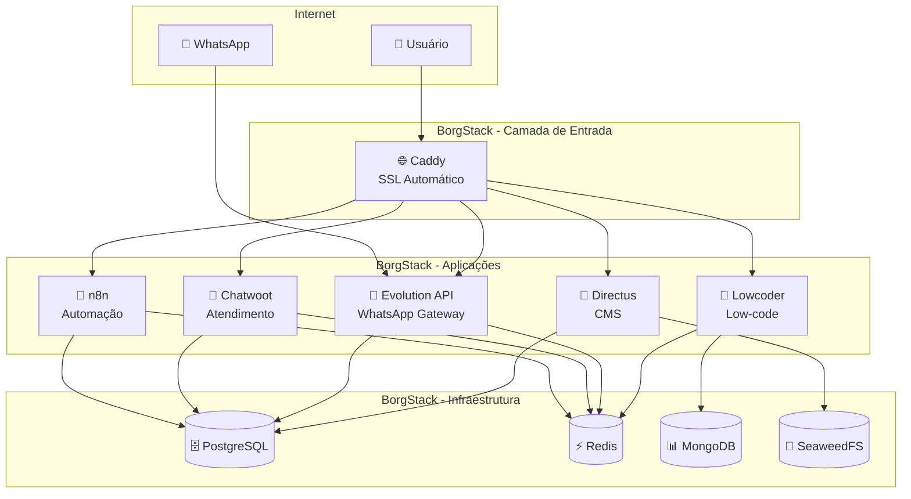
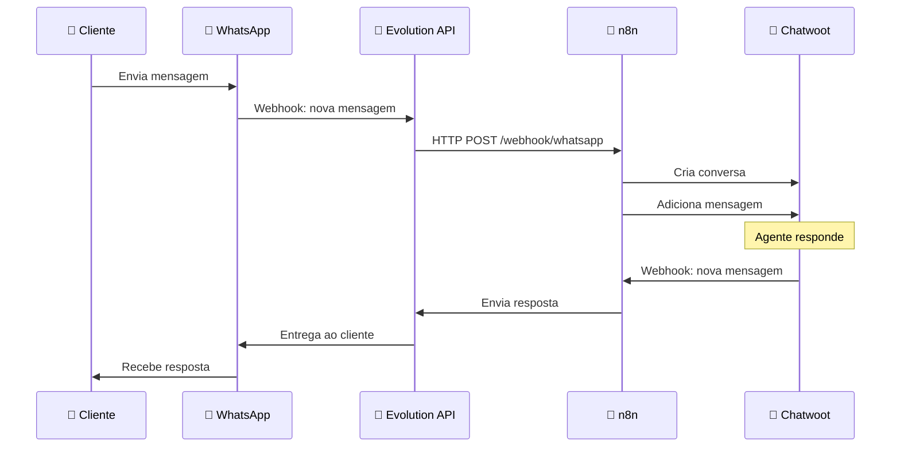

# Início Rápido: Primeiros 30 Minutos com BorgStack

> **Guia prático para começar a usar o BorgStack rapidamente**

Este guia vai levá-lo desde a instalação até seu primeiro workflow funcional em apenas 30 minutos. Se você está começando com o BorgStack, este é o lugar certo.

---

## Índice

1. [O Que é BorgStack?](#o-que-é-borgstack)
2. [Pré-Requisitos](#pré-requisitos)
3. [Instalação Rápida (Script Bootstrap)](#instalação-rápida-script-bootstrap)
4. [Primeiros Passos (Primeiro Login)](#primeiros-passos-primeiro-login)
5. [Seu Primeiro Workflow (WhatsApp → Chatwoot)](#seu-primeiro-workflow-whatsapp--chatwoot)
6. [Próximos Passos](#próximos-passos)

---

## O Que é BorgStack?

**BorgStack é uma plataforma completa de automação empresarial e atendimento ao cliente**, pronta para deploy em 4-6 horas, sem necessidade de experiência em DevOps.

### Por Que BorgStack?

Imagine ter que configurar manualmente 14 serviços diferentes, cada um com suas dependências, configurações de rede, certificados SSL, bancos de dados... O BorgStack resolve isso para você com **um único comando**.

### O Que Está Incluído?

O BorgStack integra 14 serviços enterprise-grade em uma única stack:

**🔧 Automação e Workflows:**
- **n8n** - Hub central de automação com 400+ integrações (Zapier open-source)

**💬 Comunicação e Atendimento:**
- **Chatwoot** - Plataforma omnichannel de atendimento (similar ao Intercom)
- **Evolution API** - Gateway WhatsApp Business oficial

**🗄️ Infraestrutura de Dados:**
- **PostgreSQL 18** - Banco de dados relacional com pgvector (IA-ready)
- **MongoDB 7** - Banco de dados NoSQL
- **Redis 8** - Cache em memória e fila de mensagens
- **SeaweedFS** - Armazenamento de objetos S3-compatível

**🎨 Construção de Aplicações:**
- **Lowcoder** - Construtor low-code de aplicações (similar ao Retool)
- **Directus** - CMS headless (similar ao Strapi)

**📹 Processamento de Mídia:**
- **FileFlows** - Automação de processamento de vídeo/áudio (FFmpeg)

**🔒 Infraestrutura:**
- **Caddy** - Reverse proxy com SSL automático (Let's Encrypt)
- **Duplicati** - Sistema de backup automatizado

### Arquitetura Simplificada



### Proposta de Valor

✅ **Deploy em 4-6 horas** (incluindo configuração de DNS)
✅ **Sem conhecimento de DevOps necessário** (script automatizado)
✅ **SSL automático** (certificados Let's Encrypt)
✅ **Integração pré-configurada** (serviços se comunicam nativamente)
✅ **Produção-ready** (health checks, backups, monitoring)
✅ **Open-source** (sem vendor lock-in, LGPD-compliant)

---

## Pré-Requisitos

Antes de começar, verifique se você tem os seguintes recursos disponíveis:

### ✅ Checklist de Hardware

| Recurso | Mínimo | Recomendado | Verificar |
|---------|--------|-------------|-----------|
| **CPU** | 4 vCPUs | 8 vCPUs | `nproc` |
| **RAM** | 16 GB | 36 GB | `free -h` |
| **Disco** | 200 GB SSD | 500 GB SSD | `df -h /` |

**💡 Dica:** Os requisitos mínimos são adequados para testes e desenvolvimento. Para produção, sempre use as especificações recomendadas.

**Exemplo de verificação:**
```bash
# Verificar CPU
nproc
# Output esperado: 8 (recomendado) ou mínimo 4

# Verificar RAM
free -h
# Output esperado: Total >= 36GB (recomendado) ou >= 16GB (mínimo)

# Verificar disco
df -h /
# Output esperado: Avail >= 500GB (recomendado) ou >= 200GB (mínimo)
```

### ✅ Checklist de Software

| Recurso | Requerido | Como Obter |
|---------|-----------|------------|
| **Sistema Operacional** | Ubuntu Server 24.04 LTS | [Download oficial](https://ubuntu.com/download/server) |
| **Endereço IP público** | Sim | Provedor de VPS (DigitalOcean, AWS, Hetzner, etc.) |
| **Acesso SSH** | Sim | `ssh usuario@seu-servidor.com` |
| **Domínio** | Sim (8 subdomínios) | Registrar domínio (Registro.br, Namecheap, etc.) |

**⚠️ IMPORTANTE:** Este guia é específico para **Ubuntu 24.04 LTS**. Outras distribuições ou versões não são suportadas pelo script de bootstrap automatizado.

### ✅ Checklist de Rede e DNS

Você precisará configurar **8 subdomínios** apontando para o IP público do seu servidor.

**Exemplo usando o domínio `example.com.br`:**

| Subdomínio | Serviço | Tipo DNS | Valor |
|------------|---------|----------|-------|
| `n8n.example.com.br` | n8n | A | `SEU_IP_PUBLICO` |
| `chatwoot.example.com.br` | Chatwoot | A | `SEU_IP_PUBLICO` |
| `evolution.example.com.br` | Evolution API | A | `SEU_IP_PUBLICO` |
| `lowcoder.example.com.br` | Lowcoder | A | `SEU_IP_PUBLICO` |
| `directus.example.com.br` | Directus | A | `SEU_IP_PUBLICO` |
| `fileflows.example.com.br` | FileFlows | A | `SEU_IP_PUBLICO` |
| `duplicati.example.com.br` | Duplicati | A | `SEU_IP_PUBLICO` |
| `seaweedfs.example.com.br` | SeaweedFS | A | `SEU_IP_PUBLICO` |

**💡 Dica:** Configure os registros DNS **antes** de executar o bootstrap. A propagação DNS pode levar de 10 minutos a 24 horas, dependendo do provedor.

**Como verificar se o DNS está propagado:**
```bash
# Substituir n8n.example.com.br pelo seu domínio
nslookup n8n.example.com.br

# Output esperado:
# Name:   n8n.example.com.br
# Address: SEU_IP_PUBLICO
```

### ✅ Checklist de Conhecimento

Este guia assume conhecimento básico de:

- ✅ **Linux CLI:** Navegação em diretórios (`cd`, `ls`), edição de arquivos (`nano`, `vim`)
- ✅ **Docker (conceitos básicos):** O que é um container, imagem, volume
- ✅ **DNS (conceitos básicos):** O que é um registro A, propagação DNS
- ✅ **SSH:** Como se conectar a um servidor remoto

**💡 Não se preocupe:** Mesmo que você seja iniciante, este guia tem comandos copy-pasteable e explicações detalhadas.

### ⏱️ Estimativa de Tempo

- **Preparação (DNS, servidor):** 30-60 minutos
- **Instalação automatizada:** 15-30 minutos
- **Configuração inicial:** 30-60 minutos
- **Primeiro workflow:** 15 minutos

**Total:** 4-6 horas (incluindo espera de propagação DNS e download de imagens Docker)

---

## Instalação Rápida (Script Bootstrap)

O script `bootstrap.sh` automatiza toda a instalação do BorgStack, desde a validação de requisitos até o deploy dos serviços.

### Passo 1: Conectar ao Servidor

Conecte-se ao seu servidor Ubuntu 24.04 via SSH:

```bash
ssh usuario@seu-servidor.com
```

**💡 Dica:** Substitua `usuario` pelo seu nome de usuário e `seu-servidor.com` pelo IP ou domínio do servidor.

### Passo 2: Clonar o Repositório

Clone o repositório do BorgStack:

```bash
# Navegue até o diretório home
cd ~

# Clone o repositório (substitua pela URL real do seu fork)
git clone https://github.com/yourusername/borgstack.git

# Entre no diretório do projeto
cd borgstack
```

**⚠️ Se o Git não estiver instalado:**
```bash
sudo apt-get update && sudo apt-get install -y git
```

### Passo 3: Executar o Script de Bootstrap

Execute o script de instalação automatizada:

```bash
./scripts/bootstrap.sh
```

**O que acontece durante a execução:**

#### Etapa 1: Validação do Sistema (~1 minuto)

O script verifica se seu sistema atende aos requisitos mínimos:

```text
━━━━━━━━━━━━━━━━━━━━━━━━━━━━━━━━━━━━━━━━━━━━━━━━━━━━
Validating System Requirements
━━━━━━━━━━━━━━━━━━━━━━━━━━━━━━━━━━━━━━━━━━━━━━━━━━━━

✓ Ubuntu 24.04 LTS detected
✓ RAM sufficient: 36GB (required: 16GB)
✓ Disk space sufficient: 500GB (required: 200GB)
✓ CPU cores sufficient: 8 (required: 4)
✓ All system requirements validated
```

**🛑 Se a validação falhar:** O script irá parar e mostrar qual requisito não foi atendido. Você precisará usar um servidor com recursos adequados.

#### Etapa 2: Instalação do Docker (~3-5 minutos)

O script instala Docker Engine e Docker Compose automaticamente:

```text
━━━━━━━━━━━━━━━━━━━━━━━━━━━━━━━━━━━━━━━━━━━━━━━━━━━━
Installing Docker Engine and Docker Compose v2
━━━━━━━━━━━━━━━━━━━━━━━━━━━━━━━━━━━━━━━━━━━━━━━━━━━━

ℹ Installing Docker Engine...
✓ Docker installed: Docker version 27.3.1
✓ Docker Compose installed: Docker Compose version v2.29.7
⚠ NOTE: You may need to log out and back in for group membership
```

**💡 Importante:** Após a instalação do Docker, você pode precisar fazer logout e login novamente para que as permissões tenham efeito.

#### Etapa 3: Configuração do Firewall (~1 minuto)

O script configura o UFW (Uncomplicated Firewall) com as portas necessárias:

```text
━━━━━━━━━━━━━━━━━━━━━━━━━━━━━━━━━━━━━━━━━━━━━━━━━━━━
Configuring UFW Firewall
━━━━━━━━━━━━━━━━━━━━━━━━━━━━━━━━━━━━━━━━━━━━━━━━━━━━

ℹ Allowing SSH (port 22)...
ℹ Allowing HTTP (port 80)...
ℹ Allowing HTTPS (port 443)...
✓ Firewall configured
```

#### Etapa 4: Configuração do Arquivo .env (~1 minuto)

O script irá solicitar suas informações de DNS e gerar senhas fortes automaticamente:

```text
━━━━━━━━━━━━━━━━━━━━━━━━━━━━━━━━━━━━━━━━━━━━━━━━━━━━
Configuring Environment Variables
━━━━━━━━━━━━━━━━━━━━━━━━━━━━━━━━━━━━━━━━━━━━━━━━━━━━

ℹ Please enter your domain names:

Enter base domain (e.g., example.com.br): example.com.br
Enter n8n domain [n8n.example.com.br]:
Enter Chatwoot domain [chatwoot.example.com.br]:
Enter Evolution API domain [evolution.example.com.br]:
Enter Lowcoder domain [lowcoder.example.com.br]:
Enter Directus domain [directus.example.com.br]:
Enter FileFlows domain [fileflows.example.com.br]:
Enter Duplicati domain [duplicati.example.com.br]:
Enter SeaweedFS domain [seaweedfs.example.com.br]:

ℹ Generating strong passwords (32 characters each)...
✓ Generated .env file with strong passwords
✓ File permissions set to 600 (owner read/write only)

⚠ IMPORTANT: Save these credentials securely!
⚠ The .env file contains all system passwords
```

**💡 Dica:** Você pode pressionar Enter para aceitar os valores padrão (baseados no domínio base que você forneceu).

**🔒 Segurança:** O arquivo `.env` contém todas as senhas do sistema. Ele é automaticamente configurado com permissões restritas (chmod 600) e está no `.gitignore` para evitar commits acidentais.

#### Etapa 5: Download de Imagens Docker (~10-25 minutos)

O script baixa todas as imagens Docker necessárias:

```text
━━━━━━━━━━━━━━━━━━━━━━━━━━━━━━━━━━━━━━━━━━━━━━━━━━━━
Deploying Services
━━━━━━━━━━━━━━━━━━━━━━━━━━━━━━━━━━━━━━━━━━━━━━━━━━━━

ℹ Pulling Docker images (this may take 10-25 minutes)...

[+] Pulling 14/14
 ✔ postgresql Pulled            12.3s
 ✔ redis Pulled                  8.1s
 ✔ mongodb Pulled               15.7s
 ✔ caddy Pulled                  4.2s
 ✔ n8n Pulled                   45.8s
 ✔ chatwoot Pulled              38.2s
 ✔ evolution Pulled             22.5s
 ✔ lowcoder-api-service Pulled  35.1s
 ✔ lowcoder-node-service Pulled 28.9s
 ✔ lowcoder-frontend Pulled     32.4s
 ✔ directus Pulled              18.7s
 ✔ fileflows Pulled             52.3s
 ✔ duplicati Pulled             15.8s
 ✔ seaweedfs Pulled             12.1s

ℹ Starting services...
✓ All services started successfully
```

**⏱️ Tempo estimado:** 10-25 minutos, dependendo da velocidade da sua internet. As imagens totalizam aproximadamente 8-12 GB.

#### Etapa 6: Inicialização dos Serviços (~5-10 minutos)

Após o download, o script inicia os containers e aguarda que todos fiquem saudáveis:

```text
━━━━━━━━━━━━━━━━━━━━━━━━━━━━━━━━━━━━━━━━━━━━━━━━━━━━
Waiting for Services to Become Healthy
━━━━━━━━━━━━━━━━━━━━━━━━━━━━━━━━━━━━━━━━━━━━━━━━━━━━

ℹ Waiting for health checks to pass (timeout: 5 minutes)...

Check 1/60 (every 5 seconds):
  postgresql:         starting
  redis:              healthy ✓
  mongodb:            starting
  caddy:              starting
  ...

Check 12/60:
  postgresql:         healthy ✓
  redis:              healthy ✓
  mongodb:            healthy ✓
  caddy:              healthy ✓
  n8n:                healthy ✓
  chatwoot:           healthy ✓
  evolution:          healthy ✓
  lowcoder-api:       healthy ✓
  lowcoder-node:      healthy ✓
  lowcoder-frontend:  healthy ✓
  directus:           healthy ✓
  fileflows:          healthy ✓
  duplicati:          healthy ✓
  seaweedfs:          healthy ✓

✓ All 14 services are healthy!
```

**⏱️ Tempo estimado:** 5-10 minutos. Os serviços de banco de dados (PostgreSQL, MongoDB) inicializam primeiro, seguidos pelos serviços de aplicação.

#### Etapa 7: Geração de Certificados SSL (~2-3 minutos)

O Caddy automaticamente gera certificados SSL via Let's Encrypt:

```text
━━━━━━━━━━━━━━━━━━━━━━━━━━━━━━━━━━━━━━━━━━━━━━━━━━━━
SSL Certificates
━━━━━━━━━━━━━━━━━━━━━━━━━━━━━━━━━━━━━━━━━━━━━━━━━━━━

ℹ Caddy is automatically obtaining SSL certificates from Let's Encrypt...
✓ SSL certificate obtained for n8n.example.com.br
✓ SSL certificate obtained for chatwoot.example.com.br
✓ SSL certificate obtained for evolution.example.com.br
✓ SSL certificate obtained for lowcoder.example.com.br
✓ SSL certificate obtained for directus.example.com.br
✓ SSL certificate obtained for fileflows.example.com.br
✓ SSL certificate obtained for duplicati.example.com.br
✓ SSL certificate obtained for seaweedfs.example.com.br

✓ All services now accessible via HTTPS
```

**⚠️ Nota:** Para que os certificados SSL sejam gerados com sucesso, os registros DNS **devem** estar propagados e apontando para o IP do servidor.

### Passo 4: Verificar a Instalação

Após a conclusão do bootstrap, verifique que todos os serviços estão funcionando:

```bash
docker compose ps
```

**Output esperado:**

```text
NAME                  IMAGE                          STATUS         PORTS
borgstack-caddy       caddy:2.10-alpine             healthy        0.0.0.0:80->80/tcp, 0.0.0.0:443->443/tcp
borgstack-chatwoot    chatwoot/chatwoot:v4.6.0-ce   healthy
borgstack-directus    directus/directus:11          healthy
borgstack-duplicati   duplicati/duplicati:2.1.1.102 healthy
borgstack-evolution   borgstack-evolution           healthy
borgstack-fileflows   revenz/fileflows:25.09        healthy
borgstack-lowcoder-api borgstack-lowcoder-api       healthy
borgstack-lowcoder-frontend borgstack-lowcoder-frontend healthy
borgstack-lowcoder-node borgstack-lowcoder-node     healthy
borgstack-mongodb     mongo:7.0                     healthy
borgstack-n8n         n8nio/n8n:1.112.6             healthy
borgstack-postgresql  pgvector/pgvector:pg18        healthy
borgstack-redis       redis:8.2-alpine              healthy
borgstack-seaweedfs   chrislusf/seaweedfs:3.97      healthy
```

**✅ Todos os containers devem mostrar STATUS = "healthy"**

**🛑 Se algum container estiver "unhealthy":**

```bash
# Ver logs do container com problema
docker compose logs <nome-do-serviço> --tail 100

# Exemplo: ver logs do n8n
docker compose logs n8n --tail 100
```

### Passo 5: Salvar Credenciais

As credenciais estão no arquivo `.env`. Faça backup seguro:

```bash
# Visualizar senhas geradas (NUNCA compartilhe este arquivo!)
cat .env | grep PASSWORD

# Fazer backup local (substitua pelo seu email)
scp usuario@seu-servidor.com:~/borgstack/.env ~/backup-borgstack-env-$(date +%Y%m%d).txt
```

**🔒 IMPORTANTE:**
- Armazene o arquivo `.env` em um gerenciador de senhas seguro (1Password, Bitwarden, etc.)
- Nunca commit o arquivo `.env` no Git (já está no `.gitignore`)
- Considere criptografar o backup com GPG ou similar

---

## Primeiros Passos (Primeiro Login)

Agora que o BorgStack está instalado, vamos acessar cada serviço pela primeira vez.

### Lista de URLs de Acesso

Acesse os serviços usando os domínios que você configurou:

| Serviço | URL | Credenciais Iniciais |
|---------|-----|----------------------|
| **n8n** | https://n8n.example.com.br | Criar na primeira execução |
| **Chatwoot** | https://chatwoot.example.com.br | Criar na primeira execução |
| **Evolution API** | https://evolution.example.com.br | `EVOLUTION_API_KEY` no .env |
| **Lowcoder** | https://lowcoder.example.com.br | Criar na primeira execução |
| **Directus** | https://directus.example.com.br | Admin: `DIRECTUS_ADMIN_EMAIL` / `DIRECTUS_ADMIN_PASSWORD` |
| **FileFlows** | https://fileflows.example.com.br | Configurar na primeira execução |
| **Duplicati** | https://duplicati.example.com.br | Sem autenticação inicialmente |
| **SeaweedFS** | https://seaweedfs.example.com.br | API pública (restrita por rede interna) |

**💡 Dica:** Substitua `example.com.br` pelos seus domínios reais.

### 1. Primeiro Acesso ao n8n

O n8n é o hub central de automação do BorgStack.

**Acessar:** https://n8n.example.com.br

**Tela de boas-vindas:**

1. Você verá a tela "Welcome to n8n"
2. Clique em **"Get Started"**
3. **Criar conta de administrador:**
   - **Email:** seu-email@example.com
   - **First name:** Seu Nome
   - **Last name:** Sobrenome
   - **Password:** Senha forte (mínimo 8 caracteres)
4. Clique em **"Create account"**

**Explorar interface:**

- **Workflows:** Lista de automações
- **Credentials:** Credenciais salvas (APIs, banco de dados)
- **Executions:** Histórico de execuções
- **Templates:** Biblioteca de workflows prontos

**💡 Dica:** Marque a opção "Keep me signed in" para não precisar fazer login toda vez.

### 2. Primeiro Acesso ao Chatwoot

O Chatwoot é sua plataforma de atendimento omnichannel.

**Acessar:** https://chatwoot.example.com.br

**Tela de cadastro:**

1. Você verá a tela "Create your account"
2. **Preencher dados:**
   - **Full Name:** Seu Nome Completo
   - **Email:** seu-email@example.com
   - **Password:** Senha forte
   - **Confirm Password:** Repita a senha
3. Clique em **"Create account"**

**Configurar workspace:**

1. **Account name:** Nome da sua empresa (ex: "Acme Corporation")
2. **Industry:** Selecione seu setor (ex: "Technology")
3. **Company size:** Selecione o tamanho (ex: "1-10")
4. Clique em **"Continue"**

**Criar primeiro inbox:**

1. Na tela "Add your first inbox", clique em **"Website"**
2. **Channel Name:** "Site Principal"
3. **Website URL:** https://seusite.com
4. Clique em **"Create inbox"**

**💡 Nota:** Vamos criar um inbox WhatsApp mais tarde, no workflow de exemplo.

### 3. Primeiro Acesso ao Evolution API

O Evolution API gerencia instâncias de WhatsApp Business.

**Acessar:** https://evolution.example.com.br

**⚠️ Autenticação via API Key:**

O Evolution API não tem interface web de login. Todas as operações são via API REST.

**Testar conexão:**

```bash
# Obter a API Key do .env
cat .env | grep EVOLUTION_API_KEY

# Testar conexão (substitua pela sua API key e domínio)
curl -X GET https://evolution.example.com.br/instance/fetchInstances \
  -H "apikey: SUA_API_KEY_AQUI"

# Output esperado (lista vazia inicialmente):
[]
```

**💡 Dica:** Você criará uma instância WhatsApp no próximo passo (Seu Primeiro Workflow).

### 4. Primeiro Acesso ao Directus

O Directus é seu CMS headless para gerenciar conteúdo estruturado.

**Acessar:** https://directus.example.com.br

**Login com credenciais do .env:**

```bash
# Ver credenciais de admin
cat .env | grep DIRECTUS_ADMIN

# Output:
# DIRECTUS_ADMIN_EMAIL=admin@example.com
# DIRECTUS_ADMIN_PASSWORD=sua-senha-gerada-automaticamente
```

**Após login:**

1. Você verá o dashboard do Directus
2. **Collections:** Suas tabelas/coleções de dados
3. **File Library:** Arquivos e mídia
4. **Settings:** Configurações do CMS

**💡 Dica:** Vamos usar o Directus para processar mídia automaticamente com FileFlows (workflow de exemplo).

### 5. Primeiro Acesso aos Outros Serviços

**Lowcoder (Low-code App Builder):**
- **URL:** https://lowcoder.example.com.br
- **Ação:** Criar conta na primeira execução
- **Uso:** Construir aplicações internas rapidamente

**FileFlows (Processamento de Mídia):**
- **URL:** https://fileflows.example.com.br
- **Ação:** Seguir wizard de configuração inicial
- **Uso:** Transcodificar vídeos automaticamente

**Duplicati (Backups):**
- **URL:** https://duplicati.example.com.br
- **Ação:** Configurar senha de acesso
- **Uso:** Backups automatizados para cloud (S3, Google Drive, etc.)

**⏱️ Tempo estimado até aqui:** 30-45 minutos (incluindo criação de contas)

---

## Seu Primeiro Workflow (WhatsApp → Chatwoot)

Agora vamos criar seu primeiro workflow funcional: **sincronizar mensagens do WhatsApp com o Chatwoot**.

**O que você vai construir:**



**⏱️ Tempo estimado:** 15 minutos

### Passo 1: Criar Inbox WhatsApp no Chatwoot

**Acessar Chatwoot:** https://chatwoot.example.com.br

1. No menu lateral, clique em **"Settings"** (ícone engrenagem)
2. Clique em **"Inboxes"**
3. Clique em **"Add Inbox"**
4. Selecione **"API"** (vamos integrar via Evolution API)
5. **Configure o inbox:**
   - **Channel Name:** "WhatsApp Business"
   - **Webhook URL:** (deixe em branco por enquanto)
6. Clique em **"Create API Channel"**

**Salvar informações importantes:**

Após criar o inbox, você verá:
- **Inbox Identifier:** (ex: `123`) - anote este número
- **HMAC Token:** (ex: `abc123def456`) - anote este token

### Passo 2: Criar Instância WhatsApp no Evolution API

**Via API (usando curl no terminal do servidor):**

```bash
# Conectar ao servidor via SSH (se não estiver conectado)
ssh usuario@seu-servidor.com
cd ~/borgstack

# Obter API Key
EVOLUTION_KEY=$(cat .env | grep EVOLUTION_API_KEY | cut -d '=' -f2)
EVOLUTION_DOMAIN=$(cat .env | grep EVOLUTION_API_URL | cut -d '=' -f2 | sed 's/https:\/\///')

# Criar instância WhatsApp
curl -X POST https://${EVOLUTION_DOMAIN}/instance/create \
  -H "apikey: ${EVOLUTION_KEY}" \
  -H "Content-Type: application/json" \
  -d '{
    "instanceName": "whatsapp-principal",
    "qrcode": true,
    "integration": "WHATSAPP-BAILEYS"
  }'

# Output esperado:
# {
#   "instance": {
#     "instanceName": "whatsapp-principal",
#     "status": "created"
#   },
#   "hash": "abc123...",
#   "qrcode": {
#     "code": "1@abc123...",
#     "base64": "data:image/png;base64,iVBORw0KG..."
#   }
# }
```

**💡 O campo `qrcode.base64` é a imagem QR Code que você deve escanear no WhatsApp.**

### Passo 3: Conectar WhatsApp via QR Code

**Mostrar QR Code na tela:**

Você tem duas opções:

**Opção A - Visualizar no terminal (se usa iTerm2 ou terminal com suporte a imagens):**

```bash
# Salvar QR Code em arquivo
curl -X GET https://${EVOLUTION_DOMAIN}/instance/connect/whatsapp-principal \
  -H "apikey: ${EVOLUTION_KEY}" \
  | jq -r '.qrcode.base64' \
  | sed 's/data:image\/png;base64,//' \
  | base64 -d > /tmp/qrcode.png

# Abrir imagem (no seu computador local, se fez SCP)
```

**Opção B - Usar API para obter QR Code (recomendado):**

```bash
# Obter QR Code
curl -X GET https://${EVOLUTION_DOMAIN}/instance/connect/whatsapp-principal \
  -H "apikey: ${EVOLUTION_KEY}"

# Output:
# { "qrcode": { "base64": "data:image/png;base64,..." } }
```

Copie o valor de `base64`, cole em um conversor online (ex: https://base64.guru/converter/decode/image) e escaneie com o WhatsApp:

**No seu celular:**
1. Abra o **WhatsApp**
2. Toque em **Configurações** (três pontos no canto superior direito)
3. Toque em **Aparelhos conectados**
4. Toque em **Conectar um aparelho**
5. **Escaneie o QR Code** gerado

**✅ Após escanear, o WhatsApp estará conectado ao Evolution API.**

**Verificar conexão:**

```bash
# Verificar status da instância
curl -X GET https://${EVOLUTION_DOMAIN}/instance/connectionState/whatsapp-principal \
  -H "apikey: ${EVOLUTION_KEY}"

# Output esperado:
# { "instance": "whatsapp-principal", "state": "open" }
```

### Passo 4: Importar Workflow n8n Pré-Configurado

O BorgStack já vem com workflows prontos para uso. Vamos importar o workflow de integração WhatsApp-Chatwoot.

**Acessar n8n:** https://n8n.example.com.br

1. No menu superior, clique em **"Workflows"**
2. Clique em **"Import from File"**
3. Selecione o arquivo: `/home/galvani/borgstack/config/n8n/workflows/04-whatsapp-chatwoot-integration.json`

**⚠️ Nota:** Como você está no servidor remoto, você precisa baixar o arquivo primeiro:

```bash
# No seu computador local (não no servidor)
scp usuario@seu-servidor.com:~/borgstack/config/n8n/workflows/04-whatsapp-chatwoot-integration.json ~/Downloads/
```

Depois importe via interface web do n8n.

**Alternativa - Criar workflow manualmente (versão simplificada):**

1. No n8n, clique em **"New Workflow"**
2. Nome do workflow: "WhatsApp → Chatwoot Sync"
3. Adicione os seguintes nós:

**Nó 1: Webhook Trigger**
- **Node:** Webhook
- **Webhook URL:** `/webhook/whatsapp` (anote esta URL)
- **HTTP Method:** POST
- **Response Mode:** Immediately

**Nó 2: Function - Processar Mensagem**
- **Node:** Function
- **Code:**
```javascript
// Extrair dados da mensagem Evolution API
const evolutionMsg = $input.item.json;

return {
  json: {
    from: evolutionMsg.key.remoteJid.split('@')[0],
    message: evolutionMsg.message.conversation || evolutionMsg.message.extendedTextMessage?.text,
    timestamp: evolutionMsg.messageTimestamp
  }
};
```

**Nó 3: HTTP Request - Criar Conversa Chatwoot**
- **Node:** HTTP Request
- **Method:** POST
- **URL:** `https://chatwoot.example.com.br/api/v1/accounts/1/conversations`
- **Authentication:** Bearer Token
- **Token:** (obter no Chatwoot em Settings > Profile > Access Token)
- **Body:**
```json
{
  "source_id": "{{$json.from}}",
  "inbox_id": "SEU_INBOX_ID",
  "contact": {
    "name": "{{$json.from}}"
  },
  "message": {
    "content": "{{$json.message}}"
  }
}
```

3. Conecte os nós: Webhook → Function → HTTP Request
4. Clique em **"Save"** (topo direito)
5. Clique em **"Active"** para ativar o workflow

### Passo 5: Configurar Webhook no Evolution API

Configure o Evolution API para enviar mensagens recebidas para o n8n:

```bash
# Obter URL do webhook n8n (formato: https://n8n.example.com.br/webhook/whatsapp)
N8N_WEBHOOK_URL="https://n8n.example.com.br/webhook/whatsapp"

# Configurar webhook no Evolution API
curl -X POST https://${EVOLUTION_DOMAIN}/webhook/set/whatsapp-principal \
  -H "apikey: ${EVOLUTION_KEY}" \
  -H "Content-Type: application/json" \
  -d "{
    \"url\": \"${N8N_WEBHOOK_URL}\",
    \"webhook_by_events\": true,
    \"events\": [
      \"messages.upsert\"
    ]
  }"

# Output esperado:
# { "webhook": { "url": "https://n8n.example.com.br/webhook/whatsapp", "enabled": true } }
```

### Passo 6: Testar o Workflow

**Enviar mensagem de teste:**

No seu celular, envie uma mensagem para o número WhatsApp conectado (de outro número):

```text
Olá! Este é um teste de integração.
```

**Verificar execução no n8n:**

1. No n8n, vá para **"Executions"** (menu lateral)
2. Você deve ver uma execução recente
3. Clique na execução para ver detalhes
4. **Status esperado:** Success (verde)

**Verificar conversa no Chatwoot:**

1. No Chatwoot, vá para **"Conversations"** (menu lateral)
2. Você deve ver uma nova conversa com a mensagem do WhatsApp
3. **Responda à conversa** no Chatwoot

**🎉 Parabéns! Seu primeiro workflow está funcional!**

**⚠️ Nota:** Este é um workflow simplificado (unidirecional). O workflow completo em `04-whatsapp-chatwoot-integration.json` inclui sincronização bidirecional (respostas do Chatwoot retornam ao WhatsApp).

---

## Próximos Passos

Agora que você tem o BorgStack funcionando e seu primeiro workflow, aqui estão os próximos passos recomendados:

### 📚 Aprofundar Conhecimento

Explore a documentação completa para entender cada componente:

**[→ Voltar ao Hub de Documentação](README.md)**

### 🎯 Caminhos de Aprendizado Sugeridos

Escolha um caminho baseado no seu objetivo principal:

#### Caminho 1: Atendimento ao Cliente (Customer Service)

**Objetivo:** Automatizar atendimento via WhatsApp, email, chat.

**Sequência recomendada:**

1. **[Evolution API - Gateway WhatsApp](03-services/evolution-api.md)**
   - Instâncias múltiplas
   - Webhooks avançados
   - Rate limiting

2. **[Chatwoot - Atendimento Omnichannel](03-services/chatwoot.md)**
   - Configurar múltiplos inboxes
   - Automações de atendimento
   - Chatbots com Dialogflow
   - Relatórios e métricas

3. **[n8n - Automação de Workflows](03-services/n8n.md)**
   - Workflows avançados de roteamento
   - Integração com CRM externo
   - Notificações Slack/Discord

4. **[Integração WhatsApp-Chatwoot Completa](04-integrations/whatsapp-chatwoot.md)**
   - Sincronização bidirecional
   - Tratamento de erros
   - Monitoramento

**⏱️ Tempo estimado:** 4-6 horas de leitura e prática

#### Caminho 2: Automação de Negócios (Business Automation)

**Objetivo:** Automatizar processos internos, integrações, relatórios.

**Sequência recomendada:**

1. **[n8n - Hub de Automação](03-services/n8n.md)**
   - Nós avançados (Function, Code, Loop)
   - Error handling e retry logic
   - Sub-workflows

2. **[PostgreSQL - Banco de Dados](03-services/postgresql.md)**
   - Consultas SQL no n8n
   - Otimização de queries
   - Backup e restore

3. **[Redis - Cache e Filas](03-services/redis.md)**
   - Bull Queue (filas de jobs)
   - Rate limiting
   - Cache de dados

4. **[Integração n8n com Serviços BorgStack](04-integrations/n8n-services.md)**
   - Conectar todos os serviços via n8n
   - Workflows de relatórios automatizados
   - Integrações com APIs externas

**⏱️ Tempo estimado:** 6-8 horas de leitura e prática

#### Caminho 3: CMS e Processamento de Mídia (Content & Media)

**Objetivo:** Gerenciar conteúdo, processar vídeos/áudio automaticamente.

**Sequência recomendada:**

1. **[Directus - CMS Headless](03-services/directus.md)**
   - Data models e collections
   - Permissions e roles
   - API REST e GraphQL
   - Webhooks

2. **[FileFlows - Processamento de Mídia](03-services/fileflows.md)**
   - Flows de transcodificação
   - FFmpeg presets
   - Detecção automática de formato

3. **[SeaweedFS - Armazenamento S3](03-services/seaweedfs.md)**
   - API S3-compatible
   - Filer API
   - Integração com CDN

4. **[Integração Directus-FileFlows](04-integrations/directus-fileflows.md)**
   - Pipeline automático de processamento
   - Webhooks para triggers
   - Atualização de metadata

**⏱️ Tempo estimado:** 5-7 horas de leitura e prática

### 🛠️ Próximas Tarefas Recomendadas

**Configuração Adicional (1-2 horas):**

1. **[Configurar Backups Automatizados](03-services/duplicati.md)**
   - Backup diário para S3/Google Drive
   - Retenção: 7 diários, 4 semanais, 12 mensais
   - Testar restore

2. **[Configurar Monitoramento](08-desempenho.md)**
   - Health checks
   - Logs centralizados
   - Alertas via n8n (email/Slack)

3. **[Hardening de Segurança](07-seguranca.md)**
   - Firewall adicional (fail2ban)
   - 2FA nos serviços
   - Rotação de senhas

**Workflows Avançados (2-4 horas cada):**

Explore mais exemplos de workflows prontos:

1. **Backup Automatizado de Banco de Dados**
   - Dump PostgreSQL diário
   - Enviar para Duplicati
   - Notificação de sucesso/falha

2. **Processamento Automático de Mídia**
   - Upload para Directus
   - Transcodificação FileFlows
   - Atualizar metadata

3. **Relatórios Semanais Automatizados**
   - Coletar métricas do Chatwoot
   - Coletar execuções do n8n
   - Gerar relatório HTML
   - Enviar por email

4. **Integração com CRM Externo**
   - Sincronizar contatos Chatwoot com Pipedrive/HubSpot
   - Bidirectional sync
   - Conflict resolution

**📖 Documentação completa em:** [docs/09-workflows-exemplo.md](09-workflows-exemplo.md) *(será criado na próxima task)*

### 🆘 Suporte e Comunidade

**Encontrou um problema?**

1. **[Guia de Solução de Problemas](05-solucao-de-problemas.md)**
   - Problemas comuns e soluções
   - Como ler logs
   - Comandos de diagnóstico

2. **[GitHub Issues](https://github.com/yourusername/borgstack/issues)**
   - Reportar bugs
   - Sugerir melhorias
   - Ver roadmap

3. **[Comunidade](CONTRIBUTING-PT.md)** *(será criado na próxima task)*
   - Como contribuir
   - Discussões
   - Compartilhar workflows

### 📊 Recursos Adicionais

**Documentação de Referência:**

- **[Guia de Configuração Completo](02-configuracao.md)** - Todas as variáveis de ambiente
- **[Arquitetura do Sistema](architecture/index.md)** - Como tudo se conecta
- **[Estratégia de Backup](04-integrations/backup-strategy.md)** - 3-2-1 rule
- **[Benchmarks de Performance](08-desempenho.md)** - Otimizações e limits

**Vídeos e Tutoriais (futuros):**

- *(Opcional)* Screencasts no YouTube
- *(Opcional)* Webinars de uso avançado

---

## Navegação

- **[← Voltar ao Hub de Documentação](README.md)**
- **[Próximo: Guia de Instalação Completo →](01-instalacao.md)**
- **[Guia de Configuração →](02-configuracao.md)**

---

**Última atualização:** 2025-10-08
**Versão:** 1.0
**Mantido por:** Equipe BorgStack
