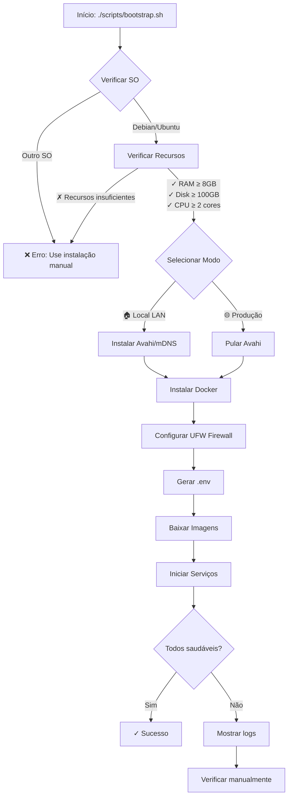

# Guia de Instalação do BorgStack

Guia completo para instalação do BorgStack em servidores Debian e Ubuntu.

---

## Índice

1. [Requisitos do Sistema](#requisitos-do-sistema)
2. [Instalação Automatizada (Recomendado)](#instalação-automatizada-recomendado)
3. [Instalação Manual (Alternativa)](#instalação-manual-alternativa)
4. [Instalação em Modo Local (Testes/Desenvolvimento)](#instalação-em-modo-local-testesdesenvolvimento)
5. [Configuração Pós-Instalação](#configuração-pós-instalação)
6. [Verificação da Instalação](#verificação-da-instalação)
7. [Solução de Problemas](#solução-de-problemas)

---

## Requisitos do Sistema

### Requisitos de Hardware

O BorgStack requer recursos robustos para executar 14 containers simultaneamente com bom desempenho.

| Componente | Mínimo | Recomendado | Observações |
|------------|--------|-------------|-------------|
| **CPU** | 2 vCPUs | 4 vCPUs | Processadores mais recentes melhoram o desempenho |
| **RAM** | 8 GB | 18 GB | 8GB executa o sistema, 18GB oferece desempenho de produção |
| **Disco** | 100 GB SSD | 250 GB SSD | SSD é obrigatório para bom desempenho de banco de dados |
| **Rede** | 100 Mbps | 1 Gbps | Para integração com WhatsApp e APIs externas |

**💡 Recomendação:** Para ambientes de produção, sempre use as especificações recomendadas. Os requisitos mínimos são adequados apenas para testes e desenvolvimento.

### Requisitos de Software

| Software | Versão | Instalação |
|----------|--------|------------|
| **Sistema Operacional** | Debian ou Ubuntu (outras distros: instalação manual necessária) | Script bootstrap valida Debian/Ubuntu automaticamente |
| **Docker Engine** | Última versão estável | Instalado automaticamente pelo bootstrap |
| **Docker Compose** | v2 (plugin) | Instalado automaticamente pelo bootstrap |
| **Git** | Qualquer versão recente | Para clonar o repositório |

**⚠️ IMPORTANTE:** O script de instalação automática suporta **apenas Debian e Ubuntu**. Se você usa outra distribuição Linux, consulte a seção [Instalação Manual](#instalação-manual-alternativa) e siga as instruções oficiais do Docker para sua distribuição.

### Requisitos de Rede

Os requisitos de rede dependem do modo de instalação escolhido:

#### Modo Produção
**Obrigatório:**
- ✅ Endereço IP público acessível pela internet
- ✅ Portas 80 e 443 abertas e acessíveis (para SSL via Let's Encrypt)
- ✅ Porta 22 acessível (para SSH, administração remota)
- ✅ Registros DNS configurados para todos os serviços

**Domínios Necessários:**

Você precisará configurar subdomínios para cada serviço. Exemplo usando `example.com`:

```
n8n.example.com         → n8n (automação de workflows)
chatwoot.example.com    → Chatwoot (atendimento ao cliente)
evolution.example.com   → Evolution API (WhatsApp Business)
lowcoder.example.com    → Lowcoder (construtor de aplicativos)
directus.example.com    → Directus (CMS headless)
fileflows.example.com   → FileFlows (processamento de mídia)
duplicati.example.com   → Duplicati (sistema de backup)
seaweedfs.example.com   → SeaweedFS (armazenamento de objetos)
```

#### Modo Local (LAN)
**Obrigatório:**
- ✅ Acesso à rede local (LAN)
- ✅ Porta 22 para SSH (administração remota)
- ✅ Avahi/mDNS funcionando na rede local (instalado automaticamente)

**Opcional:**
- 🔄 Domínios (não necessários - usa hostname.local)
- 🔄 IP público (não necessário - acesso local apenas)
- 🔄 Configuração DNS (não necessária)

**💡 Dica:** Recomendamos usar um único domínio raiz com subdomínios para produção, mas você pode usar domínios diferentes para cada serviço se preferir.

---

## Instalação Automatizada (Recomendado)

O script de bootstrap automatiza todo o processo de instalação, desde a validação de requisitos até a implantação dos serviços, com suporte a dois modos de instalação.

### Modos de Instalação Disponíveis

O script `bootstrap.sh` oferece dois modos de instalação:

| Característica | 🏠 Modo Local (LAN) | 🌐 Modo Produção |
|----------------|-------------------|-----------------|
| **Acesso** | `http://hostname.local:8080` | `https://seu-dominio.com` |
| **SSL** | Não necessário (HTTP) | Automático (Let's Encrypt) |
| **Domínios** | Não precisa configurar | Precisa configurar DNS |
| **Requisitos** | Rede local apenas | IP público + DNS |
| **Uso** | Testes, desenvolvimento, demos | Produção, acesso externo |
| **mDNS/Avahi** | ✅ Instalado automaticamente | ❌ Não necessário |

### Visão Geral do Processo



**Tempo estimado:** 15-30 minutos (dependendo da velocidade da internet para download das imagens Docker)

### Passo a Passo

#### 1. Preparar o Servidor

Conecte-se ao seu servidor Debian/Ubuntu via SSH:

```bash
ssh usuario@seu-servidor.com
```

Certifique-se de estar usando um usuário com privilégios `sudo`. Você será solicitado a inserir sua senha durante a instalação.

#### 2. Clonar o Repositório

Clone o repositório do BorgStack:

```bash
# Navegue até o diretório home
cd ~

# Clone o repositório
git clone https://github.com/yourusername/borgstack.git

# Entre no diretório do projeto
cd borgstack
```

**💡 Dica:** Se você não tiver o Git instalado, instale-o primeiro:
```bash
# Para Debian/Ubuntu:
sudo apt-get update && sudo apt-get install -y git

# Para outras distribuições:
# Consulte a documentação da sua distribuição para instalar o git
```

#### 3. Executar o Script de Bootstrap

Execute o script de instalação automatizada:

```bash
./scripts/bootstrap.sh
```

**O que acontece durante a execução:**

**Etapa 0: Seleção do Modo de Instalação**

O script irá apresentar um menu interativo para selecionar o modo de instalação:

```
╔════════════════════════════════════════════════════════════════╗
║                                                                ║
║                  BorgStack Bootstrap Script                    ║
║                                                                ║
║              Automated GNU/Linux Setup                        ║
║                                                                ║
╚════════════════════════════════════════════════════════════════╝

🚀 BorgStack Installation Mode

Choose your installation type:

1) Local Development (LAN)
   • Access via hostname.local (e.g., debian13-lxc.local:8080/n8n)
   • Automatic mDNS/Avahi setup
   • HTTP only (no SSL)
   • Database ports exposed for debugging
   • Perfect for local development and testing

2) Production Deployment
   • Access via public domain (e.g., n8n.yourdomain.com)
   • Requires DNS configuration
   • Automatic HTTPS with Let's Encrypt SSL
   • Secure configuration for production use

3) Cancel - Exit the script

Enter your choice (1, 2, or 3):
```

**Modo Local (LAN)** - Ideal para:
- ✅ Testes e desenvolvimento
- ✅ Demonstrações em rede local
- ✅ Aprendizado sem complexidade de DNS
- ✅ Ambientes de desenvolvimento interno

**Modo Produção** - Ideal para:
- ✅ Ambientes de produção
- ✅ Acesso público via internet
- ✅ SSL automático via Let's Encrypt
- ✅ Configuração segura e otimizada

**Etapa 1: Validação do Sistema (1-2 minutos)**
```
━━━━━━━━━━━━━━━━━━━━━━━━━━━━━━━━━━━━━━━━━━━━━━━━━━━━
Validating Linux Distribution
━━━━━━━━━━━━━━━━━━━━━━━━━━━━━━━━━━━━━━━━━━━━━━━━━━━━

✓ Ubuntu 22.04 detected

━━━━━━━━━━━━━━━━━━━━━━━━━━━━━━━━━━━━━━━━━━━━━━━━━━━━
Validating System Requirements
━━━━━━━━━━━━━━━━━━━━━━━━━━━━━━━━━━━━━━━━━━━━━━━━━━━━

ℹ RAM: 18GB (min: 8GB, recommended: 18GB)
✓ RAM sufficient: 18GB
ℹ Disk: 250GB (min: 100GB, recommended: 250GB)
✓ Disk space sufficient: 250GB
ℹ CPU cores: 4 (min: 2, recommended: 4)
✓ CPU cores sufficient: 4
✓ All system requirements validated
```

**Etapa 2: Instalação de Dependências (Apenas Modo Local)**

Se você selecionou **Modo Local (LAN)**, o script irá instalar e configurar o Avahi/mDNS:

```
━━━━━━━━━━━━━━━━━━━━━━━━━━━━━━━━━━━━━━━━━━━━━━━━━━━━
Installing Avahi for mDNS (Local LAN Mode)
━━━━━━━━━━━━━━━━━━━━━━━━━━━━━━━━━━━━━━━━━━━━━━━━━━━━

ℹ Installing Avahi daemon for mDNS hostname discovery...
✓ Avahi daemon installed and started successfully
ℹ Testing mDNS resolution for debian13-lxc.local...
✓ mDNS resolution working: debian13-lxc.local

━━━━━━━━━━━━━━━━━━━━━━━━━━━━━━━━━━━━━━━━━━━━━━━━━━━━
Configuring Firewall for mDNS (Local LAN Mode)
━━━━━━━━━━━━━━━━━━━━━━━━━━━━━━━━━━━━━━━━━━━━━━━━━━━━

ℹ Configuring UFW for mDNS...
✓ mDNS firewall rules configured
```

**Etapa 3: Instalação do Docker (3-5 minutos)**
```
━━━━━━━━━━━━━━━━━━━━━━━━━━━━━━━━━━━━━━━━━━━━━━━━━━━━
Installing Docker Engine and Docker Compose v2
━━━━━━━━━━━━━━━━━━━━━━━━━━━━━━━━━━━━━━━━━━━━━━━━━━━━

ℹ Installing Docker Engine...
ℹ Installing dependencies...
ℹ Adding Docker GPG key...
ℹ Adding Docker repository...
ℹ Installing Docker packages...
ℹ Adding user 'usuario' to docker group...
ℹ Starting Docker service...
✓ Docker installed: Docker version 27.3.1, build ce12230
✓ Docker Compose installed: Docker Compose version v2.29.7
⚠ NOTE: You may need to log out and back in for docker group membership to take effect.
```

**Etapa 3: Configuração do Firewall (1 minuto)**
```
━━━━━━━━━━━━━━━━━━━━━━━━━━━━━━━━━━━━━━━━━━━━━━━━━━━━
Configuring UFW Firewall
━━━━━━━━━━━━━━━━━━━━━━━━━━━━━━━━━━━━━━━━━━━━━━━━━━━━

ℹ Configuring UFW rules...
ℹ Allowing SSH (port 22)...
ℹ Allowing HTTP (port 80)...
ℹ Allowing HTTPS (port 443)...
ℹ Enabling UFW firewall...

Status: active
To                         Action      From
--                         ------      ----
22/tcp                     ALLOW       Anywhere
80/tcp                     ALLOW       Anywhere
443/tcp                    ALLOW       Anywhere

✓ Firewall configured
```

**Etapa 4: Geração do Arquivo .env (1 minuto)**

O script irá gerar o arquivo `.env` de forma diferente para cada modo:

**Modo Local (LAN):**
```
━━━━━━━━━━━━━━━━━━━━━━━━━━━━━━━━━━━━━━━━━━━━━━━━━━━━
Generating .env File
━━━━━━━━━━━━━━━━━━━━━━━━━━━━━━━━━━━━━━━━━━━━━━━━━━━━

ℹ Configuring for Local Development (LAN) mode...
ℹ Using hostname: debian13-lxc
ℹ Using domain: debian13-lxc.local
ℹ Using email: admin@localhost
ℹ Generating strong passwords...
✓ Generated .env file with strong passwords
⚠ IMPORTANT: Save these credentials securely!
```

**Modo Produção:**
```
━━━━━━━━━━━━━━━━━━━━━━━━━━━━━━━━━━━━━━━━━━━━━━━━━━━━
Generating .env File
━━━━━━━━━━━━━━━━━━━━━━━━━━━━━━━━━━━━━━━━━━━━━━━━━━━━

ℹ Configuring for Production mode...
ℹ Please enter your domain names:
ℹ Enter base domain (e.g., example.com.br): mycompany.com.br
ℹ Enter your email for SSL notifications (e.g., admin@mycompany.com.br): admin@mycompany.com.br
ℹ Generating strong passwords...
✓ Generated .env file with strong passwords
⚠ IMPORTANT: Save these credentials securely!
```

**Etapa 5: Implantação dos Serviços (5-15 minutos)**
```
━━━━━━━━━━━━━━━━━━━━━━━━━━━━━━━━━━━━━━━━━━━━━━━━━━━━
Deploying Services
━━━━━━━━━━━━━━━━━━━━━━━━━━━━━━━━━━━━━━━━━━━━━━━━━━━━

ℹ Pulling Docker images (this may take several minutes)...
[+] Pulling 14/14
 ✔ postgresql Pulled
 ✔ redis Pulled
 ✔ mongodb Pulled
 ✔ caddy Pulled
 ✔ n8n Pulled
 ✔ chatwoot Pulled
 ✔ evolution Pulled
 ✔ lowcoder-api-service Pulled
 ✔ lowcoder-node-service Pulled
 ✔ lowcoder-frontend Pulled
 ✔ directus Pulled
 ✔ fileflows Pulled
 ✔ duplicati Pulled
 ✔ seaweedfs Pulled

ℹ Starting services...
✓ All services started successfully
```

**Etapa 6: Validação de Health Checks (2-5 minutos)**
```
━━━━━━━━━━━━━━━━━━━━━━━━━━━━━━━━━━━━━━━━━━━━━━━━━━━━
Validating Health Checks
━━━━━━━━━━━━━━━━━━━━━━━━━━━━━━━━━━━━━━━━━━━━━━━━━━━━

ℹ Waiting for services to become healthy...
✓ postgresql: healthy
✓ redis: healthy
✓ mongodb: healthy
✓ n8n: healthy
✓ chatwoot: healthy
✓ evolution: healthy
✓ All core services are healthy
```

#### 4. Revisar Informações de Instalação

Após a conclusão, o script exibirá informações importantes específicas para cada modo:

**Modo Local (LAN):**
```
━━━━━━━━━━━━━━━━━━━━━━━━━━━━━━━━━━━━━━━━━━━━━━━━━━━━
Local Development (LAN) - Next Steps:
━━━━━━━━━━━━━━━━━━━━━━━━━━━━━━━━━━━━━━━━━━━━━━━━━━━━

1. Test mDNS Resolution
   Verify that mDNS is working properly:
   ping debian13-lxc.local
   curl http://debian13-lxc.local:8080

2. Access Your Services
   Your BorgStack is accessible via:
   http://debian13-lxc.local:8080/n8n
   http://debian13-lxc.local:8080/chatwoot
   http://debian13-lxc.local:8080/evolution
   http://debian13-lxc.local:8080/lowcoder
   http://debian13-lxc.local:8080/directus
   http://debian13-lxc.local:8080/fileflows
   http://debian13-lxc.local:8080/duplicati

3. First Login
   n8n: http://debian13-lxc.local:8080/n8n → Create account
   Chatwoot: http://debian13-lxc.local:8080/chatwoot → Create workspace
   Directus: http://debian13-lxc.local:8080/directus/admin → Use .env credentials

4. Documentation for troubleshooting:
   → docs/02-configuracao.md (Configuração de Hostname Local)
   → docs/architecture/development-workflow.md (mDNS/Avahi Configuration)

5. Security Recommendations
   ⚠ This is for local development only
   ⚠ Do not expose to internet without proper security
   ⚠ Save all passwords from .env to a secure password manager
```

**Modo Produção:**
```
━━━━━━━━━━━━━━━━━━━━━━━━━━━━━━━━━━━━━━━━━━━━━━━━━━━━
Production Deployment - Next Steps:
━━━━━━━━━━━━━━━━━━━━━━━━━━━━━━━━━━━━━━━━━━━━━━━━━━━━

1. Configure DNS A Records
   Add the following DNS records pointing to your server IP:
   n8n.mycompany.com.br        → YOUR_SERVER_IP
   chatwoot.mycompany.com.br   → YOUR_SERVER_IP
   evolution.mycompany.com.br  → YOUR_SERVER_IP
   lowcoder.mycompany.com.br   → YOUR_SERVER_IP
   directus.mycompany.com.br   → YOUR_SERVER_IP
   fileflows.mycompany.com.br  → YOUR_SERVER_IP
   duplicati.mycompany.com.br  → YOUR_SERVER_IP
   seaweedfs.mycompany.com.br  → YOUR_SERVER_IP

2. Verify DNS Configuration
   Wait for DNS propagation (5-30 minutes), then verify:
   dig n8n.mycompany.com.br

3. SSL Certificates (Automatic)
   Caddy will automatically generate Let's Encrypt SSL certificates
   when you first access each subdomain via HTTPS.

4. Access Your Services
   Once DNS is configured, access services at:
   https://n8n.mycompany.com.br
   https://chatwoot.mycompany.com.br
   https://evolution.mycompany.com.br
   https://lowcoder.mycompany.com.br
   https://directus.mycompany.com.br
   https://fileflows.mycompany.com.br
   https://duplicati.mycompany.com.br

5. Security Recommendations
   ⚠ Change CORS_ALLOWED_ORIGINS from '*' to specific origins
   ⚠ Save all passwords from .env to a secure password manager
   ⚠ Consider enabling full disk encryption (LUKS) for production
```

**⚠️ IMPORTANTE:** Salve o arquivo `.env` em local seguro! Ele contém todas as credenciais do sistema.

---

## Instalação Manual (Alternativa)

Se você preferir instalar manualmente ou está usando um ambiente personalizado, siga estas etapas.

### 1. Validar Requisitos do Sistema

Verifique se seu servidor atende aos requisitos mínimos:

```bash
# Verificar distribuição (Debian ou Ubuntu)
cat /etc/os-release | grep -E "^ID=" | cut -d= -f2
# Deve retornar: ubuntu ou debian

# Verificar RAM (em GB)
free -g | grep Mem: | awk '{print $2}'
# Deve retornar: 8 ou mais

# Verificar espaço em disco (em GB)
df -BG / | awk 'NR==2 {print $2}' | sed 's/G//'
# Deve retornar: 100 ou mais

# Verificar CPU cores
nproc
# Deve retornar: 2 ou mais
```

### 2. Instalar Docker Engine

**Para Debian/Ubuntu (Recomendado: Script Oficial)**

Use o script de instalação oficial do Docker:

```bash
# Baixar e executar script de instalação oficial
curl -fsSL https://get.docker.com | sh
```

Este script automaticamente:
- Detecta sua distribuição (Debian ou Ubuntu)
- Configura o repositório Docker apropriado
- Instala Docker Engine e Docker Compose v2
- Inicia e habilita o serviço Docker

**Alternativa: Instalação manual para Debian/Ubuntu**

Se o script oficial falhar, você pode instalar manualmente:

```bash
# Remover versões antigas
sudo apt-get remove -y docker docker-engine docker.io containerd runc

# Instalar dependências
sudo apt-get update
sudo apt-get install -y ca-certificates curl gnupg

# Adicionar repositório Docker
sudo install -m 0755 -d /etc/apt/keyrings
curl -fsSL https://download.docker.com/linux/ubuntu/gpg | sudo gpg --dearmor -o /etc/apt/keyrings/docker.gpg
sudo chmod a+r /etc/apt/keyrings/docker.gpg

echo \
  "deb [arch=$(dpkg --print-architecture) signed-by=/etc/apt/keyrings/docker.gpg] https://download.docker.com/linux/ubuntu \
  $(. /etc/os-release && echo "$VERSION_CODENAME") stable" | \
  sudo tee /etc/apt/sources.list.d/docker.list > /dev/null

# Instalar Docker
sudo apt-get update
sudo apt-get install -y docker-ce docker-ce-cli containerd.io docker-buildx-plugin docker-compose-plugin
```

**Para outras distribuições Linux:**

Consulte a documentação oficial do Docker em https://docs.docker.com/engine/install/ para instruções específicas da sua distribuição.

Adicione seu usuário ao grupo docker:

```bash
sudo usermod -aG docker $USER
```

Inicie e habilite o serviço Docker:

```bash
sudo systemctl start docker
sudo systemctl enable docker
```

Verifique a instalação:

```bash
docker --version
# Deve exibir: Docker version 27.3.1 ou superior

docker compose version
# Deve exibir: Docker Compose version v2.29.7 ou superior
```

**⚠️ IMPORTANTE:** Faça logout e login novamente para que a associação ao grupo docker tenha efeito. Alternativamente, execute `newgrp docker` para atualizar suas permissões de grupo na sessão atual.

### 3. Instalar Dependências do Sistema

Instale utilitários essenciais para Debian/Ubuntu:

```bash
sudo apt-get update
sudo apt-get install -y curl wget git ufw dnsutils htop sysstat
```

**Para outras distribuições Linux:**

Consulte a documentação da sua distribuição para instalar os pacotes equivalentes:
- `curl`, `wget`, `git` - ferramentas básicas
- `ufw` ou firewall equivalente - gerenciamento de firewall
- `dnsutils` ou `bind-utils` - ferramentas DNS (comando `dig`)
- `htop`, `sysstat` - monitoramento de sistema

### 4. Configurar o Firewall

Configure as regras básicas do firewall usando UFW (Uncomplicated Firewall) no Debian/Ubuntu:

```bash
# Definir políticas padrão
sudo ufw default deny incoming
sudo ufw default allow outgoing

# Permitir SSH (porta 22)
sudo ufw allow 22/tcp

# Permitir HTTP (porta 80) - necessário para Let's Encrypt
sudo ufw allow 80/tcp

# Permitir HTTPS (porta 443)
sudo ufw allow 443/tcp

# Habilitar o firewall
sudo ufw enable

# Verificar status
sudo ufw status verbose
```

**Saída esperada:**
```
Status: active
Logging: on (low)
Default: deny (incoming), allow (outgoing), disabled (routed)
New profiles: skip

To                         Action      From
--                         ------      ----
22/tcp                     ALLOW IN    Anywhere
80/tcp                     ALLOW IN    Anywhere
443/tcp                    ALLOW IN    Anywhere
```

**⚠️ ATENÇÃO:** Se você usa uma porta SSH personalizada (diferente de 22), ajuste as regras do firewall antes de habilitar, ou você perderá acesso SSH!

**Para outras distribuições Linux:**

Consulte a documentação da sua distribuição para configurar o firewall equivalente (firewalld, iptables, nftables, etc.).

### 5. Clonar o Repositório

```bash
cd ~
git clone https://github.com/yourusername/borgstack.git
cd borgstack
```

### 6. Criar e Configurar o Arquivo .env

Copie o arquivo de exemplo:

```bash
cp .env.example .env
```

Edite o arquivo `.env` com suas configurações:

```bash
nano .env
```

**Você DEVE alterar os seguintes valores:**

**Senhas de Banco de Dados (gere senhas fortes de 32 caracteres):**
```bash
# Gerar senha segura
openssl rand -base64 32 | tr -d "=+/" | cut -c1-32
```

Execute o comando acima 10 vezes para gerar senhas únicas para:
- `POSTGRES_PASSWORD`
- `N8N_DB_PASSWORD`
- `CHATWOOT_DB_PASSWORD`
- `DIRECTUS_DB_PASSWORD`
- `EVOLUTION_DB_PASSWORD`
- `MONGODB_ROOT_PASSWORD`
- `LOWCODER_DB_PASSWORD`
- `REDIS_PASSWORD`
- `LOWCODER_DB_ENCRYPTION_PASSWORD`
- `LOWCODER_DB_ENCRYPTION_SALT`

**Domínios (substitua `example.com` pelo seu domínio real):**
```bash
# Exemplo: se seu domínio é mycompany.com.br
N8N_HOST=n8n.mycompany.com.br
CHATWOOT_HOST=chatwoot.mycompany.com.br
# ... e assim por diante para todos os serviços
```

**Configure permissões seguras:**
```bash
chmod 600 .env
```

**⚠️ CRÍTICO:** Nunca commite o arquivo `.env` ao Git! Ele contém todas as credenciais do sistema.

### 7. Implantar os Serviços

Baixe as imagens Docker:

```bash
docker compose pull
```

**Tempo estimado:** 5-15 minutos, dependendo da velocidade da internet.

Inicie os serviços:

```bash
docker compose up -d
```

Verifique o status dos containers:

```bash
docker compose ps
```

**Saída esperada (após 2-3 minutos):**
```
NAME                        STATUS              PORTS
borgstack-postgresql-1      Up 2 minutes (healthy)
borgstack-redis-1           Up 2 minutes (healthy)
borgstack-mongodb-1         Up 2 minutes (healthy)
borgstack-caddy-1           Up 2 minutes (healthy)   0.0.0.0:80->80/tcp, 0.0.0.0:443->443/tcp
borgstack-n8n-1             Up 2 minutes (healthy)
borgstack-chatwoot-1        Up 2 minutes (healthy)
borgstack-evolution-1       Up 2 minutes (healthy)
...
```

**💡 Dica:** Alguns serviços levam até 90 segundos para ficarem "healthy", especialmente o Directus (migrações de banco de dados).

---

## Instalação em Modo Local (Testes/Desenvolvimento)

O modo local permite executar o BorgStack sem necessidade de domínios configurados ou certificados SSL, ideal para:

- ✅ **Testes e avaliação** do BorgStack
- ✅ **Desenvolvimento local** de workflows e integrações
- ✅ **Demonstrações** em ambiente controlado
- ✅ **Aprendizado** sem complexidade de DNS

### Diferenças do Modo Local vs Produção

| Característica | Modo Local | Modo Produção |
|----------------|------------|---------------|
| **Acesso** | `http://localhost:8080` | `https://seu-dominio.com` |
| **Portas** | 8080/4433 (evita conflitos) | 80/443 (padrão) |
| **SSL** | Não necessário (HTTP) | Automático (Let's Encrypt) |
| **Domínios** | Não precisa configurar | Precisa configurar DNS |
| **Bancos de Dados** | Acesso direto via portas | Apenas rede interna |
| **Persistência** | Mesmos volumes Docker | Mesmos volumes Docker |

### Instalação Rápida (Modo Local)

**Pré-requisitos simplificados:**
- Docker Engine e Docker Compose v2
- 8GB RAM (mínimo), 18GB recomendado
- 100GB SSD (mínimo), 250GB recomendado
- **Não precisa de:** IP público, domínios, configuração DNS

#### Passo 1: Clonar o Repositório

```bash
# Clone o repositório
git clone https://github.com/yourusername/borgstack.git
cd borgstack
```

#### Passo 2: Configurar Variáveis de Ambiente Básicas

Crie um arquivo `.env` simplificado para modo local:

```bash
# Copie o template
cp .env.example .env

# Edite apenas as senhas (opcional para testes)
nano .env
```

**Modo local não precisa alterar domínios** - será configurado automaticamente para `localhost`.

#### Passo 3: Iniciar em Modo Local

```bash
# Inicia automaticamente com docker-compose.override.yml
docker compose up -d
```

Isso vai:
1. Baixar todas as imagens Docker (8-12 GB, 10-25 minutos)
2. Iniciar todos os 14 serviços
3. Aplicar configurações de desenvolvimento local
4. Expor portas para acesso direto

#### Passo 4: Verificar Instalação

```bash
# Verificar status dos containers
docker compose ps

# Todos devem mostrar "Up (healthy)" após 2-3 minutos
```

#### Passo 5: Acessar Serviços Localmente

**Acesso via Caddy (portas 8080/4433):**
```bash
# Acesso principal via localhost:8080
http://localhost:8080/n8n        # n8n (automação)
http://localhost:8080/chatwoot   # Chatwoot (atendimento)
http://localhost:8080/evolution  # Evolution API (WhatsApp)
http://localhost:8080/lowcoder   # Lowcoder (low-code)
http://localhost:8080/directus   # Directus (CMS)
http://localhost:8080/fileflows  # FileFlows (mídia)
http://localhost:8080/duplicati  # Duplicati (backup)
```

**Acesso direto via portas expostas:**
```bash
http://localhost:5678   # n8n (direto)
http://localhost:3000   # Chatwoot (direto)
http://localhost:8081   # Evolution API (direto)
http://localhost:3001   # Lowcoder (direto)
http://localhost:8055   # Directus (direto)
http://localhost:5000   # FileFlows (direto)
http://localhost:8200   # Duplicati (direto)
http://localhost:5432   # PostgreSQL (ferramentas de DB)
http://localhost:6379   # Redis (ferramentas de cache)
http://localhost:27017  # MongoDB (ferramentas de NoSQL)
```

#### Passo 6: Primeiro Login

Crie contas de administrador nos serviços principais:

**n8n:** http://localhost:8080/n8n
- Acesse e crie primeira conta (automaticamente admin)

**Chatwoot:** http://localhost:8080/chatwoot
- Crie conta de administrador e workspace inicial

**Directus:** http://localhost:8080/directus/admin
- Use credenciais do `.env` (DIRECTUS_ADMIN_EMAIL/PASSWORD)

### Comandos Úteis (Modo Local)

```bash
# Ver logs em tempo real
docker compose logs -f

# Ver logs de serviço específico
docker compose logs -f n8n

# Reiniciar serviço específico
docker compose restart n8n

# Parar todos os serviços
docker compose down

# Remover volumes (ATENÇÃO: perde dados)
docker compose down -v
```

### Limitações do Modo Local

- ⚠️ **Sem SSL:** Apenas HTTP local
- ⚠️ **Sem Acesso Externo:** Apenas localhost
- ⚠️ **Sem Recursos Externos:** Integrações com APIs externas podem não funcionar
- ⚠️ **Performance:** Pode ser mais lento que produção

### Alternar Entre Modos

```bash
# Mudar para modo local
docker compose down
# (já usa override.yml automaticamente)
docker compose up -d

# Mudar para modo produção
docker compose down
docker compose -f docker-compose.yml -f docker-compose.prod.yml up -d
```

### Próximos Passos

Após testar em modo local, você pode:
1. **Fazer upgrade para produção:** Configure domínios e use modo produção
2. **Continuar desenvolvimento:** Use modo local para desenvolver workflows
3. **Exportar configurações:** Salve workflows e dados para migrar depois

---

## Configuração Pós-Instalação

Após a instalação bem-sucedida, você precisa configurar DNS e acessar os serviços.

### 1. Configurar Registros DNS

Configure registros DNS A para cada serviço apontando para o IP do seu servidor.

**No seu provedor DNS (exemplo: Cloudflare, GoDaddy, Route 53):**

| Tipo | Nome | Valor | TTL |
|------|------|-------|-----|
| A | n8n | `SEU_IP_PUBLICO` | 300 |
| A | chatwoot | `SEU_IP_PUBLICO` | 300 |
| A | evolution | `SEU_IP_PUBLICO` | 300 |
| A | lowcoder | `SEU_IP_PUBLICO` | 300 |
| A | directus | `SEU_IP_PUBLICO` | 300 |
| A | fileflows | `SEU_IP_PUBLICO` | 300 |
| A | duplicati | `SEU_IP_PUBLICO` | 300 |
| A | seaweedfs | `SEU_IP_PUBLICO` | 300 |

**💡 Dica:** Use TTL 300 (5 minutos) durante a configuração inicial. Após tudo funcionar, você pode aumentar para 3600 (1 hora).

### 2. Verificar Propagação DNS

Aguarde a propagação DNS (geralmente 5-15 minutos) e verifique:

```bash
# Verificar um domínio de cada vez
dig n8n.example.com

# Deve retornar seu IP público na seção ANSWER
```

**Saída esperada:**
```
;; ANSWER SECTION:
n8n.example.com.    300    IN    A    123.45.67.89
```

**Ferramentas online para verificar DNS:**
- https://dnschecker.org/
- https://www.whatsmydns.net/

### 3. Geração Automática de Certificados SSL

O Caddy (reverse proxy) gera automaticamente certificados SSL via Let's Encrypt quando você acessa cada serviço pela primeira vez.

**Como funciona:**

1. Você acessa `https://n8n.example.com` no navegador
2. Caddy detecta que não há certificado SSL para esse domínio
3. Caddy se comunica com Let's Encrypt (via ACME HTTP-01 challenge)
4. Let's Encrypt verifica que você controla o domínio (porta 80 deve estar acessível)
5. Let's Encrypt emite o certificado SSL (válido por 90 dias)
6. Caddy instala o certificado e configura HTTPS automaticamente
7. Caddy renova o certificado automaticamente antes de expirar

**Tempo estimado:** 30-60 segundos no primeiro acesso a cada domínio.

**💡 Dica:** A geração de certificados acontece em segundo plano. Se você vê um erro SSL no primeiro acesso, aguarde 30 segundos e recarregue a página.

### 4. Primeiro Acesso aos Serviços

Acesse cada serviço para verificar que está funcionando e gerar certificados SSL:

| Serviço | URL | Primeiro Acesso |
|---------|-----|-----------------|
| **n8n** | `https://n8n.example.com` | Crie conta de administrador |
| **Chatwoot** | `https://chatwoot.example.com` | Crie conta de administrador |
| **Evolution API** | `https://evolution.example.com` | Use API key do .env |
| **Lowcoder** | `https://lowcoder.example.com` | Crie conta de administrador |
| **Directus** | `https://directus.example.com/admin` | Login: credenciais do .env |
| **FileFlows** | `https://fileflows.example.com` | Configure durante o primeiro acesso |
| **Duplicati** | `https://duplicati.example.com` | Configure senha de acesso |
| **SeaweedFS** | `https://seaweedfs.example.com` | Acesso via API (sem UI web) |

### 5. Configurar Contas de Administrador

**n8n:**
```
1. Acesse https://n8n.example.com
2. Crie conta de administrador (primeiro usuário é automaticamente admin)
3. Email: seu-email@example.com
4. Senha: use uma senha forte (12+ caracteres)
5. Finalize a configuração inicial
```

**Chatwoot:**
```
1. Acesse https://chatwoot.example.com
2. Crie conta de administrador
3. Nome da conta: Seu nome ou empresa
4. Email: seu-email@example.com
5. Senha: use uma senha forte (12+ caracteres)
6. Complete o wizard de configuração
```

**Directus:**
```
1. Acesse https://directus.example.com/admin
2. Faça login com credenciais do .env:
   Email: valor de DIRECTUS_ADMIN_EMAIL
   Senha: valor de DIRECTUS_ADMIN_PASSWORD
3. Altere a senha padrão no seu perfil
```

**💡 Dica:** Anote todas as credenciais em um gerenciador de senhas seguro (ex: 1Password, Bitwarden, LastPass).

### 6. Dicas de Segurança Pós-Instalação

**Proteja o arquivo .env:**
```bash
# Verifique permissões
ls -la .env
# Deve mostrar: -rw------- (600)

# Se não estiver correto, corrija:
chmod 600 .env
```

**Faça backup das credenciais:**
```bash
# Copie o .env para local seguro (fora do servidor)
# Nunca envie por email ou chat!
# Use um gerenciador de senhas ou armazenamento criptografado
```

**Configure autenticação de dois fatores (2FA):**
- n8n: Habilite 2FA nas configurações de usuário
- Chatwoot: Habilite 2FA nas configurações de perfil
- Directus: Habilite 2FA nas configurações de usuário

---

## Verificação da Instalação

Após a instalação e configuração DNS, execute estas verificações para garantir que tudo está funcionando corretamente.

### 1. Verificar Status dos Containers

```bash
docker compose ps
```

**Todos os containers devem mostrar:**
- STATUS: `Up X minutes (healthy)` ou `Up X minutes`
- Nenhum container deve estar `Restarting` ou `Exited`

**Se algum container não está saudável:**
```bash
# Ver logs do container específico
docker compose logs nome-do-servico --tail 100

# Exemplo:
docker compose logs n8n --tail 100
```

### 2. Verificar Volumes Docker

```bash
docker volume ls | grep borgstack
```

**Saída esperada (15+ volumes):**
```
local     borgstack_postgresql_data
local     borgstack_redis_data
local     borgstack_mongodb_data
local     borgstack_n8n_data
local     borgstack_chatwoot_storage
local     borgstack_directus_uploads
local     borgstack_fileflows_data
local     borgstack_duplicati_config
local     borgstack_duplicati_data
local     borgstack_seaweedfs_data
local     borgstack_lowcoder_data
...
```

### 3. Verificar Redes Docker

```bash
docker network ls | grep borgstack
```

**Saída esperada:**
```
a1b2c3d4e5f6   borgstack_internal    bridge    local
g7h8i9j0k1l2   borgstack_external    bridge    local
```

### 4. Executar Scripts de Verificação

O BorgStack inclui scripts de validação para cada componente:

```bash
# Verificar PostgreSQL
./tests/deployment/verify-postgresql.sh

# Verificar Redis
./tests/deployment/verify-redis.sh

# Verificar MongoDB
./tests/deployment/verify-mongodb.sh

# Verificar n8n
./tests/deployment/verify-n8n.sh

# Verificar Chatwoot
./tests/deployment/verify-chatwoot.sh

# Verificar Directus
./tests/deployment/verify-directus.sh

# Executar TODOS os testes de deploy
./tests/run-all-tests.sh
```

**💡 Dica:** Se algum teste falhar, consulte a seção de [Solução de Problemas](#solução-de-problemas) abaixo.

### 5. Verificar Conectividade de Rede

**Verificar que Caddy está acessível:**
```bash
curl -I https://n8n.example.com
```

**Saída esperada:**
```
HTTP/2 200
server: Caddy
content-type: text/html; charset=utf-8
```

**Verificar SSL:**
```bash
openssl s_client -connect n8n.example.com:443 -servername n8n.example.com < /dev/null
```

**Deve mostrar:** `Verify return code: 0 (ok)` (certificado válido)

### 6. Checklist de Instalação Completa

Use este checklist para confirmar que tudo está funcionando:

- [ ] Todos os 14 containers estão `Up (healthy)`
- [ ] Todos os volumes `borgstack_*` foram criados
- [ ] Redes `borgstack_internal` e `borgstack_external` existem
- [ ] DNS configurado e propagado para todos os 8 domínios
- [ ] Certificados SSL gerados para todos os domínios (HTTPS funcionando)
- [ ] Acesso bem-sucedido ao n8n via navegador
- [ ] Acesso bem-sucedido ao Chatwoot via navegador
- [ ] Acesso bem-sucedido ao Directus via navegador
- [ ] Contas de administrador criadas em todos os serviços principais
- [ ] Arquivo `.env` salvo em local seguro com permissões 600
- [ ] Firewall UFW ativo com regras corretas (22/80/443)
- [ ] Scripts de verificação executados sem erros

**✅ Se todos os itens estão marcados, sua instalação está completa!**

---

## Solução de Problemas

### Problema: Bootstrap falha com "Insufficient RAM"

**Causa:** Servidor tem menos de 8GB de RAM.

**Solução:**
```bash
# Verificar RAM disponível
free -h

# Se você tem menos de 8GB, você tem 3 opções:
# 1. Fazer upgrade do servidor para 8GB+ (recomendado)
# 2. Reduzir serviços no docker-compose.yml (não recomendado)
# 3. Usar instalação manual e ajustar memory limits (avançado)
```

### Problema: Docker installation fails

**Causa:** Repositório Docker não acessível ou distribuição não suportada pelo script bootstrap.

**Solução:**
```bash
# Verificar distribuição
cat /etc/os-release | grep -E "^ID="

# Deve retornar: ubuntu ou debian
# Se retornar outra distribuição, use instalação manual

# Tentar script oficial do Docker
curl -fsSL https://get.docker.com | sh

# Verificar conectividade com o repositório Docker:
curl -I https://download.docker.com
# Deve retornar HTTP/1.1 200 OK

# Se estiver usando outra distribuição:
# Consulte https://docs.docker.com/engine/install/ para instalação manual
```

### Problema: Permission denied ao executar docker commands

**Causa:** Usuário não está no grupo docker.

**Solução:**
```bash
# Adicionar usuário ao grupo docker
sudo usermod -aG docker $USER

# Opção 1: Fazer logout e login novamente
exit
# Faça login via SSH novamente

# Opção 2: Atualizar grupo na sessão atual
newgrp docker

# Verificar que está funcionando
docker ps
# Não deve mais mostrar erro de permissão
```

### Problema: Ports 80/443 already in use

**Causa:** Outro servidor web (Apache/Nginx) está rodando na porta 80 ou 443.

**Solução:**
```bash
# Verificar o que está usando as portas
sudo ss -tlnp | grep ':80\|:443'

# Se Apache está rodando:
sudo systemctl stop apache2
sudo systemctl disable apache2

# Se Nginx está rodando:
sudo systemctl stop nginx
sudo systemctl disable nginx

# Reiniciar os serviços do BorgStack
docker compose restart caddy
```

### Problema: Container não está healthy após 5 minutos

**Causa:** Múltiplas possíveis - falta de recursos, erro de configuração, problema de rede.

**Diagnóstico:**
```bash
# Ver logs do container específico
docker compose logs nome-do-container --tail 100

# Exemplo para n8n:
docker compose logs n8n --tail 100

# Ver status detalhado de health
docker inspect --format='{{json .State.Health}}' borgstack-n8n-1 | jq

# Verificar uso de recursos
docker stats
```

**Soluções comuns:**
- **Erro de banco de dados:** Verifique senhas no `.env`
- **Out of memory:** Aumente RAM ou reduza serviços
- **Connection refused:** Verifique redes Docker

### Problema: SSL certificate generation fails

**Causa:** DNS não propagado, portas 80/443 bloqueadas, ou domínio aponta para IP errado.

**Diagnóstico:**
```bash
# Verificar DNS
dig n8n.example.com

# Verificar que portas 80/443 estão acessíveis externamente
# (execute de outro servidor ou https://www.yougetsignal.com/tools/open-ports/)

# Ver logs do Caddy
docker compose logs caddy | grep "acme"
```

**Soluções:**
```bash
# Se DNS não propagou, aguarde mais tempo (até 24h em casos raros)

# Se portas bloqueadas, verifique firewall do servidor e cloud provider
sudo ufw status
# E verifique security groups / firewall rules no painel da cloud

# Se domínio aponta para IP errado, corrija no DNS
```

### Problema: Cannot access service web UI

**Causa:** DNS incorreto, Caddy não está rodando, ou serviço não está healthy.

**Diagnóstico:**
```bash
# 1. Verificar DNS (produção)
dig n8n.example.com
# Deve retornar seu IP público

# 2. Verificar mDNS (modo local)
ping hostname.local
# Deve resolver para o IP local

# 3. Verificar Caddy está rodando
docker compose ps caddy

# 4. Verificar serviço está healthy
docker compose ps n8n

# 5. Tentar acessar localmente
curl -I http://localhost:5678  # porta do n8n
```

**Solução:**
```bash
# Se Caddy não está rodando:
docker compose restart caddy

# Se serviço não está healthy:
docker compose logs nome-do-servico

# Se DNS não está resolvendo (produção):
# Aguarde propagação ou verifique configuração DNS

# Se mDNS não está funcionando (modo local):
sudo systemctl status avahi-daemon
sudo ufw status | grep 5353  # verificar porta mDNS
```

### Problema: mDNS/hostname.local não funciona (Modo Local)

**Causa:** Avahi não está rodando, firewall bloqueando mDNS, ou problemas de rede.

**Sintomas:**
- `ping hostname.local` retorna "unknown host"
- Acesso via `hostname.local:8080` não funciona
- Mas acesso via `localhost:8080` ou `IP:8080` funciona

**Diagnóstico:**
```bash
# 1. Verificar se Avahi está rodando
sudo systemctl status avahi-daemon

# 2. Verificar porta mDNS está aberta
sudo netstat -ulnp | grep 5353
# OU
sudo ss -ulnp | grep 5353

# 3. Verificar configuração do firewall
sudo ufw status | grep 5353

# 4. Testar resolução mDNS
avahi-browse -a -t

# 5. Verificar logs do Avahi
sudo journalctl -u avahi-daemon -f
```

**Soluções:**
```bash
# Reiniciar Avahi
sudo systemctl restart avahi-daemon

# Abrir porta mDNS no firewall
sudo ufw allow 5353/udp comment "mDNS"

# Se estiver em rede corporativa, verifique:
# - Switch/roteador permite tráfego multicast
# - Não há VLANs bloqueando tráfego mDNS
# - Proxy do navegador não está bloqueando .local

# Alternativa: usar /etc/hosts
echo "192.168.1.100 hostname hostname.local" | sudo tee -a /etc/hosts
```

### Problema: Clientes na rede não acessam hostname.local

**Causa:** Clientes não têm suporte a mDNS/Bonjour instalado.

**Soluções por Cliente:**

**Linux/Mac (geralmente funciona automaticamente):**
```bash
# Se não funcionar, instalar Avahi:
# Ubuntu/Debian: sudo apt install avahi-daemon
# Fedora/RHEL: sudo dnf install avahi
# macOS: Suporte Bonjour já integrado
```

**Windows (requer instalação):**
```powershell
# Opção 1: Instalar Bonjour Print Services
# Download: https://support.apple.com/kb/dl999?locale=en_US

# Opção 2: iTunes (inclui Bonjour)

# Testar após instalação:
ping hostname.local
```

**Configuração Manual (fallback):**
```bash
# Adicionar ao /etc/hosts em cada cliente:
echo "192.168.1.100 hostname hostname.local" | sudo tee -a /etc/hosts
```

### Logs Importantes

Todos os logs relevantes estão disponíveis via Docker Compose:

```bash
# Ver logs de todos os serviços
docker compose logs --tail 100

# Ver logs de serviço específico
docker compose logs n8n --tail 100

# Seguir logs em tempo real
docker compose logs -f n8n

# Ver logs de múltiplos serviços
docker compose logs n8n chatwoot directus --tail 50

# Filtrar logs por padrão
docker compose logs n8n | grep ERROR
```

**Log do bootstrap:**
```bash
# O script de bootstrap salva log completo em:
cat /tmp/borgstack-bootstrap.log
```

### Obter Ajuda

Se você não conseguiu resolver o problema:

1. **Consulte a documentação detalhada:**
   - Ver `docs/05-solucao-de-problemas.md` para troubleshooting avançado
   - Ver `docs/03-services/` para guias específicos de cada serviço

2. **Execute testes de integração:**
   ```bash
   ./tests/run-all-tests.sh
   ```

3. **Colete informações de diagnóstico:**
   ```bash
   # Salvar informações de sistema
   docker compose ps > diagnostico.txt
   docker compose logs --tail 200 >> diagnostico.txt
   docker stats --no-stream >> diagnostico.txt
   ```

4. **Abra uma issue no GitHub:**
   - Inclua o arquivo `diagnostico.txt`
   - Descreva o problema e os passos que você tentou
   - Inclua versão do Ubuntu, RAM, CPU

---

## Próximos Passos

Após a instalação bem-sucedida:

1. **Configure os serviços:** Ver `docs/02-configuracao.md`
2. **Configure integrações:** Ver `docs/04-integrations/`
3. **Configure backups:** Ver `docs/03-services/duplicati.md`
4. **Otimize performance:** Ver `docs/08-desempenho.md`
5. **Revise segurança:** Ver `docs/07-seguranca.md`

**🎉 Parabéns! Seu BorgStack está instalado e funcionando!**

---

## Navegação

- **Anterior:** [README](../README.md)
- **Próximo:** [Configuração do Sistema](02-configuracao.md)
- **Índice:** [Documentação Completa](README.md)

---

**Última atualização:** 2025-10-15
**Versão do guia:** 2.0
**Compatível com:** BorgStack em Debian e Ubuntu (outras distribuições: instalação manual)
