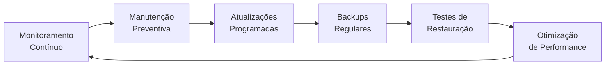
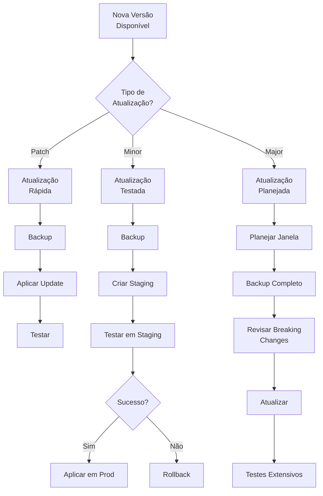

# Guia de Manutenção - BorgStack

## Visão Geral

Este guia apresenta as práticas recomendadas para manutenção contínua do BorgStack, garantindo alta disponibilidade, performance otimizada e operação confiável a longo prazo.

### Ciclo de Manutenção



### Frequência de Tarefas

| Tarefa | Frequência | Tempo Estimado | Prioridade |
|--------|-----------|----------------|------------|
| Verificar backups | Diário | 5 min | 🔴 Alta |
| Monitorar logs | Diário | 10 min | 🔴 Alta |
| Verificar espaço em disco | Semanal | 5 min | 🟡 Média |
| Atualizar imagens Docker | Mensal | 30-60 min | 🟡 Média |
| Testar restauração de backup | Mensal | 1-2 horas | 🔴 Alta |
| Rotacionar credenciais | Trimestral | 30 min | 🟡 Média |
| Revisar configuração | Trimestral | 1 hora | 🟢 Baixa |
| Auditoria de segurança | Semestral | 2-4 horas | 🔴 Alta |

---

## 1. Manutenção Preventiva

### 1.1. Checklist Diário (5 minutos)

**Execute automaticamente ou manualmente todo dia**:

```bash
#!/bin/bash
# Script: daily-check.sh

echo "=== BorgStack Daily Check - $(date) ==="

# 1. Status dos containers
echo -e "\n📦 Container Status:"
docker compose ps

# 2. Verificar backups Duplicati
echo -e "\n💾 Last Backup Check:"
docker compose exec duplicati ls -lh /backups/ | tail -5

# 3. Espaço em disco
echo -e "\n💿 Disk Space:"
df -h / | grep -v Filesystem

# 4. Uso de memória
echo -e "\n🧠 Memory Usage:"
free -h | grep Mem

# 5. Erros recentes (últimas 24h)
echo -e "\n🚨 Recent Errors:"
docker compose logs --since 24h | grep -i error | tail -10

# 6. Health status
echo -e "\n❤️  Health Status:"
docker ps --format "table {{.Names}}\t{{.Status}}" | grep -E "unhealthy|starting"

echo -e "\n✅ Daily check complete"
```

**Salvar e executar**:
```bash
chmod +x scripts/daily-check.sh
./scripts/daily-check.sh
```

**Automatizar via cron**:
```bash
# Editar crontab
crontab -e

# Adicionar linha (executa todo dia às 8h, salva resultado)
0 8 * * * /home/usuario/borgstack/scripts/daily-check.sh >> /var/log/borgstack-daily.log 2>&1
```

---

### 1.2. Checklist Semanal (15 minutos)

**Execute todo domingo**:

```bash
#!/bin/bash
# Script: weekly-check.sh

echo "=== BorgStack Weekly Check - $(date) ==="

# 1. Limpar logs antigos do Docker
echo -e "\n🧹 Cleaning old Docker logs:"
sudo find /var/lib/docker/containers/ -name "*.log" -mtime +7 -exec truncate -s 0 {} \;

# 2. Ver uso de disco por serviço
echo -e "\n📊 Docker Disk Usage:"
docker system df

# 3. Verificar imagens não utilizadas
echo -e "\n🗑️  Unused Images:"
docker images --filter "dangling=true"

# 4. Verificar volumes órfãos
echo -e "\n📦 Orphaned Volumes:"
docker volume ls --filter "dangling=true"

# 5. Estatísticas de uso de recursos (última semana)
echo -e "\n📈 Resource Usage Statistics:"
docker stats --no-stream | head -15

# 6. Verificar atualizações disponíveis
echo -e "\n🔄 Available Updates:"
docker compose pull --dry-run 2>&1 | grep "Pulling"

echo -e "\n✅ Weekly check complete"
```

**Automatizar via cron**:
```bash
# Executar todo domingo às 10h
0 10 * * 0 /home/usuario/borgstack/scripts/weekly-check.sh >> /var/log/borgstack-weekly.log 2>&1
```

---

### 1.3. Checklist Mensal (1-2 horas)

**Execute no primeiro domingo de cada mês**:

#### Tarefa 1: Limpar Dados Não Utilizados

```bash
# Parar containers temporariamente
docker compose stop

# Limpar cache do Docker (não remove volumes)
docker system prune -a -f

# Resultado esperado:
# Deleted Images: 15
# Total reclaimed space: 5.2GB

# Reiniciar
docker compose up -d
```

#### Tarefa 2: Verificar Integridade dos Backups

```bash
# 1. Verificar último backup
docker compose exec duplicati ls -lh /backups/ | tail -1

# 2. Testar restauração (selecionar arquivo aleatório)
# Acessar UI do Duplicati: https://duplicati.seudominio.com.br
# 1. Restore > Restore files
# 2. Selecionar backup recente
# 3. Escolher 1-2 arquivos pequenos
# 4. Restaurar para /tmp/test-restore
# 5. Verificar conteúdo

# 3. Verificar consistência do backup
docker compose exec duplicati duplicati-cli test file:///backups/latest.zip
```

#### Tarefa 3: Atualizar Imagens Docker

Ver seção 2.2 abaixo para procedimento completo.

#### Tarefa 4: Revisar Logs

```bash
# Exportar logs do último mês para análise
docker compose logs --since 30d > /tmp/borgstack-logs-$(date +%Y%m).txt

# Analisar erros
grep -i error /tmp/borgstack-logs-$(date +%Y%m).txt | sort | uniq -c | sort -nr | head -20

# Analisar warnings
grep -i warn /tmp/borgstack-logs-$(date +%Y%m).txt | sort | uniq -c | sort -nr | head -20
```

---

### 1.4. Checklist Trimestral (2-3 horas)

**Execute a cada 3 meses**:

#### Tarefa 1: Rotação de Credenciais

Ver seção 1.5 abaixo para procedimento completo.

#### Tarefa 2: Auditoria de Configuração

```bash
# 1. Revisar .env
nano .env

# Verificar:
# - Senhas fortes (mínimo 32 caracteres)
# - Variáveis obsoletas
# - Valores default não alterados

# 2. Revisar docker-compose.yml
nano docker-compose.yml

# Verificar:
# - Versões pinadas das imagens
# - Limites de recursos (mem_limit, cpus)
# - Health checks configurados
# - Redes corretas (internal/external)

# 3. Revisar configurações de serviços
ls -la config/*/

# Verificar mudanças inesperadas
git diff HEAD config/
```

#### Tarefa 3: Análise de Performance

```bash
# Ver métricas agregadas
docker stats --no-stream > /tmp/docker-stats-$(date +%Y%m%d).txt

# Analisar queries lentas no PostgreSQL
docker compose exec postgresql psql -U postgres -c "
  SELECT
    calls,
    mean_exec_time::int as avg_ms,
    total_exec_time::int as total_ms,
    query
  FROM pg_stat_statements
  ORDER BY mean_exec_time DESC
  LIMIT 10;
"

# Analisar cache hit rate do Redis
docker compose exec redis redis-cli INFO stats | grep -E "keyspace_(hits|misses)"
```

---

### 1.5. Rotação de Credenciais

**Executar a cada 90 dias (recomendado)**:

#### Passo 1: Gerar Novas Credenciais

```bash
# Backup do .env atual
cp .env .env.backup-$(date +%Y%m%d)

# Gerar novas senhas
./scripts/generate-passwords.sh

# Ou manualmente:
echo "Nova senha PostgreSQL: $(openssl rand -base64 32)"
echo "Nova senha Redis: $(openssl rand -base64 32)"
echo "Nova senha MongoDB: $(openssl rand -base64 32)"
```

#### Passo 2: Atualizar PostgreSQL

```bash
# 1. Conectar ao PostgreSQL
docker compose exec postgresql psql -U postgres

# 2. Alterar senha do usuário postgres
ALTER USER postgres WITH PASSWORD 'nova_senha_aqui';

# 3. Sair
\q

# 4. Atualizar .env
nano .env
# Editar: POSTGRES_PASSWORD=nova_senha_aqui

# 5. Recriar containers que usam PostgreSQL
docker compose up -d --force-recreate n8n chatwoot directus evolution
```

#### Passo 3: Atualizar Redis

```bash
# 1. Atualizar config/redis/redis.conf
nano config/redis/redis.conf

# Encontrar e editar:
requirepass nova_senha_redis

# 2. Atualizar .env
nano .env
# Editar: REDIS_PASSWORD=nova_senha_redis

# 3. Reiniciar Redis e dependentes
docker compose restart redis
docker compose restart n8n chatwoot directus lowcoder-api-service
```

#### Passo 4: Atualizar MongoDB

```bash
# 1. Conectar ao MongoDB
docker compose exec mongodb mongosh -u root -p senha_antiga

# 2. Alterar senha do root
use admin
db.changeUserPassword("root", "nova_senha_mongo")

# 3. Alterar senha do lowcoder_user
db.changeUserPassword("lowcoder_user", "nova_senha_lowcoder")

# 4. Sair
exit

# 5. Atualizar .env
nano .env
# Editar: MONGO_ROOT_PASSWORD=nova_senha_mongo
# Editar string de conexão do Lowcoder

# 6. Reiniciar Lowcoder
docker compose restart lowcoder-api-service lowcoder-node-service lowcoder-frontend
```

#### Passo 5: Rotacionar API Keys

```bash
# Chatwoot API Token
# 1. Acessar Chatwoot UI
# 2. Settings > Profile Settings > Access Token
# 3. Click "Regenerate"
# 4. Copiar novo token

# Atualizar em workflows n8n que usam Chatwoot
# E atualizar .env se armazenado lá

# Evolution API Key
# 1. Acessar painel da Evolution API
# 2. Gerar nova API key
# 3. Atualizar nos webhooks e workflows n8n

# n8n Webhook Auth
# Se usar autenticação em webhooks, regenerar tokens
```

#### Passo 6: Verificar Tudo Funcionando

```bash
# Testar conexões
./scripts/test-connections.sh

# Ou manualmente:
docker compose exec n8n wget -O- http://n8n:5678/healthz
docker compose exec chatwoot curl http://chatwoot:3000/health
docker compose exec directus curl http://directus:8055/server/health
```

---

## 2. Atualizações de Serviços

### 2.1. Estratégia de Atualização

**Filosofia**: Atualização conservadora com testes.



**Tipos de atualização**:
- **Patch** (1.0.0 → 1.0.1): Bug fixes, sem breaking changes
- **Minor** (1.0.0 → 1.1.0): Novas features, backward compatible
- **Major** (1.0.0 → 2.0.0): Breaking changes, requer planejamento

---

### 2.2. Procedimento de Atualização Segura

#### Passo 1: Verificar Atualizações Disponíveis

```bash
# Ver versões atuais
docker compose images

# Verificar atualizações disponíveis (não baixa)
docker compose pull --dry-run
```

#### Passo 2: Revisar Changelogs

```bash
# Para cada serviço com atualização, revisar:
# - n8n: https://github.com/n8n-io/n8n/releases
# - Chatwoot: https://github.com/chatwoot/chatwoot/releases
# - Directus: https://github.com/directus/directus/releases
# - PostgreSQL: https://www.postgresql.org/docs/18/release.html
# - Redis: https://github.com/redis/redis/releases

# Procurar por:
# - Breaking changes (BREAKING:, ⚠️)
# - Database migrations
# - Configuration changes
# - Deprecated features
```

#### Passo 3: Backup Completo

```bash
# 1. Parar serviços (exceto bancos de dados)
docker compose stop n8n chatwoot directus evolution lowcoder-api-service lowcoder-node-service lowcoder-frontend fileflows

# 2. Backup de bancos de dados
./scripts/backup-databases.sh

# Ou manualmente:
docker compose exec postgresql pg_dumpall -U postgres -c > /backups/postgres_all_$(date +%Y%m%d).sql
docker compose exec mongodb mongodump --archive=/backups/mongodb_all_$(date +%Y%m%d).archive --gzip
docker compose exec redis redis-cli SAVE

# 3. Backup de volumes
sudo tar -czf /backups/volumes_$(date +%Y%m%d).tar.gz -C /var/lib/docker/volumes/ \
  $(docker volume ls -q | grep borgstack | tr '\n' ' ')

# 4. Backup de configurações
tar -czf /backups/configs_$(date +%Y%m%d).tar.gz docker-compose.yml .env config/
```

#### Passo 4: Atualizar Imagens

```bash
# Baixar novas imagens
docker compose pull

# Resultado esperado:
# Pulling postgresql ... done
# Pulling redis ... done
# Pulling n8n ... done
# ...
```

#### Passo 5: Aplicar Atualizações

```bash
# Recriar containers com novas imagens
docker compose up -d --force-recreate

# Monitorar logs durante startup
docker compose logs -f
```

#### Passo 6: Verificar Saúde

```bash
# Aguardar todos ficarem healthy (pode levar 2-5 minutos)
watch docker compose ps

# Verificar logs de erro
docker compose logs --since 10m | grep -i error

# Testar acessos
curl -f https://n8n.seudominio.com.br/healthz
curl -f https://chatwoot.seudominio.com.br/health
curl -f https://directus.seudominio.com.br/server/health
```

#### Passo 7: Testes Funcionais

```bash
# Checklist manual:
# [ ] Acessar cada serviço via browser
# [ ] Fazer login
# [ ] Executar ação básica (ex: criar workflow no n8n)
# [ ] Verificar integrações funcionando (WhatsApp → Chatwoot)
# [ ] Verificar backups agendados rodando
```

#### Passo 8: Rollback (se necessário)

```bash
# Se atualização falhar:

# 1. Parar tudo
docker compose down

# 2. Editar docker-compose.yml para versões anteriores
nano docker-compose.yml

# Exemplo - reverter versão do n8n:
  n8n:
    image: n8nio/n8n:1.62.3  # Versão anterior (era 1.63.0)

# 3. Restaurar backup de banco de dados (se houve migration)
docker compose up -d postgresql
docker compose exec -T postgresql psql -U postgres < /backups/postgres_all_20251007.sql

# 4. Recriar containers
docker compose up -d

# 5. Verificar
docker compose ps
```

---

### 2.3. Atualização Individual de Serviço

Se quiser atualizar apenas um serviço:

```bash
# Exemplo: Atualizar apenas n8n

# 1. Backup
docker compose exec postgresql pg_dump -U postgres n8n_db > /backups/n8n_db_$(date +%Y%m%d).sql

# 2. Editar docker-compose.yml
nano docker-compose.yml

# Mudar versão do n8n:
  n8n:
    image: n8nio/n8n:1.63.0  # Nova versão

# 3. Aplicar
docker compose pull n8n
docker compose up -d --force-recreate n8n

# 4. Verificar
docker compose logs -f n8n
```

---

### 2.4. Solução de Problemas em Atualizações

Esta seção documenta os problemas mais comuns que podem ocorrer durante atualizações de serviços e suas soluções.

#### Issue 1: Falha no Health Check Após Atualização

**Sintomas:**
- Container em loop de restart contínuo
- Status do container mostra "unhealthy" ou "restarting"
- Docker logs mostram erros de inicialização

**Diagnóstico:**
```bash
# Verificar status do container
docker compose ps SERVICE_NAME

# Ver logs recentes
docker compose logs SERVICE_NAME --tail=100

# Monitorar logs em tempo real
docker compose logs -f SERVICE_NAME
```

**Soluções Comuns:**

1. **Aguardar mais tempo** - Algumas migrações de banco de dados demoram:
   ```bash
   # Aguardar até 10 minutos para migrations grandes
   watch docker compose ps SERVICE_NAME
   ```

2. **Verificar variáveis de ambiente** - Configurações podem ter mudado:
   ```bash
   # Comparar .env com .env.example
   diff .env .env.example

   # Verificar variáveis do serviço
   docker compose config | grep -A 20 "SERVICE_NAME:"
   ```

3. **Verificar conectividade com bancos de dados:**
   ```bash
   # Testar conexão PostgreSQL
   docker compose exec SERVICE_NAME nc -zv postgresql 5432

   # Testar conexão Redis
   docker compose exec SERVICE_NAME nc -zv redis 6379

   # Testar conexão MongoDB (se aplicável)
   docker compose exec SERVICE_NAME nc -zv mongodb 27017
   ```

4. **Rollback para versão anterior:**
   ```bash
   # Ver script de rollback
   ./scripts/update-service.sh --help

   # Ou manual:
   # 1. Editar docker-compose.yml (reverter versão)
   # 2. Restaurar backup de banco de dados
   # 3. Recriar container
   docker compose up -d --force-recreate SERVICE_NAME
   ```

**Exemplo Prático:** n8n 1.62 → 1.63 migration delay

Ao atualizar n8n de 1.62.x para 1.63.0, a migration de banco de dados pode demorar 3-5 minutos em instalações com muitos workflows. O container ficará unhealthy durante este período, mas eventualmente completará com sucesso.

```bash
# Verificar progresso da migration nos logs
docker compose logs n8n | grep -i migration
```

---

#### Issue 2: Database Migration Failure

**Sintomas:**
- Container para com erro de migration
- Logs mostram "migration failed", "schema error", ou "database locked"
- Serviço não inicia após atualização

**Diagnóstico:**
```bash
# Buscar erros de migration nos logs
docker compose logs SERVICE_NAME | grep -i migration

# Verificar espaço em disco (migrations precisam de espaço temporário)
df -h

# Verificar conexão com banco de dados
docker compose exec postgresql pg_isready -U postgres
```

**Soluções Comuns:**

1. **Verificar espaço em disco:**
   ```bash
   # Migrations precisam de espaço temporário
   df -h /

   # Liberar espaço se necessário
   docker system prune -a
   ```

2. **Verificar permissões de banco de dados:**
   ```bash
   # Conectar ao PostgreSQL
   docker compose exec postgresql psql -U postgres

   # Verificar permissões do usuário
   \du

   # Garantir que usuário tem permissões adequadas
   GRANT ALL PRIVILEGES ON DATABASE service_db TO service_user;
   ```

3. **Restaurar backup e tentar novamente:**
   ```bash
   # Parar serviço
   docker compose stop SERVICE_NAME

   # Restaurar banco de dados
   docker compose exec -T postgresql psql -U postgres service_db < /backups/service_db_backup.sql

   # Reiniciar serviço
   docker compose up -d SERVICE_NAME
   ```

4. **Consultar changelog para migrations problemáticas:**
   ```bash
   # Exemplo para n8n:
   # Visitar: https://github.com/n8n-io/n8n/releases
   # Procurar por "migration" ou "database" nas release notes
   ```

**Exemplo Prático:** Chatwoot database schema changes

Chatwoot v3.x → v4.x inclui migrations significativas de schema. Se a migration falhar:

```bash
# 1. Verificar log específico da migration
docker compose logs chatwoot | grep "migrating"

# 2. Se migration travou, restaurar backup
docker compose stop chatwoot
docker compose exec -T postgresql psql -U postgres chatwoot_db < /backups/chatwoot_db.sql

# 3. Tentar novamente com mais memória (editar docker-compose.yml)
  chatwoot:
    mem_limit: 4g  # Aumentar de 2g

# 4. Reiniciar
docker compose up -d chatwoot
```

---

#### Issue 3: Breaking Changes em API

**Sintomas:**
- Integrações param de funcionar após update
- Workflows n8n retornam erros 400/500
- Webhooks não disparam mais
- Formato de resposta da API mudou

**Diagnóstico:**
```bash
# Verificar logs de erros de API
docker compose logs SERVICE_NAME | grep -E "40[0-9]|50[0-9]"

# Testar endpoint manualmente
curl -X GET https://SERVICE.seudominio.com.br/api/endpoint

# Revisar changelog para "BREAKING CHANGE"
# Visitar página de releases do serviço
```

**Soluções Comuns:**

1. **Atualizar workflows n8n que usam API alterada:**
   ```bash
   # Acessar n8n UI
   # 1. Abrir workflow afetado
   # 2. Editar nó que usa a API
   # 3. Atualizar formato de requisição/resposta conforme nova versão
   # 4. Testar workflow
   # 5. Salvar e reativar
   ```

2. **Atualizar webhooks com novos formatos:**
   ```bash
   # Exemplo: Evolution API v2.0 → v2.2
   # Formato antigo:
   {
     "event": "messages.upsert",
     "instance": "instance1",
     "data": {...}
   }

   # Formato novo (v2.2):
   {
     "event": "MESSAGES_UPSERT",
     "instance": {"name": "instance1"},
     "data": {...}
   }

   # Atualizar código que processa webhook para novo formato
   ```

3. **Ajustar configurações conforme documentação:**
   ```bash
   # Revisar documentação da nova versão
   # Atualizar .env se necessário
   nano .env

   # Reiniciar serviço após mudanças
   docker compose restart SERVICE_NAME
   ```

**Exemplo Prático:** Evolution API v2.0 → v2.2 webhook format change

A Evolution API mudou o formato dos webhooks entre v2.0 e v2.2:

```bash
# Identificar workflows n8n que usam webhooks da Evolution
# 1. Acessar n8n UI
# 2. Buscar por workflows com nó "Webhook"
# 3. Verificar URL que inclui Evolution API

# Atualizar workflow:
# 1. Adicionar nó "Function" após webhook
# 2. Transformar formato antigo para novo:
const oldFormat = $input.item.json;
const newFormat = {
  event: oldFormat.event.toUpperCase().replace('.', '_'),
  instance: {name: oldFormat.instance},
  data: oldFormat.data
};
return {json: newFormat};

# 3. Salvar e testar
```

---

#### Issue 4: Incompatibilidade de Versão entre Serviços

**Sintomas:**
- Serviços não conseguem se comunicar
- Erros de "version mismatch" ou "unsupported version"
- Container inicia mas falha ao conectar com dependências

**Diagnóstico:**
```bash
# Verificar versões de todos os serviços
docker compose images

# Verificar conectividade entre serviços
docker compose exec SERVICE_NAME nc -zv postgresql 5432
docker compose exec SERVICE_NAME nc -zv redis 6379

# Verificar logs para erros de versão
docker compose logs SERVICE_NAME | grep -i "version"
```

**Soluções Comuns:**

1. **Atualizar serviços em ordem: infraestrutura primeiro, aplicações depois**

   Ordem correta de atualização:
   ```bash
   # 1. PostgreSQL
   ./scripts/update-service.sh postgresql 18.1

   # 2. MongoDB
   ./scripts/update-service.sh mongodb 7.0

   # 3. Redis
   ./scripts/update-service.sh redis 8.2

   # 4. Agora aplicações podem ser atualizadas
   ./scripts/update-service.sh n8n 1.113.0
   ./scripts/update-service.sh chatwoot 4.7.0
   ```

2. **Consultar matriz de compatibilidade nos changelogs:**
   ```bash
   # Exemplo: n8n requer PostgreSQL >= 13
   # Verificar requisitos na documentação:
   # https://docs.n8n.io/hosting/installation/server-setups/

   # Se PostgreSQL está muito antigo, atualizar primeiro
   ```

3. **Reverter para versões compatíveis:**
   ```bash
   # Se atualizou n8n mas PostgreSQL é antigo:

   # Opção 1: Reverter n8n
   nano docker-compose.yml  # Voltar versão do n8n
   docker compose up -d --force-recreate n8n

   # Opção 2: Atualizar PostgreSQL (requer mais cuidado)
   ./scripts/update-service.sh postgresql 18.0
   ```

**Exemplo Prático:** n8n requer PostgreSQL >= 13

n8n 1.x requer PostgreSQL versão 13 ou superior. Se você tentar atualizar n8n mas ainda usa PostgreSQL 12:

```bash
# Erro típico nos logs:
# PostgreSQL version 12.x is not supported, minimum version is 13.0

# Solução:
# 1. Fazer backup completo
./scripts/backup-now.sh

# 2. Atualizar PostgreSQL primeiro
./scripts/update-service.sh postgresql 18.0

# 3. Verificar que PostgreSQL está funcionando
docker compose ps postgresql
docker compose exec postgresql psql -U postgres -c "SELECT version();"

# 4. Agora atualizar n8n
./scripts/update-service.sh n8n 1.113.0
```

---

#### Issue 5: Perda de Configuração Após Update

**Sintomas:**
- Configurações resetadas para valores padrão
- Credenciais não funcionam mais (precisa fazer login novamente)
- Workflows, aplicativos ou dados desapareceram

**Diagnóstico:**
```bash
# Verificar se volumes não foram removidos
docker volume ls | grep borgstack

# Verificar mapeamento de volumes do serviço
docker compose config | grep -A 10 "SERVICE_NAME:" | grep volumes

# Verificar se dados existem no volume
docker run --rm -v borgstack_SERVICE_data:/data alpine ls -la /data
```

**Soluções Comuns:**

1. **Verificar se volumes não foram removidos:**
   ```bash
   # ❌ NUNCA use "docker compose down -v" (remove volumes!)
   # ✅ Use "docker compose down" (preserva volumes)

   # Se volumes foram removidos acidentalmente:
   # 1. Verificar backup
   ls -lh /backups/

   # 2. Restaurar volumes do backup
   ./scripts/restore.sh
   ```

2. **Restaurar configuração do backup:**
   ```bash
   # Listar backups disponíveis
   ls -lh backups/pre-update/

   # Identificar backup correto (antes do update)
   ls -lh backups/pre-update/ | grep SERVICE_NAME

   # Restaurar banco de dados
   docker compose exec -T postgresql psql -U postgres SERVICE_db < backups/pre-update/SERVICE_20251007_db.sql

   # Reiniciar serviço
   docker compose restart SERVICE_NAME
   ```

3. **Verificar se paths de volumes mudaram no docker-compose.yml:**
   ```bash
   # Comparar docker-compose.yml atual com backup
   diff docker-compose.yml docker-compose.yml.backup_20251007

   # Se paths mudaram, corrigir:
   nano docker-compose.yml

   # Exemplo de correção:
   # Antigo: ./data/n8n:/home/node/.n8n
   # Novo:   n8n_data:/home/node/.n8n (named volume)

   # Recriar container com paths corretos
   docker compose up -d --force-recreate SERVICE_NAME
   ```

**Exemplo Prático:** Volume path change breaking configs

Se você mudou de bind mount para named volume:

```bash
# Cenário: Antes usava bind mount
  n8n:
    volumes:
      - ./data/n8n:/home/node/.n8n

# Depois mudou para named volume
  n8n:
    volumes:
      - borgstack_n8n_data:/home/node/.n8n

# Problema: Dados ficaram no ./data/n8n mas container usa volume vazio

# Solução: Migrar dados
# 1. Parar serviço
docker compose stop n8n

# 2. Copiar dados do bind mount para volume
docker run --rm \
  -v $(pwd)/data/n8n:/source:ro \
  -v borgstack_n8n_data:/dest \
  alpine cp -a /source/. /dest/

# 3. Reiniciar serviço
docker compose up -d n8n
```

---

#### Issue 6: Imagem Docker Não Disponível

**Sintomas:**
- `docker compose pull` falha com erro "manifest unknown"
- Erro "image not found" ou "tag does not exist"
- Pull fica travado sem progresso

**Diagnóstico:**
```bash
# Verificar erro exato
docker compose pull SERVICE_NAME

# Verificar se tag existe no Docker Hub
# Visitar: https://hub.docker.com/r/REPOSITORY/tags

# Exemplo:
# n8n: https://hub.docker.com/r/n8nio/n8n/tags
# chatwoot: https://hub.docker.com/r/chatwoot/chatwoot/tags
```

**Soluções Comuns:**

1. **Verificar typo no nome da versão:**
   ```bash
   # Versões podem ter formatos diferentes:
   # - Com "v": v1.63.0 (comum em GitHub releases)
   # - Sem "v": 1.63.0 (comum em Docker Hub)

   # Verificar formato correto no Docker Hub
   # Corrigir docker-compose.yml
   nano docker-compose.yml

   # Exemplo de correção:
   # ❌ Errado: image: n8nio/n8n:v1.63.0
   # ✅ Correto: image: n8nio/n8n:1.63.0
   ```

2. **Verificar se versão foi deprecated/removed:**
   ```bash
   # Algumas imagens antigas são removidas do Docker Hub
   # Verificar se versão ainda existe

   # Se removida, usar versão alternativa
   # Exemplo: Se 1.63.0 foi removida, usar 1.63.1 ou 1.64.0
   ```

3. **Usar versão "latest" temporariamente:**
   ```bash
   # ⚠️  Não recomendado para produção, mas útil para debug

   # Testar com "latest"
   nano docker-compose.yml
   # Mudar: image: n8nio/n8n:latest

   # Pull
   docker compose pull n8n

   # Verificar versão que foi baixada
   docker compose images n8n

   # Pinar versão específica baseado no latest
   # Exemplo: latest = 1.65.3
   # Editar docker-compose.yml: image: n8nio/n8n:1.65.3
   ```

**Exemplo Prático:** Tag versioning differences between services

Diferentes serviços usam diferentes convenções de tags:

```bash
# n8n: Sem "v"
✅ n8nio/n8n:1.112.6
❌ n8nio/n8n:v1.112.6

# Chatwoot: Com "v"
✅ chatwoot/chatwoot:v4.6.0-ce
❌ chatwoot/chatwoot:4.6.0-ce

# Evolution API: Com "v"
✅ atendai/evolution-api:v2.2.3
❌ atendai/evolution-api:2.2.3

# PostgreSQL: Sem "v", usa apenas número
✅ pgvector/pgvector:pg18
❌ pgvector/pgvector:v18

# Sempre verificar no Docker Hub!
```

---

#### Tabela de Referência Rápida

| Erro | Serviço Comum | Comando Diagnóstico | Tempo Médio Resolução |
|------|---------------|---------------------|----------------------|
| Health check fail | Qualquer | `docker compose logs SERVICE` | 5-15 min |
| Migration timeout | n8n, Chatwoot, Directus | `docker compose logs SERVICE \| grep migration` | 10-30 min |
| API incompatibilidade | n8n, Evolution API | Revisar changelog | 15-60 min |
| Version mismatch | PostgreSQL, MongoDB, Redis | `docker compose images` | 10-20 min |
| Volume missing | Qualquer | `docker volume ls \| grep borgstack` | 5-10 min (restaurar backup) |
| Image not found | Qualquer | Verificar Docker Hub tags | 2-5 min |

---

### 2.5. Estratégia de Notificação de Atualizações

Esta seção documenta como monitorar e ser notificado sobre atualizações disponíveis para os serviços do BorgStack.

#### Estratégia Manual

**Comando rápido:**
```bash
# Verificar se há atualizações disponíveis
docker compose pull --dry-run 2>&1 | grep "Pulling"
```

Este comando simula o pull de novas imagens sem realmente baixá-las, mostrando quais serviços têm atualizações disponíveis.

**Frequência recomendada:** Semanal (todo domingo)

**Interpretação do output:**
```bash
# Se há atualizações:
[+] Pulling 14/14
 ✔ n8n Pulling                                  2.1s
 ✔ chatwoot Pulling                             1.8s
 ✔ directus Pulling                             1.5s
# Significa que n8n, chatwoot e directus têm novas versões disponíveis

# Se não há atualizações:
[+] Running 14/14
 ✔ n8n Pulled                                   0.0s
 ✔ chatwoot Pulled                              0.0s
# Significa que todos já estão atualizados
```

**Integração com verificação semanal:**

Adicione ao script `scripts/weekly-check.sh`:
```bash
# Adicionar ao final do arquivo
echo -e "\n🔄 Verificando Atualizações Disponíveis:"
docker compose pull --dry-run 2>&1 | grep -E "Pulling|Pulled"
```

---

#### Estratégia Automatizada com Script

**Script de verificação automática:**

O BorgStack inclui o script `scripts/check-updates.sh` que:
- Verifica atualizações para todos os serviços
- Consulta API do Docker Hub para versões mais recentes
- Identifica tipo de atualização (major/minor/patch)
- Gera relatório formatado
- Suporta notificação por email (opcional)

**Uso básico:**
```bash
# Verificar atualizações
./scripts/check-updates.sh

# Verificar e enviar email se houver atualizações
./scripts/check-updates.sh --email
```

**Output exemplo:**
```
=========================================
BorgStack Update Availability Check
2025-10-08 10:30:00
=========================================

SERVICE                   CURRENT              LATEST               UPDATE
-----------------------------------------------------------------------------------------
n8n                       1.112.6              1.113.0              MINOR
chatwoot                  v4.6.0-ce            v4.7.0-ce            MINOR
directus                  11                   11.1                 MINOR
evolution                 v2.2.3               v2.2.3               up-to-date
postgresql                pg18                 pg18                 up-to-date
mongodb                   7.0                  7.0                  up-to-date
redis                     8.2-alpine           8.2-alpine           up-to-date
caddy                     2.10-alpine          2.11-alpine          MINOR
seaweedfs                 3.97                 4.0                  MAJOR
lowcoder-api-service      2.7.4                2.7.4                up-to-date
lowcoder-node-service     2.7.4                2.7.4                up-to-date
lowcoder-frontend         2.7.4                2.7.4                up-to-date
duplicati                 2.1.1.102            2.1.1.102            up-to-date
fileflows                 25.09                25.10                MINOR

=========================================
Total services: 14
Updates available: 5
Check failures: 0
=========================================

To update a service:
  ./scripts/update-service.sh SERVICE_NAME NEW_VERSION

Example:
  ./scripts/update-service.sh n8n 1.113.0
```

**Docker Hub API Authentication (Opcional):**

Por padrão, o Docker Hub API tem limite de 100 requisições / 6 horas. Para aumentar o limite:

1. Criar token de acesso no Docker Hub:
   - Acessar: https://hub.docker.com/settings/security
   - Clicar em "New Access Token"
   - Nome: "BorgStack Update Checker"
   - Permissions: "Public Repo Read-only"
   - Copiar token gerado

2. Configurar token no sistema:
   ```bash
   # Adicionar ao .env
   echo "DOCKER_HUB_TOKEN=dckr_pat_xxxxxxxxxxxx" >> .env

   # Ou exportar temporariamente
   export DOCKER_HUB_TOKEN="dckr_pat_xxxxxxxxxxxx"

   # Usar com o script
   DOCKER_HUB_TOKEN="dckr_pat_xxxxxxxxxxxx" ./scripts/check-updates.sh
   ```

**Rate Limiting e Fallback:**

O script implementa:
- Exponential backoff (2s, 4s, 8s) para retries
- Fallback para `docker compose pull --dry-run` se API falhar
- Mensagens claras quando rate limit é atingido

**Notificação por Email:**

Configure email para receber alertas automáticos:

```bash
# 1. Instalar mailutils
sudo apt-get install mailutils

# 2. Configurar email no .env
echo "BORGSTACK_ADMIN_EMAIL=admin@seudominio.com.br" >> .env

# 3. Testar notificação
./scripts/check-updates.sh --email
```

**Agendamento via Cron:**

Automatize a verificação semanal:

```bash
# Editar crontab
crontab -e

# Adicionar linha: toda segunda-feira às 9h
0 9 * * 1 cd /home/usuario/borgstack && ./scripts/check-updates.sh --email >> /var/log/borgstack-update-check.log 2>&1
```

Isso enviará email toda segunda-feira se houver atualizações disponíveis.

---

#### Monitoramento de Changelogs

**Tabela de Changelogs dos Serviços:**

| Serviço | Changelog URL | RSS Feed | Frequência de Updates |
|---------|--------------|----------|----------------------|
| **n8n** | https://github.com/n8n-io/n8n/releases | ✅ Yes | Semanal |
| **Chatwoot** | https://github.com/chatwoot/chatwoot/releases | ✅ Yes | Quinzenal |
| **Directus** | https://github.com/directus/directus/releases | ✅ Yes | Mensal |
| **Evolution API** | https://github.com/EvolutionAPI/evolution-api/releases | ✅ Yes | Mensal |
| **PostgreSQL** | https://www.postgresql.org/docs/release/ | ✅ Yes | Trimestral (major) |
| **MongoDB** | https://www.mongodb.com/docs/manual/release-notes/ | ✅ Yes | Trimestral |
| **Redis** | https://github.com/redis/redis/releases | ✅ Yes | Semestral |
| **Caddy** | https://github.com/caddyserver/caddy/releases | ✅ Yes | Mensal |
| **SeaweedFS** | https://github.com/seaweedfs/seaweedfs/releases | ✅ Yes | Mensal |
| **Lowcoder** | https://github.com/lowcoder-org/lowcoder/releases | ✅ Yes | Mensal |
| **Duplicati** | https://github.com/duplicati/duplicati/releases | ✅ Yes | Trimestral |
| **FileFlows** | https://github.com/revenz/FileFlows/releases | ✅ Yes | Mensal |

**Recomendação:** Assinar RSS feeds dos serviços mais críticos (n8n, Chatwoot, PostgreSQL).

**Como usar RSS feeds:**
1. Usar leitor RSS como Feedly, Inoreader, ou Thunderbird
2. Adicionar URLs dos changelogs
3. Configurar notificações para novas releases

---

#### Estratégia de Watch no GitHub

**Assistir repositórios com "Releases only":**

Para receber notificações diretas no GitHub quando novas versões são lançadas:

1. Acessar repositório do serviço (ex: https://github.com/n8n-io/n8n)
2. Clicar em "Watch" (topo direito)
3. Selecionar "Custom" > "Releases"
4. Clicar "Apply"

**Serviços prioritários para watch:**
- ✅ n8n (atualizações frequentes, breaking changes ocasionais)
- ✅ Chatwoot (features importantes frequentemente)
- ✅ Evolution API (WhatsApp API changes críticos)
- ⚠️  PostgreSQL (apenas major versions)

**Filtros de notificação:**

Configure filtros no email para não perder releases importantes:
```
De: notifications@github.com
Assunto: [n8n-io/n8n] Release
Label: Important
```

---

#### Monitoramento de Segurança

**Mailing Lists de Segurança:**

Inscreva-se em listas de anúncios de segurança:

1. **PostgreSQL Security:**
   - Lista: https://www.postgresql.org/support/security/
   - Inscrição: https://lists.postgresql.org/
   - Lista: pgsql-announce@lists.postgresql.org

2. **Redis Security:**
   - GitHub Security Advisories
   - URL: https://github.com/redis/redis/security/advisories
   - Habilitar notificações no GitHub

3. **Docker Security:**
   - Blog: https://www.docker.com/blog/
   - Security: https://docs.docker.com/engine/security/
   - CVEs: https://scout.docker.com/

4. **Ubuntu Security:**
   - USN (Ubuntu Security Notices)
   - URL: https://ubuntu.com/security/notices
   - RSS: https://ubuntu.com/security/notices/rss.xml

**Monitoramento de CVEs:**

Configure alertas para CVEs críticos:

```bash
# Verificar CVEs conhecidas em imagens
docker scout cves n8nio/n8n:1.112.6

# Verificar recomendações de atualização
docker scout recommendations n8nio/n8n:1.112.6
```

**Processo para Updates de Segurança Emergenciais:**

Quando um CVE crítico é anunciado:

1. **Avaliar Impacto:**
   ```bash
   # Verificar se serviço está afetado
   docker scout cves IMAGE:TAG | grep CVE-XXXX-XXXXX
   ```

2. **Backup Rápido:**
   ```bash
   ./scripts/backup-now.sh
   ```

3. **Aplicar Update Imediatamente:**
   ```bash
   # Pular staging para security patches críticos
   ./scripts/update-service.sh SERVICE NEW_VERSION
   ```

4. **Verificar Funcionalidade:**
   ```bash
   # Teste rápido de smoke test
   docker compose ps
   curl -f https://SERVICE.seudominio.com.br/health
   ```

5. **Documentar:**
   ```bash
   # Registrar em changelog
   echo "$(date): Emergency security update - SERVICE $OLD_VERSION -> $NEW_VERSION (CVE-XXXX-XXXXX)" >> CHANGELOG.md
   ```

**Recomendação:** Updates de segurança críticos (CVSS >= 9.0) devem ser aplicados dentro de 24-48 horas.

---

### 2.6. Boas Práticas de Atualização

Esta seção documenta as melhores práticas para realizar atualizações de forma segura e eficiente no BorgStack.

#### Best Practice 1: Estratégia de Version Pinning

**Por que version pinning é importante:**

Version pinning (fixar versões exatas) garante deployments reproduzíveis e evita quebras inesperadas.

**Exemplo de version pinning correto:**

```yaml
# ❌ ERRADO: Nunca use "latest"
services:
  n8n:
    image: n8nio/n8n:latest  # Pode quebrar a qualquer momento!

# ✅ CORRETO: Sempre fixe versão exata
services:
  n8n:
    image: n8nio/n8n:1.112.6  # Versão específica, controlada
```

**Rationale:**
- **Reproduzibilidade:** Mesmo comando sempre produz mesmo resultado
- **Previsibilidade:** Você controla quando atualizar, não o Docker Hub
- **Segurança:** Evita atualizações automáticas que podem introduzir vulnerabilidades
- **Debugging:** Fácil identificar qual versão está causando problema

**Workflow de atualização com version pinning:**

```bash
# 1. Testar nova versão em staging
nano docker-compose.yml  # Mudar para nova versão
docker compose pull n8n
docker compose up -d --force-recreate n8n

# 2. Validar funcionalidade
./scripts/test-connections.sh
curl -f https://n8n-staging.seudominio.com.br/healthz

# 3. Se OK, commitar versão nova
git add docker-compose.yml
git commit -m "Update n8n from 1.112.6 to 1.113.0"

# 4. Aplicar em produção
git push
ssh prod "cd borgstack && git pull && docker compose up -d --force-recreate n8n"
```

**Referência:** Para mais detalhes sobre version pinning, consulte [docs/architecture/coding-standards.md](../architecture/coding-standards.md).

---

#### Best Practice 2: Ordem Correta de Atualização

**Regra de ouro:** Sempre atualize infraestrutura antes de aplicações.

**Ordem recomendada:**

```
1. PostgreSQL (banco de dados compartilhado)
   ↓
2. MongoDB (banco do Lowcoder)
   ↓
3. Redis (cache/fila compartilhado)
   ↓
4. SeaweedFS (object storage compartilhado)
   ↓
5. Caddy (reverse proxy)
   ↓
6. Aplicações (n8n, Chatwoot, Directus, etc.)
```

**Exemplo prático:**

```bash
# ❌ ERRADO: Atualizar n8n sem atualizar PostgreSQL antes
./scripts/update-service.sh n8n 1.113.0  # Pode falhar se requer PostgreSQL 14+

# ✅ CORRETO: Atualizar PostgreSQL primeiro
./scripts/update-service.sh postgresql 18.1
./scripts/update-service.sh n8n 1.113.0  # Agora sim!
```

**Rationale:**
- Aplicações dependem de features específicas da infraestrutura
- Atualizar infraestrutura primeiro garante compatibilidade
- Evita cascata de falhas
- Facilita rollback (infraestrutura mais estável)

**Matriz de dependências:**

| Aplicação | Depende de | Ordem de Atualização |
|-----------|------------|---------------------|
| n8n | PostgreSQL, Redis | 6º |
| Chatwoot | PostgreSQL, Redis | 6º |
| Directus | PostgreSQL, Redis, SeaweedFS | 6º |
| Evolution API | PostgreSQL, Redis | 6º |
| Lowcoder | MongoDB, Redis | 6º |
| FileFlows | SeaweedFS | 6º |
| Duplicati | SeaweedFS | 6º |

---

#### Best Practice 3: Backup Antes de CADA Atualização

**Regra absoluta:** Nunca atualize sem backup recente.

**Backup mínimo (patches e minor updates):**
```bash
# Backup do banco de dados do serviço
docker compose exec postgresql pg_dump -U postgres n8n_db > /backups/n8n_db_$(date +%Y%m%d).sql

# Backup do docker-compose.yml
cp docker-compose.yml docker-compose.yml.backup_$(date +%Y%m%d)

# Backup do .env
cp .env .env.backup_$(date +%Y%m%d)
```

**Backup completo (major updates):**
```bash
# Script automatizado
./scripts/backup-now.sh

# Ou manual
docker compose exec postgresql pg_dumpall -U postgres -c > /backups/postgres_all_$(date +%Y%m%d).sql
docker compose exec mongodb mongodump --archive=/backups/mongodb_all_$(date +%Y%m%d).archive --gzip
sudo tar -czf /backups/volumes_$(date +%Y%m%d).tar.gz -C /var/lib/docker/volumes/ $(docker volume ls -q | grep borgstack)
```

**Referência:** Procedimento completo de backup documentado em [seção 2.2 passo 3](#22-procedimento-de-atualização-segura).

---

#### Best Practice 4: Testar em Staging Primeiro

**Regra para minor e major updates:** Sempre teste antes de aplicar em produção.

**Setup de ambiente de staging:**

```bash
# 1. Criar docker-compose.staging.yml
cat > docker-compose.staging.yml << 'EOF'
# Override para staging
services:
  n8n:
    environment:
      - N8N_HOST=n8n-staging.seudominio.com.br
    ports:
      - "5679:5678"  # Porta diferente

  chatwoot:
    environment:
      - FRONTEND_URL=https://chatwoot-staging.seudominio.com.br
    ports:
      - "3001:3000"  # Porta diferente
EOF

# 2. Subir ambiente de staging
docker compose -f docker-compose.yml -f docker-compose.staging.yml up -d

# 3. Testar update em staging
nano docker-compose.staging.yml  # Mudar versão
docker compose -f docker-compose.yml -f docker-compose.staging.yml up -d --force-recreate n8n

# 4. Validar
./scripts/test-connections.sh
```

**Checklist de testes em staging:**
- ✅ Serviço inicia sem erros
- ✅ Health checks passam
- ✅ Login funciona
- ✅ Workflows/funcionalidades chave executam com sucesso
- ✅ Integrações entre serviços funcionam
- ✅ Performance aceitável (não há degradação significativa)

**Quando pular staging:**
- Patch updates com changelog verificado (ex: 1.112.6 → 1.112.7)
- Security patches críticos (CVE de alta severidade)
- Hotfixes para bugs críticos em produção

---

#### Best Practice 5: Janela de Manutenção para Major Updates

**Regra:** Major version updates (ex: n8n 1.x → 2.x) requerem planejamento.

**Planejamento de janela de manutenção:**

1. **Escolher horário de baixo tráfego:**
   ```bash
   # Analisar logs de acesso para identificar horário mais quieto
   docker compose logs caddy --since 7d | grep -o "[0-9]\{2\}:[0-9]\{2\}" | cut -d: -f1 | sort | uniq -c | sort -n

   # Típico: Domingo 2h-4h AM
   ```

2. **Notificar usuários com antecedência:**
   ```
   Assunto: Manutenção Programada - BorgStack

   Prezados,

   Realizaremos manutenção no BorgStack:
   - Data: Domingo, 15/10/2025
   - Horário: 02:00 - 04:00 (horário de Brasília)
   - Serviços afetados: n8n, Chatwoot, Directus
   - Indisponibilidade esperada: 30-60 minutos

   Recomendamos salvar trabalhos em andamento antes deste horário.

   Att,
   Equipe Técnica
   ```

3. **Preparar rollback plan:**
   ```bash
   # Documentar passos de rollback ANTES de começar
   echo "Rollback plan for n8n 1.x -> 2.x:" > /tmp/rollback-plan.txt
   echo "1. docker compose stop n8n" >> /tmp/rollback-plan.txt
   echo "2. nano docker-compose.yml # Reverter para image: n8nio/n8n:1.112.6" >> /tmp/rollback-plan.txt
   echo "3. docker compose exec -T postgresql psql -U postgres n8n_db < /backups/n8n_db_20251015.sql" >> /tmp/rollback-plan.txt
   echo "4. docker compose up -d n8n" >> /tmp/rollback-plan.txt
   ```

4. **Executar update durante janela:**
   ```bash
   # Começar às 02:00 sharp
   ./scripts/update-service.sh n8n 2.0.0

   # Monitorar atentamente
   watch docker compose ps
   docker compose logs -f n8n
   ```

5. **Validar pós-update:**
   ```bash
   # Testes funcionais completos
   ./scripts/test-all-services.sh

   # Notificar usuários quando completo
   ```

---

#### Best Practice 6: Ler Changelogs Minuciosamente

**Regra:** Sempre leia changelog COMPLETO antes de atualizar.

**O que procurar no changelog:**

```bash
# Buscar palavras-chave críticas:
curl -s https://api.github.com/repos/n8n-io/n8n/releases/latest | \
  jq -r '.body' | \
  grep -iE "BREAKING|MIGRATION|DEPRECATED|SECURITY|CVE" --color
```

**Checklist de análise de changelog:**

1. **BREAKING CHANGES:**
   - ⚠️  Identifique mudanças incompatíveis
   - 📝 Liste workflows/configurações que precisam ajuste
   - ⏱️  Estime tempo necessário para adaptações

2. **MIGRATIONS:**
   - 📊 Verifique se há migrations de banco de dados
   - ⏱️  Estime tempo de migration (importante para downtime)
   - 💾 Confirme que backup está OK

3. **DEPRECATED:**
   - 🔍 Identifique features que serão removidas
   - 📅 Planeje migração antes que sejam removidas
   - 📝 Documente impacto em workflows existentes

4. **SECURITY:**
   - 🔒 Priorize updates com fixes de segurança
   - 🎯 Verifique CVE score (CVSS >= 7.0 é alta prioridade)
   - ⚡ Aplique patches de segurança críticos rapidamente

**Exemplo de análise:**

```
# Changelog do n8n 1.63.0:

## Breaking Changes
- Webhook URL format changed (todos webhooks precisam atualização!)
- Node "HTTP Request" renamed to "HTTP" (workflows antigos podem quebrar)

## Migrations
- Database schema update (estimado: 5-10 minutos para 1000+ workflows)

## New Features
- Support for OAuth2 refresh tokens (safe to ignore se não usar)

## Bug Fixes
- Fixed memory leak in long-running workflows (boa razão para atualizar!)
- Fixed PostgreSQL connection pool issues (crítico se teve problemas)

## Security
- CVE-2024-XXXXX: Fixed XSS vulnerability (CVSS 7.5 - HIGH)
  → Prioridade ALTA: Atualizar dentro de 48h!
```

**Decisão baseada em análise:**

```
Resultado: UPDATE RECOMENDADO
Prioridade: Alta (security fix)
Tipo: Minor (1.62 → 1.63)
Downtime: 10-15 min (migration)
Impacto: Médio (breaking changes em webhooks)
Plano: Atualizar no próximo domingo, janela de 2h-4h
Preparação: Listar todos webhooks afetados e preparar updates
```

---

## 3. Gerenciamento de Backups

### 3.1. Estratégia de Backup (3-2-1 Rule)

**Regra 3-2-1**:
- **3** cópias dos dados
- **2** tipos de mídia diferentes
- **1** cópia offsite

**Implementação no BorgStack**:

| Cópia | Tipo | Localização | Frequência |
|-------|------|-------------|------------|
| **1ª** (Produção) | Volumes Docker | Servidor | Tempo real |
| **2ª** (Local) | Tar.gz encriptado | Servidor `/backups` | Diário |
| **3ª** (Remoto) | Duplicati backup | S3/Cloud | Diário |

### 3.2. Configurar Backups Automáticos

#### Duplicati (Já configurado no BorgStack)

```bash
# Verificar status do Duplicati
docker compose ps duplicati

# Acessar UI
# https://duplicati.seudominio.com.br

# Configuração típica:
# 1. General > Encryption: AES-256 with passphrase
# 2. Destination: S3 Compatible (SeaweedFS)
# 3. Source Data: /backups (mapeado para volumes)
# 4. Schedule: Daily at 2 AM
# 5. Retention: 7 daily, 4 weekly, 12 monthly
```

#### Backup Manual Completo

```bash
#!/bin/bash
# Script: full-backup.sh

BACKUP_DIR="/backups/manual"
DATE=$(date +%Y%m%d_%H%M%S)

echo "=== Full Backup Started: $DATE ==="

# Criar diretório
mkdir -p $BACKUP_DIR

# 1. Parar serviços de aplicação (não bancos)
echo "Stopping application services..."
docker compose stop n8n chatwoot directus evolution lowcoder-frontend lowcoder-node-service lowcoder-api-service fileflows

# 2. Backup PostgreSQL (todos os bancos)
echo "Backing up PostgreSQL..."
docker compose exec -T postgresql pg_dumpall -U postgres -c | gzip > "$BACKUP_DIR/postgresql_all_$DATE.sql.gz"

# 3. Backup MongoDB
echo "Backing up MongoDB..."
docker compose exec -T mongodb mongodump --archive --gzip | cat > "$BACKUP_DIR/mongodb_all_$DATE.archive.gz"

# 4. Backup Redis
echo "Backing up Redis..."
docker compose exec redis redis-cli -a $REDIS_PASSWORD BGSAVE
sleep 5
docker cp $(docker compose ps -q redis):/data/dump.rdb "$BACKUP_DIR/redis_$DATE.rdb"

# 5. Backup volumes
echo "Backing up volumes..."
docker run --rm \
  -v borgstack_n8n_data:/source/n8n:ro \
  -v borgstack_chatwoot_storage:/source/chatwoot:ro \
  -v borgstack_directus_uploads:/source/directus:ro \
  -v $BACKUP_DIR:/backup \
  alpine tar czf /backup/volumes_$DATE.tar.gz -C /source .

# 6. Backup configurações
echo "Backing up configs..."
tar czf "$BACKUP_DIR/configs_$DATE.tar.gz" docker-compose.yml .env config/

# 7. Reiniciar serviços
echo "Restarting services..."
docker compose up -d

# 8. Encriptar backup (opcional)
echo "Encrypting backup..."
tar czf - "$BACKUP_DIR"/*_$DATE.* | gpg --symmetric --cipher-algo AES256 -o "$BACKUP_DIR/full_backup_$DATE.tar.gz.gpg"

# 9. Limpar arquivos não encriptados
rm -f "$BACKUP_DIR"/*_$DATE.{sql.gz,archive.gz,rdb,tar.gz}

# 10. Calcular checksum
sha256sum "$BACKUP_DIR/full_backup_$DATE.tar.gz.gpg" > "$BACKUP_DIR/full_backup_$DATE.tar.gz.gpg.sha256"

echo "=== Backup Complete: $BACKUP_DIR/full_backup_$DATE.tar.gz.gpg ==="
```

### 3.3. Teste de Restauração

**Execute mensalmente para garantir que backups funcionam**:

```bash
#!/bin/bash
# Script: test-restore.sh

TEST_DIR="/tmp/restore-test-$(date +%Y%m%d)"
BACKUP_FILE="/backups/manual/full_backup_20251007.tar.gz.gpg"

echo "=== Testing Backup Restore ==="

# 1. Criar diretório de teste
mkdir -p $TEST_DIR

# 2. Desencriptar backup
gpg --decrypt $BACKUP_FILE | tar xzf - -C $TEST_DIR

# 3. Verificar conteúdo
echo "Backup contents:"
ls -lh $TEST_DIR

# 4. Testar restauração de PostgreSQL (em banco de teste)
echo "Testing PostgreSQL restore..."
gunzip -c $TEST_DIR/postgresql_all_*.sql.gz | head -100

# 5. Verificar integridade
echo "Verifying checksums..."
cd $(dirname $BACKUP_FILE)
sha256sum -c $(basename $BACKUP_FILE).sha256

# 6. Limpar
rm -rf $TEST_DIR

echo "=== Restore Test Complete ==="
```

### 3.4. Retenção de Backups

```bash
# Script para limpar backups antigos
#!/bin/bash
# Script: cleanup-old-backups.sh

BACKUP_DIR="/backups/manual"

echo "=== Cleaning Old Backups ==="

# Manter:
# - Últimos 7 dias (daily)
# - Últimos 4 domingos (weekly)
# - Último dia de cada mês dos últimos 12 meses (monthly)

# Remover backups com mais de 90 dias
find $BACKUP_DIR -name "full_backup_*.gpg" -mtime +90 -delete

# Listar backups remanescentes
echo "Remaining backups:"
ls -lh $BACKUP_DIR

echo "=== Cleanup Complete ==="
```

Automatizar limpeza:
```bash
# Executar todo domingo às 4h
0 4 * * 0 /home/usuario/borgstack/scripts/cleanup-old-backups.sh >> /var/log/borgstack-cleanup.log 2>&1
```

---

## 4. Monitoramento e Logs

### 4.1. Configurar Retenção de Logs

```bash
# Editar /etc/docker/daemon.json
sudo nano /etc/docker/daemon.json

# Adicionar:
{
  "log-driver": "json-file",
  "log-opts": {
    "max-size": "50m",
    "max-file": "3",
    "compress": "true"
  }
}

# Reiniciar Docker
sudo systemctl restart docker

# Recriar containers para aplicar
docker compose down
docker compose up -d
```

### 4.2. Exportar Logs para Análise

```bash
# Exportar logs do último mês
docker compose logs --since 30d > /tmp/logs_$(date +%Y%m).txt

# Comprimir
gzip /tmp/logs_$(date +%Y%m).txt

# Mover para arquivo
mv /tmp/logs_$(date +%Y%m).txt.gz /var/log/borgstack/
```

### 4.3. Alertas por E-mail

```bash
#!/bin/bash
# Script: alert-on-error.sh

# Verificar erros nas últimas 24h
ERRORS=$(docker compose logs --since 24h | grep -i "error\|critical\|fatal" | wc -l)

if [ $ERRORS -gt 10 ]; then
  echo "⚠️  ALERT: $ERRORS errors found in the last 24 hours" | \
    mail -s "BorgStack Error Alert" admin@seudominio.com.br
fi
```

Automatizar:
```bash
# Executar todo dia às 9h
0 9 * * * /home/usuario/borgstack/scripts/alert-on-error.sh
```

---

## 5. Scaling e Otimização

### 5.1. Scaling Vertical (Mais Recursos)

```bash
# Aumentar recursos do servidor
# - Adicionar mais RAM
# - Adicionar mais CPU
# - Adicionar mais disco

# Após upgrade, ajustar limites no docker-compose.yml
nano docker-compose.yml

# Exemplo: Aumentar limite do PostgreSQL
  postgresql:
    mem_limit: 8g  # Era 4g
    mem_reservation: 4g  # Era 2g
    cpus: "4.0"  # Era 2.0

# Aplicar
docker compose up -d --force-recreate postgresql
```

### 5.2. Scaling Horizontal (Mais Workers)

```bash
# Exemplo: Adicionar workers do n8n
nano docker-compose.yml

# Adicionar novo serviço:
  n8n-worker:
    image: n8nio/n8n:1.112.6
    environment:
      - N8N_EXECUTIONS_MODE=queue
      - QUEUE_BULL_REDIS_HOST=redis
    networks:
      - borgstack_internal
    depends_on:
      - redis

# Configurar n8n principal para usar fila
  n8n:
    environment:
      - N8N_EXECUTIONS_MODE=queue

# Aplicar
docker compose up -d
```

---

## Recursos Adicionais

### Documentação Relacionada

- [Instalação](01-instalacao.md)
- [Configuração](02-configuracao.md)
- [Solução de Problemas](05-solucao-de-problemas.md)
- [Segurança](07-seguranca.md)
- [Performance](08-desempenho.md)

### Scripts Úteis

Todos os scripts de manutenção estão em `scripts/`:
- `daily-check.sh` - Verificação diária
- `weekly-check.sh` - Verificação semanal
- `full-backup.sh` - Backup completo
- `test-restore.sh` - Teste de restauração
- `cleanup-old-backups.sh` - Limpeza de backups antigos

---

**Última atualização**: 2025-10-08
**Versão do guia**: 1.0
**Compatibilidade**: BorgStack v1.0
### 2.7. Template de Checklist de Atualização

Esta seção fornece templates de checklists para usar durante atualizações.

#### Checklist de Pré-Atualização

```markdown
## Checklist de Pré-Atualização

**Informações da Atualização:**
- [ ] Serviço: _________________
- [ ] Versão Atual: _________________
- [ ] Versão Nova: _________________
- [ ] Tipo de Update: [ ] Patch [ ] Minor [ ] Major
- [ ] Data/Hora Planejada: _________________
- [ ] Responsável: _________________

**Preparação:**
- [ ] Changelog revisado e breaking changes identificados
- [ ] Janela de manutenção agendada (se major update)
- [ ] Usuários notificados (se downtime esperado)
- [ ] Backup completo realizado e verificado
- [ ] Snapshot do servidor criado (se VPS suporta)
- [ ] Rollback plan documentado
- [ ] Versão anterior anotada para rollback

**Validação de Ambiente:**
- [ ] Espaço em disco suficiente: `df -h` (mínimo 20% livre)
- [ ] Memória disponível: `free -h` (mínimo 4GB livre)
- [ ] Todos containers healthy: `docker compose ps`
- [ ] Backups recentes existem: `ls -lh /backups/`
```

---

#### Checklist Durante Atualização

```markdown
## Checklist Durante Atualização

- [ ] Backup automático executado pelo script
- [ ] docker-compose.yml atualizado com nova versão
- [ ] Nova imagem baixada: `docker compose pull SERVICE`
- [ ] Container recriado: `docker compose up -d --force-recreate SERVICE`
- [ ] Logs monitorados: `docker compose logs -f SERVICE`
- [ ] Startup bem-sucedido (sem erros críticos nos logs)
- [ ] Health check passou: `docker compose ps SERVICE`
- [ ] Tempo de startup: _________ (para comparação futura)
```

---

#### Checklist Pós-Atualização

```markdown
## Checklist Pós-Atualização

**Validação Técnica:**
- [ ] Container no estado "Up" e "healthy"
- [ ] Sem erros críticos nos logs (últimos 5 minutos)
- [ ] Conectividade com bancos de dados verificada
- [ ] API health endpoints respondem:
  - [ ] n8n: `curl https://n8n.example.com.br/healthz`
  - [ ] Chatwoot: `curl https://chatwoot.example.com.br/health`
  - [ ] Directus: `curl https://directus.example.com.br/server/health`
- [ ] Portas corretas expostas: `docker compose ps`
- [ ] Volumes persistidos corretamente: `docker volume ls | grep borgstack`

**Validação Funcional:**
- [ ] Acesso via browser funciona
- [ ] Login com credenciais admin funciona
- [ ] Funcionalidade básica testada (ex: criar workflow, enviar mensagem)
- [ ] Integrações entre serviços funcionando (ex: n8n → PostgreSQL)
- [ ] Webhooks recebendo eventos (se aplicável)

**Documentação:**
- [ ] Atualização registrada em changelog
- [ ] Versão nova anotada em documentação
- [ ] Problemas encontrados documentados
- [ ] Tempo total de atualização: _________ minutos

**Rollback (se necessário):**
- [ ] Motivo do rollback: _________________
- [ ] Rollback executado com sucesso: [ ] Sim [ ] Não
- [ ] Sistema restaurado ao estado anterior: [ ] Sim [ ] Não
- [ ] Issue reportado ao desenvolvedor do serviço: [ ] Sim [ ] Não [ ] N/A
```

---

### 2.8. Notas Específicas por Serviço

Esta seção documenta considerações específicas para atualização de cada serviço do BorgStack.

#### PostgreSQL

**Considerações:**
- Major version updates (ex: 17 → 18) requerem `pg_upgrade` ou dump/restore
- Extensions (pgvector) devem ser compatíveis com nova versão
- Sempre teste migrations em staging devido a schema changes
- Downtime esperado: 5-15 minutos para dump/restore

**Comando de atualização:**
```bash
# 1. Backup completo
docker compose exec postgresql pg_dumpall -U postgres -c > /backups/postgres_all_$(date +%Y%m%d).sql

# 2. Verificar compatibilidade do pgvector
# Consultar: https://github.com/pgvector/pgvector/releases

# 3. Atualizar
./scripts/update-service.sh postgresql 18.1

# 4. Verificar version
docker compose exec postgresql psql -U postgres -c "SELECT version();"
```

---

#### n8n

**Considerações:**
- Workflow encryption key DEVE permanecer consistente (N8N_ENCRYPTION_KEY)
- Database migrations rodam automaticamente no startup
- Custom nodes podem quebrar em major updates
- Webhook URLs permanecem estáveis entre versões

**Comando de atualização:**
```bash
# 1. Verificar encryption key está no .env
grep N8N_ENCRYPTION_KEY .env

# 2. Backup workflows
docker compose exec postgresql pg_dump -U postgres n8n_db > /backups/n8n_db_$(date +%Y%m%d).sql

# 3. Atualizar
./scripts/update-service.sh n8n 1.113.0

# 4. Verificar workflows funcionando
# Acessar UI e executar workflow de teste
```

---

#### Chatwoot

**Considerações:**
- Rails migrations podem demorar 5-10 minutos em databases grandes
- Redis cache deve ser limpo após major updates: `docker compose exec redis redis-cli FLUSHALL`
- Sessões de agentes podem ser invalidadas (usuários precisam re-login)

**Comando de atualização:**
```bash
# 1. Backup
docker compose exec postgresql pg_dump -U postgres chatwoot_db > /backups/chatwoot_db_$(date +%Y%m%d).sql

# 2. Atualizar
./scripts/update-service.sh chatwoot v4.7.0-ce

# 3. Limpar cache (se major update)
docker compose exec redis redis-cli FLUSHALL

# 4. Notificar agentes para fazer re-login
```

---

#### Evolution API

**Considerações:**
- Sessões WhatsApp persistem entre updates (não precisa re-escanear QR)
- Webhook format pode mudar entre versões (verificar changelog)
- Configurações multi-instance requerem todas instâncias atualizadas juntas

**Comando de atualização:**
```bash
# 1. Backup configurações
docker compose exec postgresql pg_dump -U postgres evolution_db > /backups/evolution_db_$(date +%Y%m%d).sql

# 2. Atualizar
./scripts/update-service.sh evolution v2.2.4

# 3. Verificar sessões ativas
curl https://evolution.seudominio.com.br/instance/fetchInstances
```

---

#### Directus

**Considerações:**
- Database migrations via `npx directus database migrate:latest`
- Custom extensions podem precisar updates
- Assets/uploads persistem em SeaweedFS (sem re-upload necessário)

**Comando de atualização:**
```bash
# 1. Backup
docker compose exec postgresql pg_dump -U postgres directus_db > /backups/directus_db_$(date +%Y%m%d).sql

# 2. Atualizar
./scripts/update-service.sh directus 11.2

# 3. Verificar migrations
docker compose logs directus | grep -i migration

# 4. Verificar assets acessíveis
curl https://directus.seudominio.com.br/assets/SOME_ID
```

---

#### MongoDB

**Considerações:**
- Feature Compatibility Version (FCV) deve ser atualizada após major upgrade
- Command: `db.adminCommand({ setFeatureCompatibilityVersion: "7.0" })`
- Replication set upgrades requerem rolling update (não aplicável em single-node BorgStack)

**Comando de atualização:**
```bash
# 1. Backup
docker compose exec mongodb mongodump --archive=/backups/mongodb_all_$(date +%Y%m%d).archive --gzip

# 2. Atualizar
./scripts/update-service.sh mongodb 7.1

# 3. Atualizar FCV
docker compose exec mongodb mongosh -u root -p <password> --eval 'db.adminCommand({ setFeatureCompatibilityVersion: "7.1" })'
```

---

#### Redis

**Considerações:**
- Dados in-memory perdidos em container recreation (by design)
- RDB/AOF persistence habilitado em config para cache crítico
- Sem migrations necessárias, update é instantâneo

**Comando de atualização:**
```bash
# 1. Backup (se persistence habilitado)
docker compose exec redis redis-cli BGSAVE

# 2. Atualizar
./scripts/update-service.sh redis 8.3-alpine

# 3. Verificar conexão
docker compose exec redis redis-cli PING
```

---

#### Caddy

**Considerações:**
- Certificados SSL persistem entre updates
- Sintaxe do Caddyfile pode mudar (validar com `caddy validate`)
- Automatic reloads em config changes (sem restart necessário se usar `caddy reload`)

**Comando de atualização:**
```bash
# 1. Validar Caddyfile atual
docker compose exec caddy caddy validate --config /etc/caddy/Caddyfile

# 2. Atualizar
./scripts/update-service.sh caddy 2.11-alpine

# 3. Verificar certificados SSL
curl -I https://n8n.seudominio.com.br
```

---

#### SeaweedFS

**Considerações:**
- Filer metadata armazenado em LevelDB (verificar compatibilidade)
- Volume topology changes requerem planejamento cuidadoso
- S3 API compatibility geralmente estável

**Comando de atualização:**
```bash
# 1. Backup metadata (se possível)
# SeaweedFS não tem export direto, confiar em snapshots de volume

# 2. Atualizar
./scripts/update-service.sh seaweedfs 4.0

# 3. Verificar S3 API
aws s3 --endpoint-url=http://localhost:8333 ls
```

---

#### Lowcoder

**Considerações:**
- Multi-container service (atualizar os 3 containers juntos)
- MongoDB schema migrations podem ocorrer
- Metadados de aplicação persistem em MongoDB

**Comando de atualização:**
```bash
# 1. Backup MongoDB
docker compose exec mongodb mongodump --archive=/backups/mongodb_lowcoder_$(date +%Y%m%d).archive --gzip

# 2. Atualizar todos 3 containers
./scripts/update-service.sh lowcoder-api-service 2.7.5

# 3. Verificar todos 3 healthy
docker compose ps | grep lowcoder
```

---

#### FileFlows

**Considerações:**
- Flow configurations armazenadas em volume (persistem entre updates)
- FFmpeg version pode mudar (afeta codec availability)
- Re-processar jobs falhados após update se houver codec issues

**Comando de atualização:**
```bash
# 1. Pausar flows ativos (via UI)
# 2. Atualizar
./scripts/update-service.sh fileflows 25.11

# 3. Verificar codecs disponíveis
docker compose exec fileflows ffmpeg -codecs

# 4. Reativar flows
```

---

#### Duplicati

**Considerações:**
- Configurações de backup armazenadas em database (persistem)
- Schedule continua após update
- Testar backup/restore após major version update

**Comando de atualização:**
```bash
# 1. Aguardar backup em andamento completar
docker compose logs duplicati | grep -i running

# 2. Atualizar
./scripts/update-service.sh duplicati 2.1.2.103

# 3. Verificar schedule
# Acessar UI e confirmar próximo backup agendado
```

---

### 2.9. Referência Rápida de Comandos

Esta seção fornece referência rápida dos comandos mais usados para atualizações.

#### Verificar Atualizações Disponíveis

```bash
# Método 1: Script automatizado (recomendado)
./scripts/check-updates.sh

# Método 2: Manual (rápido)
docker compose pull --dry-run 2>&1 | grep "Pulling"

# Método 3: Verificar versão atual
docker compose images
```

---

#### Atualizar Serviço Individual (Automatizado)

```bash
# Usando script de update (recomendado)
./scripts/update-service.sh SERVICE_NAME VERSION

# Exemplos:
./scripts/update-service.sh n8n 1.113.0
./scripts/update-service.sh postgresql 18.1
./scripts/update-service.sh chatwoot v4.7.0-ce
```

---

#### Atualizar Serviço Individual (Manual)

```bash
# 1. Backup
docker compose exec postgresql pg_dump -U postgres SERVICE_db > /backups/SERVICE_db_$(date +%Y%m%d).sql

# 2. Editar docker-compose.yml
nano docker-compose.yml
# Mudar versão da imagem

# 3. Pull e recreate
docker compose pull SERVICE_NAME
docker compose up -d --force-recreate SERVICE_NAME

# 4. Monitorar
docker compose logs -f SERVICE_NAME
```

---

#### Atualizar Todos os Serviços

```bash
# 1. Backup completo
./scripts/backup-now.sh

# 2. Pull todas imagens novas
docker compose pull

# 3. Recreate todos containers
docker compose up -d --force-recreate

# 4. Monitorar
docker compose logs -f
watch docker compose ps
```

---

#### Rollback de Serviço

```bash
# 1. Parar serviço
docker compose stop SERVICE_NAME

# 2. Editar docker-compose.yml (reverter versão)
nano docker-compose.yml
# Mudar para versão anterior

# 3. Restaurar database se necessário
docker compose exec -T postgresql psql -U postgres SERVICE_db < /backups/SERVICE_db_20251007.sql

# 4. Recreate container
docker compose up -d --force-recreate SERVICE_NAME

# 5. Verificar
docker compose ps SERVICE_NAME
docker compose logs SERVICE_NAME --tail=50
```

---

#### Verificar Versão Atual de Serviço

```bash
# Método 1: Todos serviços
docker compose images

# Método 2: Serviço específico
docker compose images SERVICE_NAME

# Método 3: Com detalhes
docker inspect $(docker compose ps -q SERVICE_NAME) | grep -i version
```

---

#### Visualizar Histórico de Atualizações

```bash
# Ver log de atualizações
tail -100 /var/log/borgstack-updates.log

# Filtrar por serviço específico
grep "SERVICE_NAME" /var/log/borgstack-updates.log

# Ver atualizações do último mês
grep "2025-10" /var/log/borgstack-updates.log

# Ver apenas atualizações com sucesso
grep "SUCCESS" /var/log/borgstack-updates.log
```

---

#### Verificar Health dos Serviços

```bash
# Ver status de todos
docker compose ps

# Ver apenas unhealthy
docker compose ps | grep -i unhealthy

# Health check de serviço específico
docker compose ps SERVICE_NAME

# Verificar health endpoint via API
curl -f https://n8n.seudominio.com.br/healthz
curl -f https://chatwoot.seudominio.com.br/health
curl -f https://directus.seudominio.com.br/server/health
```

---

#### Comandos de Emergência

```bash
# Parar todos serviços (exceto bancos)
docker compose stop n8n chatwoot directus evolution lowcoder-frontend lowcoder-node-service lowcoder-api-service fileflows

# Reiniciar serviço problemático
docker compose restart SERVICE_NAME

# Verificar logs de erro recentes
docker compose logs --since 10m | grep -i error

# Recreate serviço do zero (perde estado in-memory)
docker compose up -d --force-recreate SERVICE_NAME

# Restaurar backup completo (último recurso!)
./scripts/restore.sh
```

---

