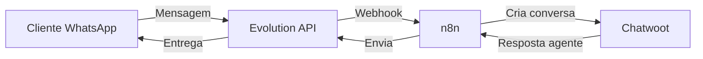
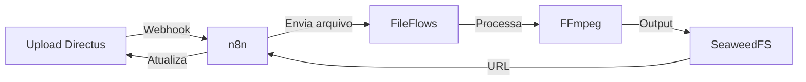

# Workflows de Exemplo: Guia Prático

> **5 workflows prontos para implementar em 15-30 minutos cada**

Este guia apresenta workflows práticos para casos de uso reais. Cada workflow inclui código pronto para copiar e colar.

---

## Índice

1. [Introdução](#introdução)
2. [Workflow 1: Atendimento WhatsApp Automatizado](#workflow-1-atendimento-whatsapp-automatizado)
3. [Workflow 2: Backup Automático de Banco de Dados](#workflow-2-backup-automático-de-banco-de-dados)
4. [Workflow 3: Processamento Automático de Mídia](#workflow-3-processamento-automático-de-mídia)
5. [Workflow 4: Integração com CRM Externo](#workflow-4-integração-com-crm-externo)
6. [Workflow 5: Relatório Semanal Automatizado](#workflow-5-relatório-semanal-automatizado)
7. [Ideias Rápidas para Outros Workflows](#ideias-rápidas-para-outros-workflows)
8. [Solução de Problemas](#solução-de-problemas)

---

## Introdução

### O Que São Workflows?

Workflows são automações que conectam diferentes serviços do BorgStack. O **n8n** é o hub central que orquestra todas as integrações.

### Estrutura dos Workflows

Cada workflow neste guia segue o padrão:

1. **Caso de Uso**: Problema de negócio que resolve
2. **Serviços Usados**: Componentes do BorgStack envolvidos
3. **Pré-requisitos**: O que configurar antes
4. **Implementação**: Código pronto (JSON n8n ou comandos)
5. **Teste**: Como validar que funciona
6. **Troubleshooting**: Problemas comuns

### Como Importar Workflows

Todos os workflows estão disponíveis em `config/n8n/workflows/`. Para importar:

1. Acesse n8n: `https://n8n.seudominio.com.br`
2. Menu **Workflows** > **Import from File**
3. Selecione o arquivo `.json` correspondente
4. Configure credenciais quando solicitado
5. Ative o workflow

---

## Workflow 1: Atendimento WhatsApp Automatizado

### Caso de Uso

Pequena empresa quer atendimento automático via WhatsApp com histórico centralizado no Chatwoot.

### Serviços Usados

- Evolution API (WhatsApp)
- n8n (orquestração)
- Chatwoot (atendimento)
- PostgreSQL (dados)

### Diagrama



### Pré-requisitos

```bash
# 1. Verificar serviços rodando
docker compose ps evolution chatwoot n8n

# 2. Obter Evolution API Key
cat .env | grep EVOLUTION_API_KEY

# 3. Obter Chatwoot API Token (via interface web)
# Chatwoot > Settings > Profile > Access Token
```

### Implementação

**Arquivo pronto:** `config/n8n/workflows/04-whatsapp-chatwoot-integration.json`

**Ou criar manualmente no n8n:**

**Nó 1: Webhook (Trigger)**
- **URL**: `/webhook/whatsapp`
- **Method**: POST
- **Response**: Immediately

**Nó 2: Function - Extrair Dados**
```javascript
const msg = $input.item.json;
return {
  json: {
    phone: msg.key.remoteJid.split('@')[0],
    message: msg.message.conversation || msg.message.extendedTextMessage?.text || '[Mídia]',
    timestamp: msg.messageTimestamp,
    instanceName: msg.instanceName
  }
};
```

**Nó 3: HTTP Request - Chatwoot**
- **Method**: POST
- **URL**: `https://chatwoot.seudominio.com.br/api/v1/accounts/1/conversations`
- **Authentication**: Bearer Token (seu token)
- **Body**:
```json
{
  "source_id": "{{$json.phone}}",
  "inbox_id": "{{$env.CHATWOOT_INBOX_ID}}",
  "contact": {
    "name": "+{{$json.phone}}"
  },
  "message": {
    "content": "{{$json.message}}"
  }
}
```

### Configurar Webhook no Evolution

```bash
EVOLUTION_KEY=$(cat .env | grep EVOLUTION_API_KEY | cut -d'=' -f2)
EVOLUTION_URL=$(cat .env | grep EVOLUTION_API_URL | cut -d'=' -f2)

curl -X POST ${EVOLUTION_URL}/webhook/set/whatsapp-principal \
  -H "apikey: ${EVOLUTION_KEY}" \
  -H "Content-Type: application/json" \
  -d '{
    "url": "https://n8n.seudominio.com.br/webhook/whatsapp",
    "webhook_by_events": true,
    "events": ["messages.upsert"]
  }'
```

### Teste

1. Envie mensagem WhatsApp para o número conectado
2. Verifique execução em n8n > Executions
3. Confirme conversa criada no Chatwoot

### Troubleshooting

| Problema | Solução |
|----------|---------|
| Webhook não dispara | Verificar URL pública do n8n acessível |
| Erro 401 Chatwoot | Verificar token de autenticação |
| Mensagem duplicada | Adicionar verificação de message ID |

**Detalhes completos:** [docs/04-integrations/whatsapp-chatwoot.md](04-integrations/whatsapp-chatwoot.md)

---

## Workflow 2: Backup Automático de Banco de Dados

### Caso de Uso

Backup diário do PostgreSQL às 2h da manhã com notificação por email.

### Serviços Usados

- PostgreSQL (dados)
- n8n (orquestração)
- Duplicati (backup)
- SMTP (email)

### Implementação no n8n

**Nó 1: Schedule Trigger**
- **Mode**: Every Day
- **Hour**: 2
- **Minute**: 0

**Nó 2: Execute Command**
```bash
docker compose exec -T postgresql pg_dumpall -U postgres > /tmp/backup-$(date +%Y%m%d-%H%M%S).sql
```

**Nó 3: HTTP Request - Duplicati**
- **Method**: POST
- **URL**: `http://duplicati:8200/api/v1/backup/1/run`
- **Authentication**: None (rede interna)

**Nó 4: Function - Verificar Sucesso**
```javascript
const status = $input.item.json.status;
return {
  json: {
    success: status === 'Success',
    timestamp: new Date().toISOString(),
    backupSize: $input.item.json.size || 'unknown'
  }
};
```

**Nó 5: Send Email (sucesso)**
- **To**: `admin@seudominio.com`
- **Subject**: `✅ Backup completado - {{$json.timestamp}}`
- **Body**: `Backup realizado com sucesso. Tamanho: {{$json.backupSize}}`

**Nó 6: Send Email (falha)**
- **To**: `admin@seudominio.com`
- **Subject**: `❌ FALHA no Backup - {{$json.timestamp}}`
- **Body**: `AÇÃO NECESSÁRIA: Verificar logs imediatamente`

### Configurar SMTP no n8n

```bash
# Adicionar credencial SMTP no n8n
# Settings > Credentials > Add Credential > SMTP
# Host: smtp.gmail.com (ou seu provedor)
# Port: 587
# User: seu-email@gmail.com
# Password: app-password (não a senha normal do Gmail)
```

### Teste

```bash
# Testar manualmente
docker compose exec n8n npx n8n execute --id=WORKFLOW_ID
```

### Rotação de Backups

Adicionar no servidor (crontab):

```bash
# Limpar backups com mais de 7 dias
0 3 * * * find /tmp/backup-*.sql -mtime +7 -delete
```

---

## Workflow 3: Processamento Automático de Mídia

### Caso de Uso

Upload de vídeo no Directus dispara transcodificação automática via FileFlows.

### Serviços Usados

- Directus (CMS)
- n8n (orquestração)
- FileFlows (processamento)
- SeaweedFS (storage)

### Diagrama



### Arquivo Pronto

`config/n8n/workflows/directus-fileflows-upload.json`

### Implementação Resumida

**Nó 1: Webhook Directus**
- Configurar em Directus: Settings > Webhooks > Create
- **Trigger**: `items.create` na collection `videos`
- **URL**: `https://n8n.seudominio.com.br/webhook/video-upload`

**Nó 2: HTTP Request - FileFlows**
- **Method**: POST
- **URL**: `http://fileflows:5000/api/flow/trigger`
- **Body**:
```json
{
  "filePath": "{{$json.data.file.filename_disk}}",
  "flowName": "Video Transcoding"
}
```

**Nó 3: Wait** (aguardar processamento)
- **Resume On**: Webhook Call
- **Timeout**: 30 minutes

**Nó 4: Update Directus**
- **Method**: PATCH
- **URL**: `https://directus.seudominio.com.br/items/videos/{{$json.data.id}}`
- **Body**:
```json
{
  "processed_file": "{{$json.outputUrl}}",
  "status": "ready"
}
```

### Configurar Flow no FileFlows

1. Acesse FileFlows: `https://fileflows.seudominio.com.br`
2. Flows > Add Flow: "Video Transcoding"
3. Adicione nós:
   - **Input**: File Input
   - **Video Encoder**: H.264 (libx264), AAC audio
   - **Output**: SeaweedFS Upload

### Teste

```bash
# Fazer upload de vídeo teste no Directus
curl -X POST https://directus.seudominio.com.br/files \
  -H "Authorization: Bearer SEU_TOKEN" \
  -F "file=@/path/to/test-video.mp4"
```

---

## Workflow 4: Integração com CRM Externo

### Caso de Uso

Sincronizar contatos do Chatwoot com CRM externo (Pipedrive, HubSpot, etc.).

### Serviços Usados

- Chatwoot (contatos)
- n8n (orquestração)
- PostgreSQL (dados)
- API externa (CRM)

### Implementação Genérica

**Nó 1: Webhook Chatwoot**
- **Trigger**: `contact.created`
- **URL**: `https://n8n.seudominio.com.br/webhook/crm-sync`

**Nó 2: HTTP Request - Buscar Dados**
- **Method**: GET
- **URL**: `https://chatwoot.seudominio.com.br/api/v1/accounts/1/contacts/{{$json.id}}`

**Nó 3: Function - Mapear Campos**
```javascript
// Mapear campos Chatwoot -> CRM
const contact = $input.item.json;
return {
  json: {
    name: contact.name,
    email: contact.email,
    phone: contact.phone_number,
    source: 'chatwoot',
    custom_attributes: contact.custom_attributes
  }
};
```

**Nó 4: HTTP Request - CRM**
- **Method**: POST
- **URL**: `https://api.seu-crm.com/v1/contacts`
- **Authentication**: Bearer Token ou API Key
- **Body**: `{{$json}}`

**Nó 5: Error Handler** (retry com backoff)
- **Max Tries**: 3
- **Wait Between Tries**: 5s, 10s, 30s

**Nó 6: Log Erro no PostgreSQL** (se falhar após retries)
```sql
INSERT INTO sync_errors (service, entity_id, error, timestamp)
VALUES ('crm', '{{$json.id}}', '{{$error}}', NOW());
```

### Exemplo: Pipedrive

```javascript
// Nó 3: Mapear para Pipedrive
return {
  json: {
    name: $input.item.json.name,
    phone: [{value: $input.item.json.phone_number, primary: true}],
    email: [{value: $input.item.json.email, primary: true}]
  }
};
```

**Nó 4**:
- **URL**: `https://api.pipedrive.com/v1/persons?api_token=SEU_TOKEN`

---

## Workflow 5: Relatório Semanal Automatizado

### Caso de Uso

Relatório semanal com métricas de Chatwoot e n8n enviado por email toda segunda-feira 9h.

### Serviços Usados

- PostgreSQL (consultas)
- n8n (orquestração)
- SMTP (email)

### Implementação

**Nó 1: Schedule**
- **Cron**: `0 9 * * 1` (segundas 9h)

**Nó 2: PostgreSQL - Conversas Chatwoot**
```sql
SELECT
  COUNT(*) as total_conversas,
  COUNT(CASE WHEN status = 'resolved' THEN 1 END) as resolvidas,
  COUNT(CASE WHEN status = 'open' THEN 1 END) as abertas,
  AVG(EXTRACT(EPOCH FROM (updated_at - created_at))/60) as tempo_medio_min
FROM chatwoot_db.conversations
WHERE created_at > NOW() - INTERVAL '7 days';
```

**Nó 3: PostgreSQL - Execuções n8n**
```sql
SELECT
  COUNT(*) as total_execucoes,
  COUNT(CASE WHEN finished THEN 1 END) as sucesso,
  COUNT(CASE WHEN stopped_at IS NOT NULL AND NOT finished THEN 1 END) as falhas
FROM n8n_db.execution_entity
WHERE started_at > NOW() - INTERVAL '7 days';
```

**Nó 4: Function - Formatar HTML**
```javascript
const chatwoot = $input.item.json[0];
const n8n = $input.item.json[1];

const html = `
<h2>Relatório Semanal BorgStack</h2>
<p>Período: ${new Date(Date.now() - 7*24*60*60*1000).toLocaleDateString()} - ${new Date().toLocaleDateString()}</p>

<h3>Chatwoot - Atendimento</h3>
<ul>
  <li><strong>Total de conversas:</strong> ${chatwoot.total_conversas}</li>
  <li><strong>Resolvidas:</strong> ${chatwoot.resolvidas}</li>
  <li><strong>Abertas:</strong> ${chatwoot.abertas}</li>
  <li><strong>Tempo médio:</strong> ${Math.round(chatwoot.tempo_medio_min)} minutos</li>
</ul>

<h3>n8n - Automações</h3>
<ul>
  <li><strong>Total de execuções:</strong> ${n8n.total_execucoes}</li>
  <li><strong>Sucesso:</strong> ${n8n.sucesso}</li>
  <li><strong>Falhas:</strong> ${n8n.falhas}</li>
  <li><strong>Taxa de sucesso:</strong> ${((n8n.sucesso/n8n.total_execucoes)*100).toFixed(1)}%</li>
</ul>
`;

return { json: { html } };
```

**Nó 5: Send Email**
- **To**: `equipe@seudominio.com`
- **Subject**: `📊 Relatório Semanal BorgStack - {{$now.format('DD/MM/YYYY')}}`
- **Body**: `{{$json.html}}` (formato HTML)

### Adicionar Gráfico (Opcional)

Use serviço como QuickChart para gerar imagens:

```javascript
const chartUrl = `https://quickchart.io/chart?c={
  type:'bar',
  data:{
    labels:['Resolvidas','Abertas'],
    datasets:[{data:[${chatwoot.resolvidas},${chatwoot.abertas}]}]
  }
}`;
```

---

## Ideias Rápidas para Outros Workflows

### Workflow 6: Lead Capture Form

```
Formulário Web → n8n → Chatwoot (cria contato) → PostgreSQL → Email notificação
```

**Tempo**: 10 minutos | **Dificuldade**: Fácil

### Workflow 7: RSS para Blog Directus

```
RSS Feed Monitor → n8n → Directus (cria post) → Social Media (Buffer/Hootsuite)
```

**Tempo**: 15 minutos | **Dificuldade**: Fácil

### Workflow 8: Error Monitoring

```
n8n Error Trigger → Slack/Discord webhook → PagerDuty (criar incidente)
```

**Tempo**: 10 minutos | **Dificuldade**: Fácil

### Workflow 9: Invoice Generation

```
Evento (nova venda) → n8n → PDF Generator → Email → Accounting System API
```

**Tempo**: 30 minutos | **Dificuldade**: Média

### Workflow 10: Customer Feedback

```
Survey Webhook → n8n → Análise de sentimento → PostgreSQL → Alerta se negativo
```

**Tempo**: 20 minutos | **Dificuldade**: Média

---

## Solução de Problemas

### Workflows Não Disparam

```bash
# Verificar se workflow está ativo
# n8n > Workflows > verificar toggle "Active"

# Ver logs
docker compose logs n8n --tail 100 -f
```

### Timeout em HTTP Requests

Aumentar timeout no nó HTTP Request:
- Options > Timeout: 30000 (30 segundos)

### Credenciais Inválidas

```bash
# Recriar credencial no n8n
# Settings > Credentials > Delete old > Add new
```

### Webhook Não Recebe Dados

```bash
# Testar webhook manualmente
curl -X POST https://n8n.seudominio.com.br/webhook/test \
  -H "Content-Type: application/json" \
  -d '{"test": "data"}'

# Ver execução em n8n > Executions
```

### Performance Lenta

```bash
# Verificar recursos
docker stats

# Limitar execuções simultâneas
# n8n settings > Execution Process > Max 5
```

---

## Guia de Customização

### Adaptar Templates

1. **Identifique o workflow base** mais próximo do seu caso
2. **Clone o workflow** no n8n (Duplicate)
3. **Ajuste URLs e credenciais** para seu ambiente
4. **Teste com dados reais** em pequena escala
5. **Ative e monitore** por 24-48h
6. **Otimize baseado em logs** e performance

### Patterns Comuns

**Error Handling:**
```javascript
try {
  // Sua lógica aqui
  return { json: result };
} catch (error) {
  return { json: { error: error.message } };
}
```

**Retry Logic:**
- Adicione nó "Wait" entre retries
- Use exponential backoff: 5s, 15s, 45s

**Logging:**
```javascript
console.log('DEBUG:', JSON.stringify($input.item.json, null, 2));
```

---

## Recursos Adicionais

### Documentação Relacionada

- **[n8n - Guia Completo](03-services/n8n.md)** - Conceitos avançados
- **[Integração WhatsApp-Chatwoot](04-integrations/whatsapp-chatwoot.md)** - Detalhes completos
- **[Integração Directus-FileFlows](04-integrations/directus-fileflows.md)** - Pipeline de mídia
- **[PostgreSQL - Queries Otimizadas](03-services/postgresql.md)** - Performance

### Comunidade

- **[GitHub Discussions](https://github.com/yourusername/borgstack/discussions)** - Compartilhe workflows
- **[Contributing Guide](CONTRIBUTING-PT.md)** - Como contribuir com novos exemplos

---

## Navegação

- **[← Guia de Performance](08-desempenho.md)**
- **[→ Guia de Contribuição](CONTRIBUTING-PT.md)**
- **[↑ Voltar ao Hub](README.md)**

---

**Última atualização:** 2025-10-08
**Versão:** 1.0
