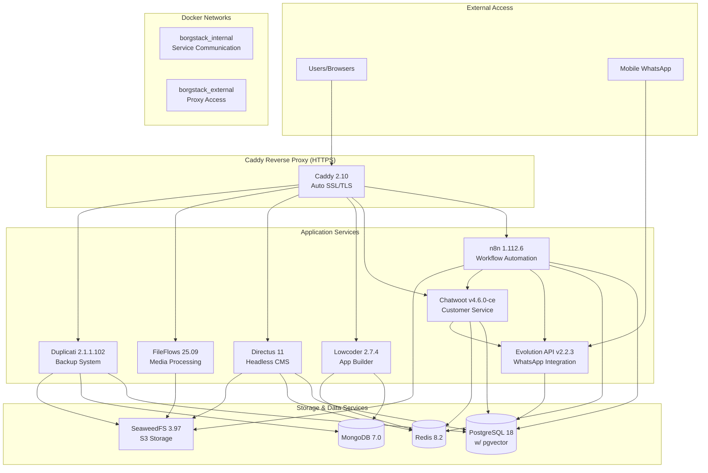
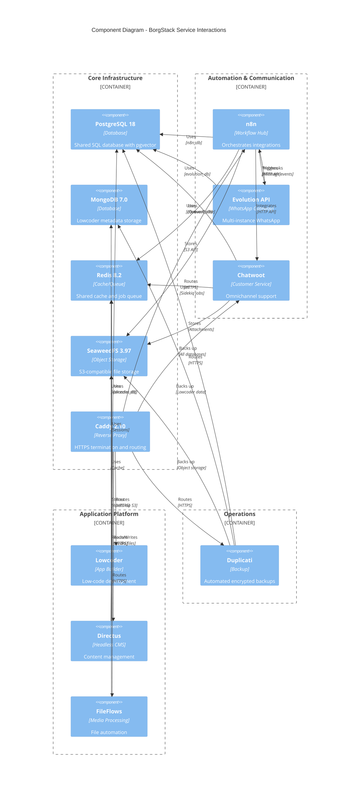
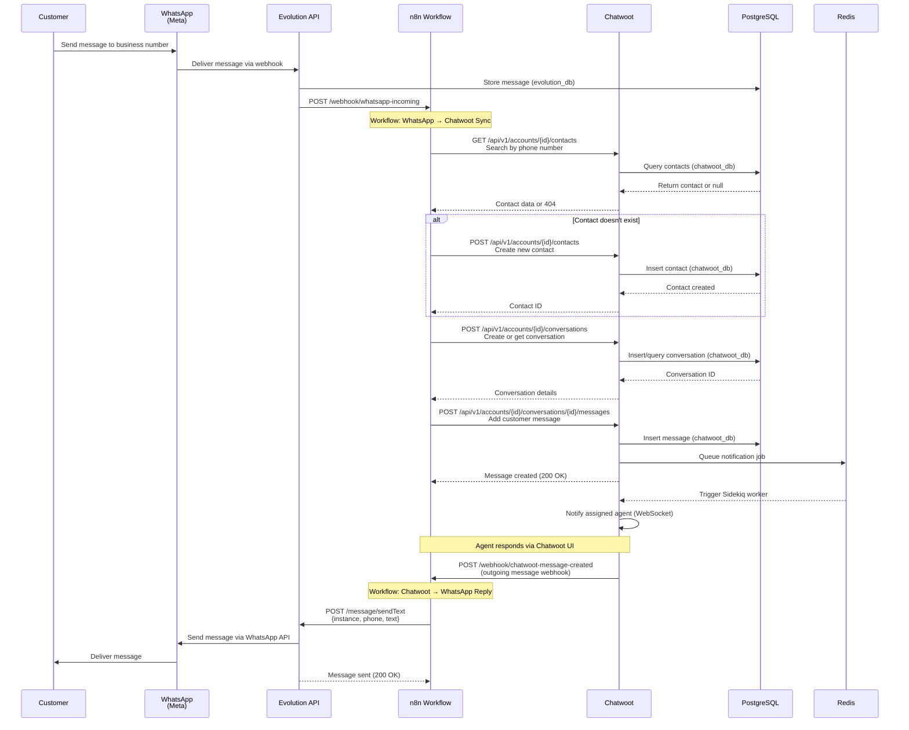
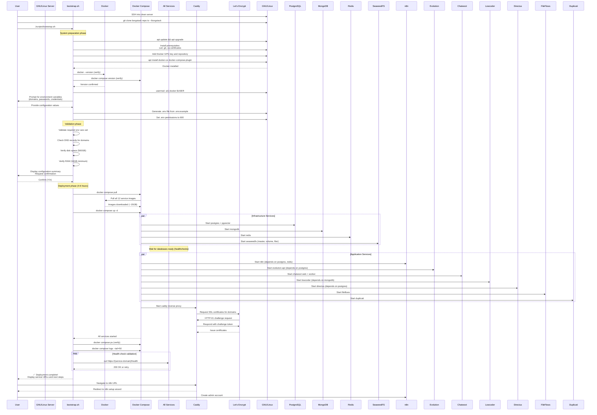
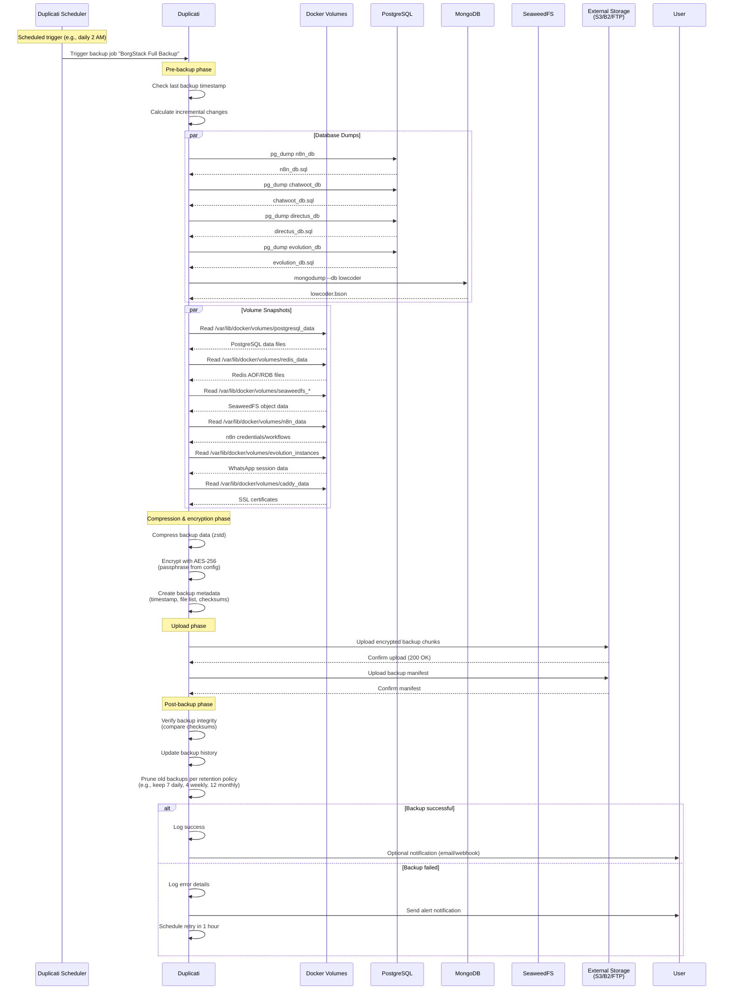
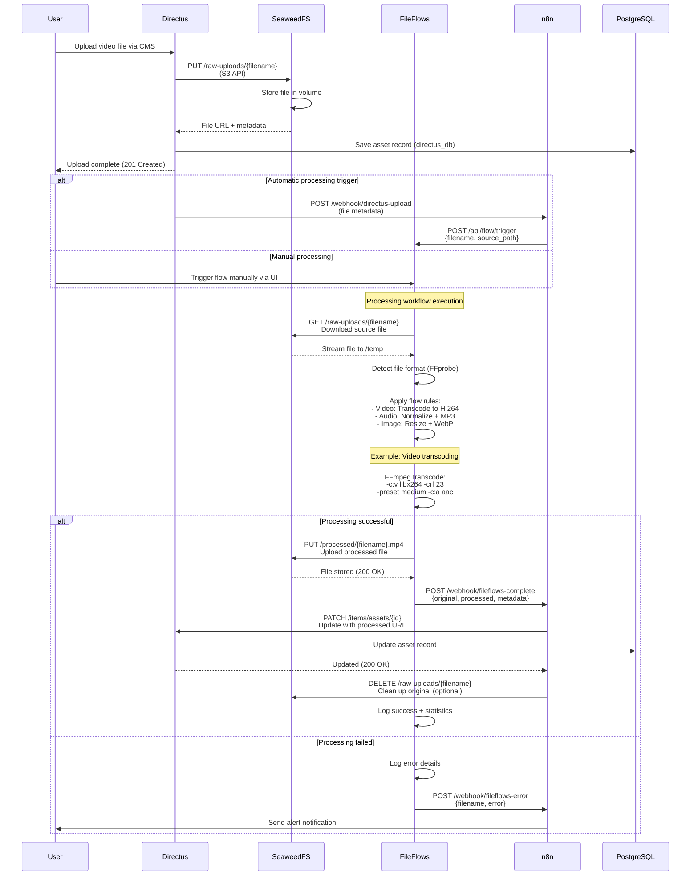

# BorgStack Fullstack Architecture Document

## Introduction

This document outlines the complete fullstack architecture for **BorgStack**, including backend systems, frontend implementation, and their integration. It serves as the single source of truth for AI-driven development, ensuring consistency across the entire technology stack.

This unified approach combines what would traditionally be separate backend and frontend architecture documents, streamlining the development process for a Docker Compose-based infrastructure project where these concerns are tightly integrated.

### Starter Template or Existing Project

**N/A - Greenfield project**

BorgStack is a greenfield infrastructure project built from scratch. There are no starter templates being used. The architecture centers around a monorepo with `docker-compose.yml` as the centerpiece, integrating 13 open source components into a unified deployment stack.

### Change Log

| Date | Version | Description | Author |
|------|---------|-------------|--------|
| 2025-01-29 | v1.0 | Initial architecture document created from PRD v1.1 | Winston (Architect) |

---

## High Level Architecture

### Technical Summary

BorgStack is a **containerized microservices infrastructure** deployed via Docker Compose on GNU/Linux. The architecture integrates 13 open source components into a unified automation and customer service platform for Brazilian businesses seeking data sovereignty and zero licensing costs.

The system uses **Docker networks for service isolation**, with an internal network (`borgstack_internal`) for secure inter-service communication and Caddy reverse proxy handling external HTTPS access with automatic SSL certificate management. Core infrastructure components include PostgreSQL 18 with pgvector extension (shared by n8n, Chatwoot, Directus, Evolution API), MongoDB 7.0 (dedicated to Lowcoder), Redis 8.2 (shared caching/queuing), and SeaweedFS (S3-compatible object storage).

Integration occurs through **HTTP APIs and webhooks** between services, with n8n serving as the workflow orchestration hub connecting Evolution API (WhatsApp), Chatwoot (customer service), and other components. Each service maintains its own authentication system with no centralized SSO. The architecture prioritizes **single-server deployment with container-level high availability** through Docker's automatic restart policies, targeting 4-6 hour deployment time on properly configured hardware.

### Platform and Infrastructure Choice

**Platform:** Self-Hosted Docker Infrastructure on GNU/Linux

**Key Services:**
- **Orchestration:** Docker Compose v2
- **Reverse Proxy:** Caddy 2.10 (automatic HTTPS/SSL)
- **Networking:** Docker bridge networks with isolation
- **Storage:** Local volumes for persistence + SeaweedFS for object storage
- **Backup:** Duplicati for automated encrypted backups
- **Monitoring:** Docker logs with centralized access via `docker compose logs`

**Deployment Host and Regions:**
- **Deployment Model:** Single-server VPS or dedicated server
- **Minimum Specs:** 4 vCPUs, 16GB RAM, 200GB SSD (testing)
- **Recommended Specs:** 8 vCPUs, 36GB RAM, 500GB SSD (production)
- **Geographic Hosting:** Customer-controlled (Brazilian data sovereignty requirement)
- **Scalability:** Horizontal scaling supported for n8n and Chatwoot within single-server limits

### Repository Structure

**Structure:** Monorepo

**Monorepo Tool:** Not applicable (simple directory structure)

**Package Organization:**
```
borgstack/
├── docker-compose.yml          # Centerpiece orchestration file
├── .env.example                # Environment variable template
├── Caddyfile                   # Reverse proxy configuration
├── scripts/
│   ├── bootstrap.sh            # GNU/Linux setup automation
│   └── healthcheck.sh          # Deployment verification
├── config/                     # Service-specific configurations
│   ├── postgresql/
│   ├── redis/
│   ├── seaweedfs/
│   └── ...
├── docs/                       # Documentation (Portuguese)
│   ├── prd.md
│   ├── architecture.md
│   ├── installation.md
│   ├── integration-guides/
│   └── troubleshooting.md
└── tests/
    ├── integration/
    └── deployment/
```

### High Level Architecture Diagram



### Architectural Patterns

- **Microservices Architecture:** Each component runs as an independent Docker container with its own lifecycle - _Rationale:_ Enables independent updates, failure isolation, and resource scaling per service
- **Reverse Proxy Pattern:** Caddy as single entry point for all HTTPS traffic - _Rationale:_ Centralizes SSL management, simplifies DNS configuration, and provides consistent access control
- **Shared Database with Isolation:** PostgreSQL serves multiple apps with separate databases per service (n8n_db, chatwoot_db, directus_db, evolution_db) - _Rationale:_ Reduces infrastructure complexity while maintaining data isolation and schema independence
- **Service Discovery via DNS:** Services communicate using Docker service names (e.g., `http://n8n:5678`) - _Rationale:_ Eliminates hardcoded IPs and simplifies container replacement
- **Orchestrator Pattern:** n8n acts as workflow hub coordinating actions across services - _Rationale:_ Provides no-code integration layer matching target user technical capabilities
- **Event-Driven Integration:** Webhook-based communication between Evolution API, n8n, and Chatwoot - _Rationale:_ Loose coupling enables flexible workflow customization
- **Backup-as-Code:** Duplicati automated schedules for all persistent data - _Rationale:_ Protects intellectual property (workflows, configurations) per FR13
- **Single-Server High Availability:** Container restart policies with volume persistence - _Rationale:_ Balances reliability with deployment simplicity (multi-server HA explicitly out of scope per NFR2)

---

## Tech Stack

This section defines the **DEFINITIVE technology selection** for BorgStack. All deployment and integration work must use these exact versions. This is an infrastructure project deploying pre-built Docker images, not a custom application development project.

### Technology Stack Table

| Category | Technology | Version | Purpose | Rationale |
|----------|-----------|---------|---------|-----------|
| **Core Infrastructure** |
| Orchestration | Docker Compose | v2 (latest) | Container orchestration and service management | Industry standard for multi-container applications; simpler than Kubernetes for single-server deployments |
| Operating System | GNU/Linux | Distribuição compatível | Host operating system | Compatibilidade com Docker; suporte a containers; ampla documentação |
| Reverse Proxy | Caddy | 2.10-alpine | HTTPS termination and routing | Zero-configuration automatic SSL/TLS; simpler than nginx for this use case |
| **Databases & Caching** |
| Relational Database | PostgreSQL + pgvector | 18.0 (pgvector/pgvector:pg18) | Primary database for n8n, Chatwoot, Directus, Evolution API | Latest PostgreSQL with vector search for RAG/LLM integrations; shared to reduce infrastructure complexity |
| NoSQL Database | MongoDB | 7.0 (mongo:7.0) | Dedicated database for Lowcoder metadata | Required by Lowcoder; isolated to prevent schema conflicts with SQL services |
| Cache/Queue | Redis | 8.2-alpine | Session management, caching, message queuing | Shared across all services; Alpine image for minimal footprint |
| Object Storage | SeaweedFS | 3.97 (chrislusf/seaweedfs:3.97) | S3-compatible distributed file storage | Self-hosted alternative to AWS S3; needed for media processing and CMS assets |
| **Application Services** |
| Workflow Automation | n8n | 1.112.6 (n8nio/n8n:1.112.6) | Workflow orchestration hub | Central integration platform; connects all services via HTTP/webhook patterns |
| WhatsApp Integration | Evolution API | v2.2.3 (atendai/evolution-api:v2.2.3) | Multi-instance WhatsApp Business API | Enables WhatsApp workflows; supports multiple business accounts |
| Customer Service | Chatwoot | v4.6.0-ce (chatwoot/chatwoot:v4.6.0-ce) | Omnichannel customer communication | Open source alternative to Intercom/Zendesk; integrates with Evolution API for WhatsApp |
| Application Builder | Lowcoder | 2.7.4 (lowcoderorg/lowcoder-ce:2.7.4) | Low-code internal tools platform | Optional custom app development; connects to PostgreSQL and Redis |
| Headless CMS | Directus | 11 (directus/directus:11) | Data management and content delivery | Flexible CMS with REST/GraphQL APIs; uses PostgreSQL and SeaweedFS |
| Media Processing | FileFlows | 25.09 (revenz/fileflows:25.09) | Automated media conversion workflows | File processing automation; integrates with SeaweedFS |
| Backup System | Duplicati | 2.1.1.102 (duplicati/duplicati:2.1.1.102) | Encrypted backup automation | Protects workflows and configurations; supports external storage destinations |
| **Development & Operations** |
| Container Runtime | Docker Engine | Latest stable | Container execution environment | Required by Docker Compose; installed by bootstrap script |
| Version Control | Git | Latest stable | Configuration management | Tracks docker-compose.yml and configuration changes |
| Scripting | Bash | 5.x (GNU/Linux default) | Bootstrap and automation scripts | Native to GNU/Linux; used for setup automation |
| **Monitoring & Logging** |
| Log Aggregation | Docker Logs | Native (docker compose logs) | Centralized log access | Built-in; no additional infrastructure needed per NFR14 |
| Health Checks | Docker Healthcheck | Native | Container availability monitoring | Built-in Docker Compose feature |
| **Security** |
| SSL/TLS | Let's Encrypt (via Caddy) | Automatic | Certificate management | Automatic renewal; zero-configuration |
| Secret Management | .env files | N/A | Environment variable storage | Simple file-based approach with 600 permissions; production should consider Docker secrets |
| Network Isolation | Docker Networks | Native | Service segmentation | borgstack_internal for service communication; borgstack_external for proxy access |
| **Backup & Storage** |
| Volume Management | Docker Volumes | Native | Persistent data storage | Named volumes for databases, configs, and application data |
| Backup Destination | External Storage | Configurable | Off-site backup target | Customer-configured (S3, FTP, local drive) via Duplicati |

---

## Data Models

**Not Applicable - Infrastructure Project**

BorgStack is an infrastructure deployment project that integrates pre-built Docker images of existing applications. There are no custom shared data models or TypeScript interfaces to define, as each service (n8n, Chatwoot, Evolution API, Directus, Lowcoder, FileFlows) maintains its own internal data models defined by those applications.

**Service-Specific Data Models:**
- **n8n**: Workflow definitions, credentials, execution logs (managed internally)
- **Chatwoot**: Conversations, contacts, agents, inboxes (PostgreSQL schema defined by Chatwoot)
- **Evolution API**: WhatsApp instances, messages, webhooks (PostgreSQL schema defined by Evolution API)
- **Directus**: User-defined collections and fields (dynamic schema)
- **Lowcoder**: Applications, queries, components (MongoDB schema defined by Lowcoder)
- **FileFlows**: Media processing flows, libraries, nodes (internal data model)

**Integration Data Exchange:**

Integration between services occurs via HTTP APIs and webhooks with JSON payloads. The data schemas are defined by each service's API documentation:

- **n8n → Evolution API**: WhatsApp message sending (JSON payloads per Evolution API docs)
- **Evolution API → n8n**: Webhook events for incoming messages
- **n8n → Chatwoot**: Contact creation, conversation management (Chatwoot API)
- **Directus → SeaweedFS**: S3-compatible file uploads (standard S3 API)
- **FileFlows → SeaweedFS**: Media file processing (S3 API)

**Integration Payload Examples:**

**1. Evolution API → n8n: Incoming WhatsApp Message Webhook**

```json
POST https://n8n.example.com.br/webhook/whatsapp-incoming
Content-Type: application/json

{
  "event": "messages.upsert",
  "instance": "customer_support",
  "data": {
    "key": {
      "remoteJid": "5511987654321@s.whatsapp.net",
      "fromMe": false,
      "id": "3EB0C8F3E7E3A7D8C0F1"
    },
    "message": {
      "conversation": "Olá, preciso de ajuda com meu pedido #12345"
    },
    "messageTimestamp": 1735632000,
    "pushName": "João Silva",
    "messageType": "conversation",
    "owner": "5511999887766@s.whatsapp.net"
  },
  "destination": "https://n8n.example.com.br/webhook/whatsapp-incoming",
  "date_time": "2025-01-01T12:00:00.000Z",
  "server_url": "https://evolution.example.com.br",
  "apikey": "${EVOLUTION_API_KEY}"
}
```

**2. n8n → Chatwoot: Create Contact**

```json
POST https://chatwoot.example.com.br/api/v1/accounts/1/contacts
Authorization: Bearer ${CHATWOOT_API_TOKEN}
Content-Type: application/json

{
  "inbox_id": 1,
  "name": "João Silva",
  "phone_number": "+5511987654321",
  "identifier": "whatsapp:5511987654321",
  "custom_attributes": {
    "whatsapp_id": "5511987654321@s.whatsapp.net",
    "evolution_instance": "customer_support",
    "source": "whatsapp_evolution_api",
    "last_seen": "2025-01-01T12:00:00.000Z"
  }
}
```

**Response:**

```json
{
  "id": 42,
  "name": "João Silva",
  "phone_number": "+5511987654321",
  "identifier": "whatsapp:5511987654321",
  "email": null,
  "custom_attributes": {
    "whatsapp_id": "5511987654321@s.whatsapp.net",
    "evolution_instance": "customer_support",
    "source": "whatsapp_evolution_api"
  },
  "created_at": "2025-01-01T12:00:01.000Z"
}
```

**3. n8n → Chatwoot: Create Conversation**

```json
POST https://chatwoot.example.com.br/api/v1/accounts/1/conversations
Authorization: Bearer ${CHATWOOT_API_TOKEN}
Content-Type: application/json

{
  "source_id": "evolution_msg_3EB0C8F3E7E3A7D8C0F1",
  "inbox_id": 1,
  "contact_id": 42,
  "status": "open",
  "custom_attributes": {
    "whatsapp_instance": "customer_support",
    "initial_message_id": "3EB0C8F3E7E3A7D8C0F1"
  }
}
```

**Response:**

```json
{
  "id": 1523,
  "account_id": 1,
  "inbox_id": 1,
  "status": "open",
  "contact_id": 42,
  "display_id": 1523,
  "messages": [],
  "created_at": "2025-01-01T12:00:02.000Z"
}
```

**4. n8n → Chatwoot: Add Message to Conversation**

```json
POST https://chatwoot.example.com.br/api/v1/accounts/1/conversations/1523/messages
Authorization: Bearer ${CHATWOOT_API_TOKEN}
Content-Type: application/json

{
  "content": "Olá, preciso de ajuda com meu pedido #12345",
  "message_type": "incoming",
  "private": false,
  "source_id": "3EB0C8F3E7E3A7D8C0F1",
  "content_attributes": {
    "whatsapp_message_type": "conversation",
    "received_at": "2025-01-01T12:00:00.000Z"
  }
}
```

**Response:**

```json
{
  "id": 98234,
  "content": "Olá, preciso de ajuda com meu pedido #12345",
  "conversation_id": 1523,
  "message_type": "incoming",
  "created_at": "2025-01-01T12:00:03.000Z",
  "sender": {
    "id": 42,
    "name": "João Silva",
    "type": "contact"
  }
}
```

**5. Chatwoot → n8n: Outgoing Message Webhook (Agent Reply)**

```json
POST https://n8n.example.com.br/webhook/chatwoot-message-created
Content-Type: application/json

{
  "event": "message_created",
  "id": 98235,
  "content": "Olá João! Vou verificar o status do pedido #12345 para você.",
  "created_at": "2025-01-01T12:02:00.000Z",
  "message_type": "outgoing",
  "content_type": "text",
  "private": false,
  "conversation": {
    "id": 1523,
    "inbox_id": 1,
    "status": "open"
  },
  "sender": {
    "id": 5,
    "name": "Maria Atendente",
    "type": "agent"
  },
  "contact": {
    "id": 42,
    "name": "João Silva",
    "phone_number": "+5511987654321"
  },
  "account": {
    "id": 1,
    "name": "BorgStack Support"
  }
}
```

**6. n8n → Evolution API: Send WhatsApp Text Message**

```json
POST https://evolution.example.com.br/message/sendText/customer_support
apikey: ${EVOLUTION_API_KEY}
Content-Type: application/json

{
  "number": "5511987654321",
  "text": "Olá João! Vou verificar o status do pedido #12345 para você.",
  "delay": 1000
}
```

**Response:**

```json
{
  "key": {
    "remoteJid": "5511987654321@s.whatsapp.net",
    "fromMe": true,
    "id": "BAE5F8D3C2A1B0E9F7D6"
  },
  "message": {
    "conversation": "Olá João! Vou verificar o status do pedido #12345 para você."
  },
  "messageTimestamp": 1735632120,
  "status": "PENDING"
}
```

**7. Evolution API → n8n: Message Status Update Webhook**

```json
POST https://n8n.example.com.br/webhook/whatsapp-status
Content-Type: application/json

{
  "event": "messages.update",
  "instance": "customer_support",
  "data": {
    "key": {
      "remoteJid": "5511987654321@s.whatsapp.net",
      "fromMe": true,
      "id": "BAE5F8D3C2A1B0E9F7D6"
    },
    "status": "READ",
    "messageTimestamp": 1735632150
  }
}
```

**Payload Size Considerations:**

- Typical incoming WhatsApp message webhook: 0.5-2 KB
- Chatwoot conversation creation: 0.3-1 KB
- Media messages (images/videos): 2-10 KB (metadata only, actual media stored in SeaweedFS)
- Webhook retry payloads: Identical to original, cached in Redis for 24 hours
- n8n workflow execution data: Average 5-15 KB per execution, pruned after 336 hours (14 days)

There is no shared TypeScript interface package, as this is a Docker Compose infrastructure stack, not a monorepo application with shared code.

---

## API Specification

**Not Applicable - Infrastructure Project**

BorgStack does not define custom APIs. Each service exposes its own REST/GraphQL APIs as documented by the upstream projects:

| Service | API Type | Documentation |
|---------|----------|---------------|
| n8n | REST | https://docs.n8n.io/api/ |
| Evolution API | REST | https://doc.evolution-api.com/ |
| Chatwoot | REST | https://www.chatwoot.com/developers/api/ |
| Lowcoder | REST | https://docs.lowcoder.cloud/ |
| Directus | REST/GraphQL | https://docs.directus.io/reference/ |
| SeaweedFS | S3-compatible | https://github.com/seaweedfs/seaweedfs/wiki/Amazon-S3-API |
| FileFlows | REST | https://docs.fileflows.com/ |
| Duplicati | REST | https://duplicati.readthedocs.io/ |

**Integration Approach:**

Users configure integrations through **n8n workflows** using HTTP Request nodes and webhook triggers. No custom API gateway or BFF (Backend for Frontend) layer is required. Each service's API is accessed directly through its native endpoints.

---

## Components

This section describes the 13 services that comprise BorgStack, organized by architectural layer.

### Core Infrastructure Layer

#### PostgreSQL with pgvector
**Responsibility:** Shared relational database serving n8n, Chatwoot, Directus, and Evolution API with vector search capabilities for RAG/LLM integrations.

**Key Interfaces:**
- PostgreSQL wire protocol (port 5432) on `borgstack_internal` network
- Database isolation: `n8n_db`, `chatwoot_db`, `directus_db`, `evolution_db`
- Separate users with role-based permissions per database

**Dependencies:** None (foundational service)

**Technology Stack:**
- Image: `pgvector/pgvector:pg18`
- Extensions: pgvector for vector embeddings
- Volume: `postgresql_data` for persistence
- Health check: `pg_isready` command

---

#### MongoDB
**Responsibility:** Dedicated NoSQL database for Lowcoder metadata, configuration, and application storage.

**Key Interfaces:**
- MongoDB wire protocol (port 27017) on `borgstack_internal` network
- Database: `lowcoder` with authentication

**Dependencies:** None (foundational service)

**Technology Stack:**
- Image: `mongo:7.0`
- Volume: `mongodb_data` for persistence
- Health check: `mongosh --eval "db.adminCommand('ping')"`

---

#### Redis
**Responsibility:** Shared in-memory cache and message queue for session management, background jobs, and caching across all services.

**Key Interfaces:**
- Redis protocol (port 6379) on `borgstack_internal` network
- Shared by n8n, Chatwoot, Directus, Lowcoder

**Dependencies:** None (foundational service)

**Technology Stack:**
- Image: `redis:8.2-alpine`
- Volume: `redis_data` for AOF persistence
- Configuration: Password protection, memory limits, eviction policies

---

#### SeaweedFS
**Responsibility:** S3-compatible object storage for file uploads, media assets, and CMS content.

**Key Interfaces:**
- S3 API (port 8333) on `borgstack_internal` network
- Filer API (port 8888) for direct file operations
- Master/Volume server topology

**Dependencies:** None (foundational service)

**Technology Stack:**
- Image: `chrislusf/seaweedfs:3.97`
- Volumes: `seaweedfs_master`, `seaweedfs_volume`, `seaweedfs_filer`
- Configuration: Replication strategy, storage quotas

---

#### Caddy
**Responsibility:** Reverse proxy with automatic HTTPS/SSL certificate generation and renewal for all web services.

**Key Interfaces:**
- HTTPS (port 443) and HTTP (port 80) on host network
- Proxies to application services on `borgstack_internal` network
- Routes based on domain/subdomain configuration

**Dependencies:** All application services (routing target)

**Technology Stack:**
- Image: `caddy:2.10-alpine`
- Volume: `caddy_data` for certificates and `caddy_config`
- Configuration: `Caddyfile` with automatic SSL via Let's Encrypt

---

### Application Services Layer

#### n8n (Workflow Automation Hub)
**Responsibility:** Central workflow orchestration platform connecting all services via HTTP nodes and webhooks.

**Key Interfaces:**
- Web UI (port 5678) exposed via Caddy
- REST API for workflow management
- Webhook endpoints for external triggers
- HTTP Request nodes for service integration

**Dependencies:**
- PostgreSQL (`n8n_db`)
- Redis (session/queue management)
- Evolution API, Chatwoot, Directus, SeaweedFS (integration targets)

**Technology Stack:**
- Image: `n8nio/n8n:1.112.6`
- Volume: `n8n_data` for credentials and custom nodes
- Environment: Database connection, Redis, webhook URL

---

#### Evolution API (WhatsApp Integration)
**Responsibility:** Multi-instance WhatsApp Business API gateway for sending/receiving messages and managing connections.

**Key Interfaces:**
- REST API (port 8080) on `borgstack_internal` network
- Webhook delivery to n8n for incoming messages
- Instance management API

**Dependencies:**
- PostgreSQL (`evolution_db`)
- Redis (session management)

**Technology Stack:**
- Image: `atendai/evolution-api:v2.2.3`
- Volume: `evolution_instances` for WhatsApp session data
- Configuration: Database, Redis, webhook URLs to n8n

---

#### Chatwoot (Customer Service Platform)
**Responsibility:** Omnichannel customer communication platform with agent management and conversation tracking.

**Key Interfaces:**
- Web UI (port 3000) exposed via Caddy
- REST API for conversation management
- Webhook configuration for Evolution API integration
- Agent dashboard and customer-facing widget

**Dependencies:**
- PostgreSQL (`chatwoot_db`)
- Redis (Sidekiq background jobs)
- Evolution API (WhatsApp channel integration via n8n)
- SeaweedFS (attachment storage)

**Technology Stack:**
- Image: `chatwoot/chatwoot:v4.6.0-ce`
- Volumes: `chatwoot_storage`, `chatwoot_public`
- Services: Web, worker (Sidekiq), rails console

---

#### Lowcoder (Low-Code Application Builder)
**Responsibility:** Optional low-code platform for building custom internal business applications.

**Key Interfaces:**
- Web UI (port 3000) exposed via Caddy
- Application runtime for deployed apps
- API query builder connecting to PostgreSQL and other services

**Dependencies:**
- MongoDB (`lowcoder` database via LOWCODER_MONGODB_URL)
- Redis (via LOWCODER_REDIS_URL)
- PostgreSQL (optional, for custom applications connecting to SQL data)

**Technology Stack:**
- Image: `lowcoderorg/lowcoder-ce:2.7.4`
- Volume: `lowcoder_stacks` for application definitions
- Configuration: MongoDB and Redis connection strings

---

#### Directus (Headless CMS)
**Responsibility:** Data management and content delivery platform with REST/GraphQL APIs.

**Key Interfaces:**
- Web UI (port 8055) exposed via Caddy
- REST API and GraphQL API for content delivery
- Asset management with SeaweedFS integration

**Dependencies:**
- PostgreSQL (`directus_db`)
- Redis (caching)
- SeaweedFS (file storage via S3 configuration)

**Technology Stack:**
- Image: `directus/directus:11`
- Volume: `directus_uploads` (local cache before S3 upload)
- Configuration: Database, Redis, S3 credentials for SeaweedFS

---

#### FileFlows (Media Processing)
**Responsibility:** Automated media file conversion and processing workflows.

**Key Interfaces:**
- Web UI (port 5000) exposed via Caddy
- File processing engine watching input directories
- Output to SeaweedFS or local storage

**Dependencies:**
- SeaweedFS (input/output file storage)

**Technology Stack:**
- Image: `revenz/fileflows:25.09`
- Volumes: `fileflows_data`, `fileflows_logs`, `fileflows_temp`
- Configuration: Processing nodes, library paths

---

#### Duplicati (Backup System)
**Responsibility:** Automated encrypted backup of all persistent data with scheduling and external storage support.

**Key Interfaces:**
- Web UI (port 8200) exposed via Caddy
- Backup job scheduler
- External storage connectors (S3, FTP, local)

**Dependencies:**
- Access to all Docker volumes (PostgreSQL, MongoDB, SeaweedFS, etc.)

**Technology Stack:**
- Image: `duplicati/duplicati:2.1.1.102`
- Volume: `duplicati_config` for backup definitions
- Configuration: Backup sources (volumes), destinations, schedules

---

### Component Diagrams



---

## External APIs

BorgStack services integrate with several external APIs for core functionality. These are APIs **external to the BorgStack deployment** that services connect to over the internet.

### WhatsApp Business API (via Evolution API)

- **Purpose:** Enable WhatsApp messaging capabilities through Evolution API
- **Documentation:** https://developers.facebook.com/docs/whatsapp
- **Base URL(s):** https://graph.facebook.com/v18.0/ (Meta's WhatsApp Cloud API) OR self-hosted WhatsApp Business API
- **Authentication:** Bearer token (access token from Meta Business App)
- **Rate Limits:**
  - Cloud API: 1,000 free conversations/month, then tiered pricing
  - Business messages: 80 messages/second per phone number
  - Marketing messages: Lower rate limits apply

**Key Endpoints Used:**
- `POST /{phone-number-id}/messages` - Send WhatsApp messages (text, media, interactive)
- `GET /{phone-number-id}` - Verify phone number configuration
- `POST /{phone-number-id}/register` - Register phone number with WhatsApp

**Integration Notes:**
- Evolution API abstracts WhatsApp Business API complexity
- Supports both Meta's Cloud API and self-hosted Business API Server
- Requires Meta Business Account, App, and verified phone number
- Webhook configuration required for receiving messages (Evolution API handles this)
- Users must configure WhatsApp API credentials in Evolution API admin panel

---

### Let's Encrypt ACME API (via Caddy)

- **Purpose:** Automatic SSL/TLS certificate issuance and renewal
- **Documentation:** https://letsencrypt.org/docs/
- **Base URL(s):** https://acme-v02.api.letsencrypt.org/directory (production), https://acme-staging-v02.api.letsencrypt.org/directory (staging)
- **Authentication:** ACME protocol with domain validation (HTTP-01 or TLS-ALPN-01 challenge)
- **Rate Limits:**
  - 50 certificates per registered domain per week
  - 5 duplicate certificates per week
  - 300 new orders per account per 3 hours

**Key Endpoints Used:**
- Automatic ACME protocol negotiation (handled by Caddy)
- HTTP-01 challenge: `/.well-known/acme-challenge/` endpoint verification
- Certificate renewal 30 days before expiration

**Integration Notes:**
- Fully automated by Caddy; no manual configuration required
- Requires DNS records pointing to server public IP
- Port 80 must be accessible for HTTP-01 challenge validation
- Port 443 for TLS certificate serving
- Caddy automatically handles certificate storage and renewal
- Staging environment recommended for testing to avoid rate limits

---

### External Storage Providers (via Duplicati)

- **Purpose:** Off-site backup destinations for disaster recovery
- **Documentation:** Varies by provider
- **Base URL(s):** Configured per provider
- **Authentication:** Provider-specific (API keys, OAuth, credentials)
- **Rate Limits:** Provider-specific

**Supported Providers:**
- **AWS S3 / S3-compatible** - `https://{bucket}.s3.{region}.amazonaws.com`
- **Google Cloud Storage** - `https://storage.googleapis.com`
- **Backblaze B2** - `https://api.backblazeb2.com`
- **Azure Blob Storage** - `https://{account}.blob.core.windows.net`
- **FTP/SFTP servers** - Customer-provided
- **WebDAV** - Customer-provided (e.g., Nextcloud, ownCloud)
- **Local/Network drives** - Direct file system access

**Integration Notes:**
- Users configure backup destination in Duplicati web UI
- Recommended: External cloud storage for true disaster recovery
- Encryption keys stored in Duplicati configuration (must be backed up separately)
- Test restoration procedures critical for backup validation
- Consider Brazilian data sovereignty requirements when selecting provider

---

### Optional Email Service (SMTP for Chatwoot/n8n)

- **Purpose:** Email notifications, channel integration, workflow alerts
- **Documentation:** Provider-specific (SendGrid, Mailgun, AWS SES, custom SMTP)
- **Base URL(s):** SMTP server address (e.g., smtp.sendgrid.net:587)
- **Authentication:** SMTP credentials or API keys
- **Rate Limits:** Provider-specific (typically measured in emails/day or emails/month)

**Key Endpoints Used:**
- SMTP protocol for email sending
- Chatwoot: Email channel for customer support tickets
- n8n: Email nodes for workflow notifications

**Integration Notes:**
- Not required for core functionality but recommended for production
- Chatwoot requires SMTP for email inbox functionality
- n8n email nodes optional for workflow notifications
- Consider transactional email providers for reliability (SendGrid, Mailgun, Postmark)
- Brazilian providers: MailerLite, Brevo (formerly Sendinblue) with Brazilian data centers

---

## Core Workflows

This section illustrates key system workflows using sequence diagrams to show component interactions and integration patterns.

### Workflow 1: WhatsApp to Chatwoot Customer Service Integration

This workflow demonstrates the core integration pattern connecting Evolution API, n8n, and Chatwoot for automated customer service.



**Key Integration Points:**
- **Webhook triggers**: Evolution API and Chatwoot both webhook to n8n to initiate workflows
- **Bi-directional sync**: n8n maintains contact/conversation state between platforms
- **Async communication**: Redis queues enable background processing in Chatwoot
- **Error handling**: n8n workflows should include error nodes for API failures (retry logic, alert notifications)

**Error Handling Scenarios:**

**Scenario 1: Chatwoot API Returns 500 Error**
- **Trigger**: Chatwoot database connection pool exhausted or internal server error
- **Detection**: n8n HTTP Request node receives 500 status code
- **Response**:
  1. Retry 3 times with exponential backoff (1s, 2s, 4s)
  2. If all retries fail: Log to PostgreSQL `n8n_db.error_queue` table with payload and timestamp
  3. Send alert email to `admin@${BORGSTACK_DOMAIN}` using n8n Send Email node
  4. Continue workflow execution (don't block other messages)
  5. Manual recovery: Admin reviews error_queue and replays failed messages
- **Prevention**: Monitor Chatwoot connection pool usage, scale PostgreSQL max_connections if needed

**Scenario 2: Contact Creation Race Condition**
- **Trigger**: Two simultaneous messages from same WhatsApp number arrive within 100ms
- **Detection**: Both n8n workflow instances attempt to create contact, second receives 422 Unprocessable Entity (duplicate phone number)
- **Response**:
  1. Catch 422 error in n8n workflow
  2. Re-query Chatwoot contacts API to fetch existing contact (GET /api/v1/accounts/{id}/contacts)
  3. Use retrieved contact ID to continue conversation creation
  4. Log race condition occurrence to n8n execution logs
- **Prevention**: Implement distributed lock in Redis before contact creation (SET NX with 5s TTL on key `contact:create:{phone}`)

**Scenario 3: Evolution API Webhook Delivery Failure**
- **Trigger**: n8n server temporarily unavailable (restart, deployment, OOM)
- **Detection**: Evolution API receives connection timeout or 503 from n8n webhook endpoint
- **Response**:
  1. Evolution API retries webhook delivery 5 times over 10 minutes (exponential backoff)
  2. If all retries fail: Message remains in Evolution API database but not synced to Chatwoot
  3. n8n scheduled workflow runs every 15 minutes: Query Evolution API `/message/list` endpoint for messages created in last 30 minutes
  4. Compare against Chatwoot conversation history to identify missing messages
  5. Sync missing messages to Chatwoot
- **Prevention**: Implement n8n high-availability (run 2 instances behind load balancer) or use message queue (RabbitMQ/Redis Streams)

**Scenario 4: WhatsApp Message Send Failure (Rate Limit)**
- **Trigger**: Too many messages sent to WhatsApp API, Meta returns 429 Too Many Requests
- **Detection**: Evolution API receives 429 from Meta Cloud API, returns error to n8n
- **Response**:
  1. n8n workflow catches 429 status code
  2. Wait for time specified in Retry-After header (typically 60s)
  3. Retry message send once after wait period
  4. If retry fails: Log to `n8n_db.failed_messages` table with `status='rate_limited'`
  5. Display warning in Chatwoot conversation: "Message delayed due to WhatsApp rate limits"
  6. n8n scheduled workflow retries rate-limited messages every 5 minutes
- **Prevention**: Implement rate limiting in n8n workflow (max 80 messages/hour per instance using Redis counter)

**Scenario 5: Redis Connection Loss**
- **Trigger**: Redis container restart, network partition, or memory eviction
- **Detection**: Chatwoot Sidekiq workers cannot connect to Redis, jobs fail with connection errors
- **Response**:
  1. Chatwoot logs error to `log/production.log`: "Redis::CannotConnectError"
  2. Sidekiq jobs remain in Redis queue (persist to disk if AOF enabled)
  3. When Redis recovers: Sidekiq workers automatically reconnect and process queued jobs
  4. For new messages during outage: n8n workflow calls Chatwoot API directly (synchronous), bypassing Redis queue
  5. Monitor Redis availability using `/health` endpoint, alert if down > 2 minutes
- **Prevention**: Configure Redis persistence (AOF with everysec fsync), set maxmemory-policy to allkeys-lru to prevent OOM

---

### Workflow 2: Initial Deployment and Bootstrap

This workflow shows the deployment process from clean GNU/Linux server to running BorgStack installation.



**Deployment Timing Breakdown:**
- **System prep**: 5-10 minutes (apt updates, Docker install)
- **Image pull**: 30-60 minutes (depends on network speed)
- **Service startup**: 10-20 minutes (database initialization, healthchecks)
- **SSL certificate generation**: 2-5 minutes per domain
- **Initial configuration**: 2-3 hours (user setup of each service)
- **Total**: 4-6 hours per NFR1 requirement

---

### Workflow 3: Automated Backup Process

This workflow demonstrates Duplicati's automated backup protecting all persistent data.



**Backup Strategy Details:**
- **Incremental backups**: Only changed data backed up after initial full backup
- **Encryption at rest**: AES-256 encryption ensures data sovereignty even on third-party storage
- **Retention policy**: Configurable (default: 7 daily, 4 weekly, 12 monthly, 5 yearly)
- **Backup size estimation**: ~50GB for full backup (depends on data volume)
- **Network transfer time**: 30-120 minutes depending on bandwidth

---

### Workflow 4: Media File Processing Pipeline

This workflow shows FileFlows processing media files with SeaweedFS storage integration.



**Processing Capabilities:**
- **Video transcoding**: H.264/H.265 encoding, resolution scaling, bitrate optimization
- **Audio processing**: Normalization, format conversion, silence removal
- **Image optimization**: WebP conversion, resizing, compression
- **Batch processing**: Queue multiple files with priority scheduling

---

## Database Schema

BorgStack uses a **shared database infrastructure with logical isolation** strategy. Each service manages its own schema internally, but the architecture defines the database organization to prevent conflicts and enable independent updates.

### PostgreSQL Database Organization

**Server:** PostgreSQL 18.0 with pgvector extension
**Image:** `pgvector/pgvector:pg18`
**Host:** `postgresql:5432` on `borgstack_internal` network

**Database Isolation Strategy:**

```sql
-- Root superuser (for administration only)
-- Username: postgres
-- Password: ${POSTGRES_PASSWORD} from .env

-- Service-specific databases with dedicated users
CREATE DATABASE n8n_db;
CREATE USER n8n_user WITH ENCRYPTED PASSWORD '${N8N_DB_PASSWORD}';
GRANT ALL PRIVILEGES ON DATABASE n8n_db TO n8n_user;
ALTER DATABASE n8n_db OWNER TO n8n_user;

CREATE DATABASE chatwoot_db;
CREATE USER chatwoot_user WITH ENCRYPTED PASSWORD '${CHATWOOT_DB_PASSWORD}';
GRANT ALL PRIVILEGES ON DATABASE chatwoot_db TO chatwoot_user;
ALTER DATABASE chatwoot_db OWNER TO chatwoot_user;

CREATE DATABASE directus_db;
CREATE USER directus_user WITH ENCRYPTED PASSWORD '${DIRECTUS_DB_PASSWORD}';
GRANT ALL PRIVILEGES ON DATABASE directus_db TO directus_user;
ALTER DATABASE directus_db OWNER TO directus_user;

CREATE DATABASE evolution_db;
CREATE USER evolution_user WITH ENCRYPTED PASSWORD '${EVOLUTION_DB_PASSWORD}';
GRANT ALL PRIVILEGES ON DATABASE evolution_db TO evolution_user;
ALTER DATABASE evolution_db OWNER TO evolution_user;

-- Enable pgvector extension for each database requiring vector operations
\c n8n_db
CREATE EXTENSION IF NOT EXISTS vector;

\c directus_db
CREATE EXTENSION IF NOT EXISTS vector;
```

**Schema Ownership:**

Each service owns and manages its schema through migrations:

| Database | Service | Schema Management | Migration Tool |
|----------|---------|-------------------|----------------|
| `n8n_db` | n8n | Automatic on startup | TypeORM migrations |
| `chatwoot_db` | Chatwoot | Rails migrations | Rails ActiveRecord |
| `directus_db` | Directus | Automatic on startup | Knex.js migrations |
| `evolution_db` | Evolution API | Prisma migrations | Prisma ORM |

**Performance Configuration:**

```conf
# PostgreSQL 18 tuning for 36GB RAM server
shared_buffers = 8GB
effective_cache_size = 24GB
maintenance_work_mem = 2GB
checkpoint_completion_target = 0.9
wal_buffers = 16MB
default_statistics_target = 100
random_page_cost = 1.1
effective_io_concurrency = 200
work_mem = 20MB
min_wal_size = 1GB
max_wal_size = 4GB
max_connections = 200
```

---

### MongoDB Database Organization

**Server:** MongoDB 7.0
**Image:** `mongo:7.0`
**Host:** `mongodb:27017` on `borgstack_internal` network

**Database Structure:**

```javascript
// Root admin user
// Username: admin
// Password: ${MONGODB_ROOT_PASSWORD} from .env

// Lowcoder dedicated database
use lowcoder;
db.createUser({
  user: "lowcoder_user",
  pwd: "${LOWCODER_DB_PASSWORD}",
  roles: [
    { role: "readWrite", db: "lowcoder" },
    { role: "dbAdmin", db: "lowcoder" }
  ]
});
```

**Schema Management:**

Lowcoder manages its MongoDB schema internally. Key collections include:

- `applications` - Low-code app definitions
- `queries` - Database queries and API configurations
- `users` - Lowcoder user accounts
- `organizations` - Multi-tenant organization data
- `datasources` - External data source connections

---

### Redis Data Organization

**Server:** Redis 8.2
**Image:** `redis:8.2-alpine`
**Host:** `redis:6379` on `borgstack_internal` network

**Key Namespace Strategy:**

Redis is shared across services using key prefixes to prevent collisions:

```
n8n:session:{sessionId}           # n8n user sessions
n8n:cache:{workflowId}            # n8n workflow caches
n8n:bull:{queueName}              # n8n job queues (Bull MQ)

chatwoot:sidekiq:{queue}          # Chatwoot background jobs
chatwoot:cache:{key}              # Chatwoot application cache
chatwoot:session:{userId}         # Chatwoot user sessions

directus:cache:{collection}       # Directus collection cache
directus:session:{token}          # Directus authentication tokens

lowcoder:session:{sessionId}      # Lowcoder user sessions
lowcoder:cache:{key}              # Lowcoder application cache
```

**Configuration:**

```conf
# redis.conf optimizations
maxmemory 4gb
maxmemory-policy allkeys-lru
appendonly yes
appendfsync everysec
save 900 1
save 300 10
save 60 10000
```

---

### SeaweedFS Storage Organization

**Server:** SeaweedFS 3.97
**Image:** `chrislusf/seaweedfs:3.97`
**Components:** Master (9333), Volume (8080), Filer (8888), S3 API (8333)

**Bucket Structure:**

```
/borgstack/
  ├── n8n/                    # n8n workflow attachments
  ├── chatwoot/               # Chatwoot conversation attachments
  │   ├── avatars/
  │   ├── messages/
  │   └── uploads/
  ├── directus/               # Directus CMS assets
  │   ├── originals/
  │   ├── thumbnails/
  │   └── documents/
  ├── fileflows/              # FileFlows processing
  │   ├── input/
  │   ├── output/
  │   └── temp/
  ├── lowcoder/               # Lowcoder app assets
  └── duplicati/              # Backup staging area
```

---

## Frontend Architecture

**Not Applicable - Pre-built Service UIs**

BorgStack is an infrastructure deployment project. Each service provides its own frontend interface that is maintained by the upstream project:

| Service | Frontend Technology | Access |
|---------|-------------------|--------|
| n8n | Vue.js 3 | https://n8n.{domain} |
| Chatwoot | Ruby on Rails + Vue.js | https://chatwoot.{domain} |
| Evolution API | Swagger UI (API docs) | https://evolution.{domain} |
| Lowcoder | React | https://lowcoder.{domain} |
| Directus | Vue.js 3 | https://directus.{domain} |
| FileFlows | Blazor WebAssembly | https://fileflows.{domain} |
| Duplicati | Angular | https://duplicati.{domain} |

**No Custom Frontend Development:**
- BorgStack does not include custom UI components, dashboards, or unified interfaces
- Users access each service directly through its native web interface
- Each service handles its own authentication, routing, and state management
- Portuguese language support configured per service (where available)

---

## Backend Architecture

**Not Applicable - Pre-built Service Backends**

BorgStack deploys containerized applications with their own backend implementations:

| Service | Backend Technology | API Type |
|---------|-------------------|----------|
| n8n | Node.js + Express + TypeORM | REST |
| Chatwoot | Ruby on Rails + Sidekiq | REST |
| Evolution API | Node.js + Express + Prisma | REST |
| Lowcoder | Java Spring Boot + Node.js | REST |
| Directus | Node.js + Express + Knex | REST + GraphQL |
| FileFlows | .NET 8 + ASP.NET Core | REST |
| Duplicati | .NET + Nancy Framework | REST |

**No Custom Backend Development:**
- BorgStack does not include custom API development, business logic, or service layers
- Integration occurs through n8n workflows calling existing service APIs
- Each service manages its own data access, authentication, and business logic
- Configuration through environment variables, not code modifications

---

## Unified Project Structure

BorgStack uses a simple monorepo structure optimized for Docker Compose deployment and Portuguese documentation.

```
borgstack/
├── .github/
│   └── workflows/
│       └── ci.yml                    # CI validation (docker-compose config lint)
│
├── config/                           # Service-specific configuration files
│   ├── postgresql/
│   │   ├── init-databases.sql        # Database initialization script
│   │   └── postgresql.conf           # Performance tuning
│   ├── redis/
│   │   └── redis.conf                # Cache/queue configuration
│   ├── seaweedfs/
│   │   └── filer.toml                # Filer configuration
│   ├── caddy/
│   │   └── Caddyfile                 # Reverse proxy + SSL config
│   ├── n8n/
│   │   └── workflows/                # Example workflow templates
│   ├── chatwoot/
│   │   └── .env.example              # Chatwoot-specific vars
│   ├── evolution/
│   │   └── .env.example              # Evolution API config
│   └── duplicati/
│       └── backup-config.json        # Backup job definitions
│
├── scripts/
│   ├── bootstrap.sh                  # GNU/Linux automated setup
│   ├── healthcheck.sh                # Post-deployment verification
│   ├── backup-now.sh                 # Manual backup trigger
│   ├── restore.sh                    # Disaster recovery script
│   ├── update-service.sh             # Individual service update
│   └── generate-env.sh               # Interactive .env generator
│
├── docs/                             # Portuguese documentation
│   ├── prd.md                        # Product requirements (source)
│   ├── architecture.md               # This document
│   ├── 01-installation.md            # Guia de instalação
│   ├── 02-configuration.md           # Configuração inicial
│   ├── 03-services/                  # Service-specific guides
│   │   ├── n8n.md                    # Como usar n8n
│   │   ├── chatwoot.md               # Guia Chatwoot
│   │   ├── evolution-api.md          # Integração WhatsApp
│   │   ├── lowcoder.md               # Construir aplicativos
│   │   ├── directus.md               # CMS e gestão de dados
│   │   ├── fileflows.md              # Processamento de mídia
│   │   └── duplicati.md              # Backups e restauração
│   ├── 04-integrations/              # Integration tutorials
│   │   ├── whatsapp-chatwoot.md      # WhatsApp → Chatwoot via n8n
│   │   ├── directus-fileflows.md     # CMS → Media processing
│   │   └── backup-strategy.md        # Estratégia de backup
│   ├── 05-troubleshooting.md         # Solução de problemas
│   ├── 06-maintenance.md             # Manutenção e atualizações
│   ├── 07-security.md                # Hardening de segurança
│   └── 08-performance.md             # Otimização de desempenho
│
├── tests/
│   ├── integration/                  # Integration test scripts
│   │   ├── test-n8n-evolution.sh     # n8n → Evolution API
│   │   ├── test-chatwoot-api.sh      # Chatwoot API connectivity
│   │   └── test-backup-restore.sh    # Backup/restore validation
│   └── deployment/                   # Deployment validation
│       ├── check-dns.sh              # DNS configuration check
│       ├── check-resources.sh        # RAM/disk validation
│       └── verify-services.sh        # Health check all services
│
├── .env.example                      # Environment variable template
├── .gitignore                        # Exclude .env, volumes, logs
├── docker-compose.yml                # Main orchestration file
├── docker-compose.override.yml       # Local development overrides
├── docker-compose.prod.yml           # Production-specific config
├── LICENSE                           # Open source license
└── README.md                         # Quick start (bilingual EN/PT-BR)
```

---

## Development Workflow

This section defines the deployment setup and operational workflow for BorgStack. Note: This is an infrastructure deployment project, not an application development project, so "development" refers to deploying and configuring the stack.

### Local Development Setup

**Note:** BorgStack is designed for server deployment. "Local development" means deploying on a local GNU/Linux VM or test server for learning/testing purposes before production deployment.

#### Prerequisites

```bash
# Target system requirements
# - GNU/Linux (clean installation)
# - 8 vCPUs (minimum 4 for testing)
# - 36GB RAM (minimum 16GB for testing)
# - 500GB SSD (minimum 200GB for testing)
# - Static IP or domain name with DNS configured

# Verify system resources
lscpu | grep "CPU(s)"              # Check CPU count
free -h                             # Check RAM
df -h                               # Check disk space
cat /etc/os-release                 # Verify GNU/Linux
```

#### Initial Setup

```bash
# 1. Clone the repository to home directory
cd ~
git clone https://github.com/your-org/borgstack.git
cd borgstack

# 2. Run interactive bootstrap script
sudo ./scripts/bootstrap.sh

# The bootstrap script will:
# - Install Docker and Docker Compose v2
# - Check system prerequisites (CPU, RAM, disk, DNS)
# - Generate .env file interactively (prompts for passwords, domains)
# - Pull all Docker images (~15GB download)
# - Initialize databases and networks
# - Start all services
# - Generate SSL certificates via Caddy
# - Run health checks
# - Display service URLs and credentials

# 3. Manual alternative: Generate .env from template
cp .env.example .env
nano .env  # Fill in all required values
chmod 600 .env  # Secure permissions

# 4. Start services manually
docker compose pull
docker compose up -d

# 5. Monitor startup logs
docker compose logs -f
```

#### Development Commands

```bash
# ============================================
# SERVICE MANAGEMENT
# ============================================

# Start all services
docker compose up -d

# Start specific service
docker compose up -d n8n

# Stop all services
docker compose down

# Stop but keep volumes (data persists)
docker compose stop

# Restart single service
docker compose restart chatwoot

# View running services
docker compose ps

# ============================================
# LOGS AND DEBUGGING
# ============================================

# View all logs
docker compose logs

# Follow logs in real-time
docker compose logs -f

# View specific service logs
docker compose logs n8n

# Last 100 lines from all services
docker compose logs --tail=100

# Logs since timestamp
docker compose logs --since 2024-01-29T10:00:00

# ============================================
# HEALTH CHECKS AND VALIDATION
# ============================================

# Run health check script
./scripts/healthcheck.sh

# Check service health manually
curl -f https://n8n.example.com.br/healthz
curl -f https://chatwoot.example.com.br/api/v1/accounts
curl -f https://directus.example.com.br/server/health

# Check database connectivity
docker compose exec postgresql pg_isready
docker compose exec mongodb mongosh --eval "db.adminCommand('ping')"
docker compose exec redis redis-cli ping

# ============================================
# DATABASE ACCESS (for debugging)
# ============================================

# PostgreSQL shell
docker compose exec postgresql psql -U postgres

# Connect to specific database
docker compose exec postgresql psql -U n8n_user -d n8n_db

# MongoDB shell
docker compose exec mongodb mongosh -u admin -p

# Redis CLI
docker compose exec redis redis-cli -a ${REDIS_PASSWORD}

# ============================================
# BACKUP AND RESTORE
# ============================================

# Manual backup trigger
./scripts/backup-now.sh

# Restore from backup
./scripts/restore.sh /path/to/backup

# ============================================
# UPDATES
# ============================================

# Update single service to new version
./scripts/update-service.sh n8n 1.113.0

# Update all services (edit docker-compose.yml versions first)
docker compose pull
docker compose up -d

# ============================================
# CLEANUP
# ============================================

# Stop and remove containers (keeps volumes)
docker compose down

# Remove everything including volumes (DESTRUCTIVE)
docker compose down -v

# Clean up unused Docker resources
docker system prune -a

# Remove specific volume
docker volume rm borgstack_n8n_data
```

---

### Environment Configuration

#### Required Environment Variables

```bash
# ============================================
# FRONTEND ENVIRONMENT (.env for host system)
# ============================================

# Domain configuration (used by Caddy for routing)
BORGSTACK_DOMAIN=example.com.br
N8N_HOST=n8n.${BORGSTACK_DOMAIN}
CHATWOOT_HOST=chatwoot.${BORGSTACK_DOMAIN}
EVOLUTION_HOST=evolution.${BORGSTACK_DOMAIN}
LOWCODER_HOST=lowcoder.${BORGSTACK_DOMAIN}
DIRECTUS_HOST=directus.${BORGSTACK_DOMAIN}
FILEFLOWS_HOST=fileflows.${BORGSTACK_DOMAIN}
DUPLICATI_HOST=duplicati.${BORGSTACK_DOMAIN}

# SSL configuration
CADDY_EMAIL=admin@${BORGSTACK_DOMAIN}  # Let's Encrypt notifications

# ============================================
# BACKEND ENVIRONMENT (service configurations)
# ============================================

# Database credentials (PostgreSQL)
POSTGRES_PASSWORD=                     # Root password
N8N_DB_PASSWORD=                       # n8n database password
CHATWOOT_DB_PASSWORD=                  # Chatwoot database password
DIRECTUS_DB_PASSWORD=                  # Directus database password
EVOLUTION_DB_PASSWORD=                 # Evolution API database password

# Database credentials (MongoDB)
MONGODB_ROOT_PASSWORD=                 # MongoDB root password
LOWCODER_DB_PASSWORD=                  # Lowcoder database password

# Cache credentials (Redis)
REDIS_PASSWORD=                        # Shared Redis password

# Object storage credentials (SeaweedFS)
SEAWEEDFS_ACCESS_KEY=                  # S3 API access key
SEAWEEDFS_SECRET_KEY=                  # S3 API secret key

# Application secrets
N8N_ENCRYPTION_KEY=                    # n8n workflow encryption
CHATWOOT_SECRET_KEY_BASE=              # Rails secret
DIRECTUS_KEY=                          # Directus instance key
DIRECTUS_SECRET=                       # Directus auth secret
EVOLUTION_API_KEY=                     # Evolution API authentication

# Admin credentials
N8N_BASIC_AUTH_USER=admin
N8N_BASIC_AUTH_PASSWORD=               # n8n admin password
DIRECTUS_ADMIN_EMAIL=admin@${BORGSTACK_DOMAIN}
DIRECTUS_ADMIN_PASSWORD=               # Directus admin password
LOWCODER_ADMIN_EMAIL=admin@${BORGSTACK_DOMAIN}
LOWCODER_ADMIN_PASSWORD=               # Lowcoder admin password

# ============================================
# SHARED ENVIRONMENT (used by multiple services)
# ============================================

# Timezone (affects logs, scheduling)
TZ=America/Sao_Paulo

# Webhook URLs (for service integrations)
N8N_WEBHOOK_BASE=https://n8n.${BORGSTACK_DOMAIN}/webhook
EVOLUTION_WEBHOOK_URL=${N8N_WEBHOOK_BASE}/evolution
CHATWOOT_WEBHOOK_URL=${N8N_WEBHOOK_BASE}/chatwoot

# Email configuration (optional)
SMTP_HOST=smtp.example.com
SMTP_PORT=587
SMTP_USER=noreply@${BORGSTACK_DOMAIN}
SMTP_PASSWORD=
SMTP_FROM=BorgStack <noreply@${BORGSTACK_DOMAIN}>

# Backup configuration
DUPLICATI_PASSPHRASE=                  # Encryption passphrase
DUPLICATI_BACKUP_DESTINATION=s3://bucket-name/borgstack-backups
DUPLICATI_BACKUP_SCHEDULE=0 2 * * *   # Daily at 2 AM (cron format)
```

---

## Deployment Architecture

BorgStack uses a **single-server containerized deployment** model optimized for Brazilian businesses requiring data sovereignty and zero licensing costs.

### Deployment Strategy

**Frontend Deployment:**
- **Platform:** Self-hosted via Caddy reverse proxy
- **Build Command:** Not applicable (pre-built Docker images)
- **Output Directory:** Not applicable (containerized services)
- **CDN/Edge:** None (direct server access via HTTPS)
- **Access Pattern:** Users access service URLs directly (e.g., https://n8n.example.com.br)
- **Static Assets:** Each service serves its own static assets from container

**Backend Deployment:**
- **Platform:** GNU/Linux server (VPS, bare metal, or private cloud)
- **Build Command:** `docker compose pull` (downloads pre-built images)
- **Deployment Method:** Docker Compose orchestration
- **Deployment Directory:** `~/borgstack` (home directory of deployment user)
- **Container Registry:** Docker Hub (official images)
- **Scaling Strategy:** Vertical scaling (increase server resources) or horizontal for n8n/Chatwoot workers

**Infrastructure Deployment:**
- **Provisioning:** Manual server setup or bootstrap script automation
- **Configuration Management:** Environment variables + volume-mounted configs
- **Service Discovery:** Docker DNS (service names resolve automatically)
- **Load Balancing:** Not applicable (single server, Caddy routes by domain)
- **SSL/TLS:** Automatic via Caddy + Let's Encrypt

---

### Deployment Checklist

**Pre-Deployment:**
- [ ] Server provisioned with GNU/Linux
- [ ] DNS A records configured pointing to server IP
- [ ] Firewall allows ports 80, 443, 22
- [ ] SSH key-based authentication configured
- [ ] Non-root user created with sudo privileges and Docker group membership
- [ ] Server meets resource requirements (8 vCPUs, 36GB RAM, 500GB SSD)
- [ ] Backup destination configured (S3 bucket, FTP server, etc.)

**Deployment:**
- [ ] Clone repository to `~/borgstack`
- [ ] Run `./scripts/bootstrap.sh` or manual installation
- [ ] All Docker images pulled successfully
- [ ] `.env` file generated with strong passwords (chmod 600)
- [ ] All services started (`docker compose ps` shows "Up")
- [ ] SSL certificates generated successfully
- [ ] Health checks passing for all services

**Post-Deployment:**
- [ ] Access each service web UI and verify functionality
- [ ] Configure admin accounts for each service
- [ ] Set up first n8n workflow (e.g., WhatsApp → Chatwoot)
- [ ] Configure Duplicati backup schedule and test backup
- [ ] Test backup restoration on staging/dev server
- [ ] Document admin credentials in secure password manager
- [ ] Configure monitoring/alerting (email notifications)
- [ ] Review security hardening checklist
- [ ] Train users on each service interface

---

## Security and Performance

### Security Requirements

**Frontend Security:**

- **CSP Headers:** Configured via Caddy for all services
  ```
  Content-Security-Policy: default-src 'self'; script-src 'self' 'unsafe-inline' 'unsafe-eval'; style-src 'self' 'unsafe-inline'; img-src 'self' data: https:; font-src 'self' data:; connect-src 'self' wss:
  ```
  Note: `'unsafe-inline'` and `'unsafe-eval'` required by some services (n8n, Lowcoder) for their admin UIs

- **XSS Prevention:**
  - Caddy automatically adds `X-Content-Type-Options: nosniff` header
  - `X-Frame-Options: SAMEORIGIN` prevents clickjacking
  - Each service implements input sanitization internally
  - No custom frontend code to inject vulnerabilities

- **Secure Storage:**
  - Browser localStorage/sessionStorage managed by each service
  - Authentication tokens use httpOnly cookies where supported
  - SSL/TLS encrypts all traffic in transit

**Backend Security:**

- **Input Validation:**
  - Each service implements its own validation (Rails validators, Express middleware, etc.)
  - PostgreSQL prepared statements prevent SQL injection
  - MongoDB parameterized queries prevent NoSQL injection
  - API rate limiting configured per service

- **Rate Limiting:**
  - Caddy rate limiting configuration in Caddyfile:
    ```
    rate_limit {
        zone dynamic {
            key {remote_host}
            events 100
            window 1m
        }
    }
    ```
  - Additional service-level rate limits (n8n, Chatwoot) configured via environment variables
  - Evolution API has built-in rate limiting for WhatsApp API compliance

- **CORS Policy:**
  - Caddy CORS configuration for API endpoints:
    ```
    @cors_preflight {
        method OPTIONS
    }
    handle @cors_preflight {
        header Access-Control-Allow-Origin "*"
        header Access-Control-Allow-Methods "GET, POST, PUT, PATCH, DELETE"
        header Access-Control-Allow-Headers "Content-Type, Authorization"
        respond 204
    }
    ```
  - Production deployments should restrict origins to known domains
  - Each service has CORS configuration for its specific needs

**Authentication Security:**

- **Token Storage:**
  - JWTs stored in httpOnly cookies (Chatwoot, Directus)
  - Session tokens stored in Redis with expiration
  - API keys stored encrypted in PostgreSQL (n8n credentials)
  - No tokens in localStorage where avoidable

- **Session Management:**
  - Redis-backed sessions with configurable TTL (default 7 days)
  - Session invalidation on password change
  - Concurrent session limits per service configuration
  - Force logout on suspicious activity

- **Password Policy:**
  - Minimum 12 characters (enforced during bootstrap .env generation)
  - Must include uppercase, lowercase, numbers, special characters
  - Bcrypt hashing for stored passwords (Rails default)
  - Password rotation recommended every 90 days
  - No password reuse across services

**Network Security:**

- **Firewall Rules (UFW):**
  ```bash
  # Default deny incoming, allow outgoing
  sudo ufw default deny incoming
  sudo ufw default allow outgoing

  # Allow SSH (change port if using non-standard)
  sudo ufw allow 22/tcp

  # Allow HTTP/HTTPS for Caddy
  sudo ufw allow 80/tcp
  sudo ufw allow 443/tcp

  # Enable firewall
  sudo ufw enable
  ```

- **Docker Network Isolation:**
  - `borgstack_internal` network: Service-to-service communication only (not exposed to host)
  - `borgstack_external` network: Only Caddy attached (public-facing)
  - Database ports (5432, 27017, 6379) never exposed to host in production
  - SeaweedFS S3 API accessible only via internal network

**Data Security:**

- **Encryption at Rest Strategy:**

  **Mandatory (MVP):**
  - ✅ **Duplicati backups**: AES-256 encryption before upload to external storage
    ```bash
    # Configured in Duplicati web UI
    Encryption: AES-256
    Passphrase: ${DUPLICATI_PASSPHRASE} from .env
    Encryption before upload: Yes
    ```
  - ✅ **.env file security**: 600 permissions, excluded from git
    ```bash
    chmod 600 .env
    # For production, consider: ansible-vault encrypt .env
    ```

  **Recommended (Production Hardening):**
  - 🔒 **PostgreSQL sensitive columns** using pgcrypto extension:
    ```sql
    -- Enable pgcrypto extension
    CREATE EXTENSION IF NOT EXISTS pgcrypto;

    -- n8n credentials encryption
    \c n8n_db
    ALTER TABLE credentials ADD COLUMN data_encrypted BYTEA;
    UPDATE credentials SET data_encrypted = pgp_sym_encrypt(data::text, '${N8N_ENCRYPTION_KEY}');

    -- Evolution API session tokens encryption
    \c evolution_db
    ALTER TABLE sessions ADD COLUMN token_encrypted BYTEA;
    UPDATE sessions SET token_encrypted = pgp_sym_encrypt(token, '${EVOLUTION_ENCRYPTION_KEY}');

    -- Query encrypted data
    SELECT pgp_sym_decrypt(data_encrypted, '${N8N_ENCRYPTION_KEY}')::text FROM credentials;
    ```
  - 🔒 **Full disk encryption (LUKS)** for production VPS:
    ```bash
    # During GNU/Linux installation, enable LUKS encryption
    # Or for existing volumes:
    cryptsetup luksFormat /dev/vdb
    cryptsetup luksOpen /dev/vdb borgstack_encrypted
    mkfs.ext4 /dev/mapper/borgstack_encrypted
    ```
  - 🔒 **Redis persistence files** on encrypted volume:
    - Store `dump.rdb` and `appendonly.aof` on encrypted filesystem
    - Docker volume backed by LUKS-encrypted partition

  **Optional/Deferred:**
  - MongoDB encryption at rest requires **Enterprise edition** (out of scope for MVP)
  - SeaweedFS file encryption optional (files are primarily media/public assets)
  - Consider SeaweedFS encryption for sensitive documents in production

  **Key Management:**
  - **Development**: Encryption keys in .env file (600 permissions)
  - **Production**: Consider external secret management:
    ```bash
    # HashiCorp Vault integration
    export N8N_ENCRYPTION_KEY=$(vault kv get -field=key secret/borgstack/n8n)

    # AWS Secrets Manager (if using EC2)
    export N8N_ENCRYPTION_KEY=$(aws secretsmanager get-secret-value --secret-id borgstack/n8n --query SecretString --output text)

    # Docker Secrets (Docker Swarm)
    echo "encryption-key-value" | docker secret create n8n_encryption_key -
    ```
  - **Key rotation policy**: Rotate encryption keys every 90 days in production
  - **Key backup**: Store encryption keys separately from encrypted data

- **Encryption in Transit:**
  - All external traffic encrypted via HTTPS/TLS 1.3 (Caddy with Let's Encrypt)
  - Internal service communication unencrypted (Docker internal network assumed secure)
  - WhatsApp Business API uses end-to-end encryption (Meta managed)
  - Optional: Enable TLS for internal PostgreSQL connections in high-security environments

- **Secret Management Best Practices:**
  - Never commit .env files to git (.gitignore configured)
  - Use strong, unique passwords for each service (minimum 12 characters)
  - Rotate credentials regularly (recommended: every 90 days)
  - Store .env backup in encrypted external location (separate from data backups)
  - Use password manager (e.g., 1Password, Bitwarden) for admin credential storage

---

### Performance Optimization

**Backend Performance:**

- **Response Time Target:**
  - API endpoints: < 200ms (p95)
  - Database queries: < 50ms (p95)
  - Webhook delivery: < 500ms (p95)
  - File uploads: Limited by network bandwidth

- **Database Optimization:**
  - **PostgreSQL tuning** (for 36GB RAM server):
    ```conf
    # postgresql.conf
    shared_buffers = 8GB
    effective_cache_size = 24GB
    maintenance_work_mem = 2GB
    checkpoint_completion_target = 0.9
    wal_buffers = 16MB
    default_statistics_target = 100
    random_page_cost = 1.1  # SSD optimization
    effective_io_concurrency = 200
    work_mem = 20MB
    min_wal_size = 1GB
    max_wal_size = 4GB
    max_connections = 200
    max_parallel_workers_per_gather = 2
    max_parallel_workers = 8
    ```

- **Caching Strategy (Backend):**
  - **Redis caching layers:**
    - n8n: Workflow definitions cached (TTL 300s)
    - Chatwoot: Conversation metadata cached (TTL 600s)
    - Directus: Collection schemas cached (TTL 3600s)
    - Lowcoder: Application definitions cached (TTL 1800s)
  - **Application-level caching**: Managed by each service
  - **Cache invalidation**: Services handle via Redis pub/sub or TTL expiration
  - **Cache hit ratio target**: > 80% for frequently accessed data

---

## Testing Strategy

BorgStack testing focuses on **deployment validation and integration verification** rather than unit testing, since all services are pre-built Docker images.

### Testing Pyramid

```
                   E2E/Integration Tests
                   /                    \
          Deployment Validation    Service Integration
          /                                          \
   Configuration Tests                        API Connectivity Tests
```

**Testing Philosophy:**
- **No unit tests**: Services are pre-built; upstream projects maintain their own unit tests
- **Focus on integration**: Verify services communicate correctly
- **Deployment validation**: Ensure clean deployment succeeds
- **Configuration verification**: Validate docker-compose.yml and .env correctness

---

### Performance Testing

Performance testing validates that BorgStack meets NFR1 performance requirements and establishes baselines for capacity planning.

**Testing Tools:**

| Tool | Purpose | Installation |
|------|---------|--------------|
| **wrk** | HTTP load testing for API endpoints | `sudo apt install wrk` |
| **ab (Apache Bench)** | Simple HTTP throughput testing | `sudo apt install apache2-utils` |
| **pgbench** | PostgreSQL performance benchmarking | Included with PostgreSQL |
| **redis-benchmark** | Redis performance testing | Included with Redis |
| **iostat** | Disk I/O performance monitoring | `sudo apt install sysstat` |

**Performance Test Scenarios:**

```bash
#!/bin/bash
# performance-tests.sh - Run performance test suite

echo "=========================================="
echo "BorgStack Performance Test Suite"
echo "=========================================="

# Test 1: n8n webhook throughput
echo ""
echo "Test 1: n8n Webhook Throughput"
wrk -t4 -c100 -d60s https://n8n.example.com.br/webhook/test \
  --latency
# Target: 100 req/s sustained, p95 < 200ms

# Test 2: Chatwoot API response time
echo ""
echo "Test 2: Chatwoot API Response Time"
wrk -t4 -c50 -d30s https://chatwoot.example.com.br/api/v1/accounts \
  -H "api_access_token: ${CHATWOOT_API_TOKEN}" \
  --latency
# Target: p95 < 150ms, p99 < 300ms

# Test 3: PostgreSQL connection pool saturation
echo ""
echo "Test 3: PostgreSQL Connection Pool"
docker compose exec -T postgresql pgbench \
  -c 50 -j 2 -T 300 -U postgres n8n_db
# Target: < 150 concurrent connections, no "too many clients" errors

# Test 4: Redis cache performance
echo ""
echo "Test 4: Redis Operations Throughput"
docker compose exec -T redis redis-benchmark \
  -h localhost -p 6379 -a ${REDIS_PASSWORD} \
  -t get,set -n 100000 -q
# Target: > 10,000 ops/sec

# Test 5: SeaweedFS file upload performance
echo ""
echo "Test 5: SeaweedFS Upload Performance"
for i in {1..100}; do
  time curl -s -F "file=@test-10mb.mp4" \
    -H "Authorization: AWS4-HMAC-SHA256 ..." \
    http://localhost:8333/borgstack/test/ > /dev/null
done | grep real | awk '{print $2}' | sort -n | tail -5
# Target: Consistent upload time < 2s per 10MB file

# Test 6: Database query performance
echo ""
echo "Test 6: PostgreSQL Query Performance"
docker compose exec -T postgresql psql -U postgres -c "
SELECT
  schemaname,
  tablename,
  seq_scan,
  idx_scan,
  ROUND((seq_tup_read / NULLIF(seq_scan, 0))::numeric, 2) as avg_seq_read,
  ROUND((idx_tup_fetch / NULLIF(idx_scan, 0))::numeric, 2) as avg_idx_fetch
FROM pg_stat_user_tables
WHERE seq_scan > 0 OR idx_scan > 0
ORDER BY seq_tup_read DESC
LIMIT 10;
"
# Target: Index scans > Sequential scans for large tables

# Test 7: Disk I/O baseline
echo ""
echo "Test 7: Disk I/O Performance"
sudo iostat -x 5 3
# Target: > 100 MB/s sequential read/write on SSD

# Test 8: API Gateway (Caddy) throughput
echo ""
echo "Test 8: Caddy Reverse Proxy Throughput"
wrk -t8 -c200 -d30s https://directus.example.com.br/server/health \
  --latency
# Target: > 1000 req/s, p95 < 50ms

echo ""
echo "=========================================="
echo "Performance Tests Complete"
echo "=========================================="
```

**Performance Baselines (36GB RAM, 8 vCPU Server):**

| Metric | Target (p95) | Acceptable (p99) | Critical Threshold |
|--------|--------------|------------------|--------------------|
| **API Response Time** | < 200ms | < 500ms | > 1000ms |
| **Webhook Throughput** | 100 req/s | 50 req/s | < 25 req/s |
| **Database Connections** | < 150 concurrent | < 180 concurrent | > 200 (pool exhausted) |
| **Redis Operations** | > 10,000 ops/s | > 5,000 ops/s | < 1,000 ops/s |
| **Disk I/O (SSD)** | > 100 MB/s | > 50 MB/s | < 20 MB/s |
| **Memory Usage** | < 75% | < 85% | > 90% (swap risk) |
| **CPU Usage** | < 70% avg | < 85% avg | > 95% sustained |

**Load Testing Schedule:**

- **Pre-production**: Full suite on staging server before production deployment
- **Post-deployment**: Establish baseline within first week
- **Weekly**: Automated performance monitoring (cron job)
- **Before updates**: Regression testing to detect performance degradation
- **Quarterly**: Full load test to validate scaling strategy

**Performance Monitoring Script:**

```bash
#!/bin/bash
# weekly-performance-check.sh - Automated performance monitoring

BASELINE_FILE="performance-baseline.txt"
CURRENT_FILE="/tmp/performance-current.txt"
ALERT_EMAIL="admin@${BORGSTACK_DOMAIN}"

# Run quick performance checks
docker stats --no-stream > "$CURRENT_FILE"

# Compare against baseline
if [ -f "$BASELINE_FILE" ]; then
  # Alert if CPU usage increased > 20%
  # Alert if memory usage increased > 15%
  # Alert if any container using > 90% memory

  DEGRADATION=$(compare-performance.sh "$BASELINE_FILE" "$CURRENT_FILE")

  if [ $? -ne 0 ]; then
    echo "Performance degradation detected" | \
      mail -s "BorgStack Performance Alert" "$ALERT_EMAIL"
  fi
fi

# Update baseline monthly
if [ $(date +%d) -eq 01 ]; then
  cp "$CURRENT_FILE" "$BASELINE_FILE"
  echo "Performance baseline updated for $(date +%Y-%m)"
fi
```

**Performance Troubleshooting Guide:**

**Issue: High API response times (> 500ms p95)**
- Check: `docker stats` for CPU/memory bottlenecks
- Check: `docker compose logs n8n --tail=100 | grep -i slow`
- Action: Scale up server resources or enable caching

**Issue: Database connection pool exhausted**
- Check: `SELECT count(*) FROM pg_stat_activity;`
- Action: Increase `max_connections` in postgresql.conf
- Action: Review connection leaks in application code

**Issue: Redis memory usage > 80%**
- Check: `docker compose exec redis redis-cli INFO memory`
- Action: Review `maxmemory` setting and eviction policy
- Action: Analyze cache hit ratio and optimize TTL values

**Issue: Disk I/O bottleneck (iowait > 30%)**
- Check: `iostat -x 5` for disk utilization %
- Action: Upgrade to faster SSD
- Action: Enable PostgreSQL connection pooling (pgbouncer)
- Action: Move SeaweedFS volume to dedicated disk

---

## Coding Standards

BorgStack coding standards focus on **configuration management, shell scripting, and documentation** since this is an infrastructure deployment project, not custom application development.

### Critical Infrastructure Rules

- **Docker Compose Version Pinning:** Always specify exact image versions in docker-compose.yml. Never use `latest` tag.
  ```yaml
  # ✅ Correct
  image: n8nio/n8n:1.112.6

  # ❌ Wrong
  image: n8nio/n8n:latest
  ```
  _Rationale: Ensures reproducible deployments; prevents unexpected breaking changes_

- **Environment Variable Security:** Never commit `.env` files or secrets to git. Always use `.env.example` as template.
  ```bash
  # ✅ Correct - .gitignore includes
  .env
  .env.local
  .env.*.local

  # ❌ Wrong - committing secrets
  git add .env
  ```
  _Rationale: Prevents credential exposure; maintains security posture_

- **Volume Naming Convention:** Prefix all Docker volumes with `borgstack_` for easy identification.
  ```yaml
  # ✅ Correct
  volumes:
    borgstack_postgresql_data:
    borgstack_mongodb_data:

  # ❌ Wrong
  volumes:
    postgres_data:
    mongo_data:
  ```
  _Rationale: Prevents conflicts with other Docker stacks on same host_

- **Network Isolation:** Use `borgstack_internal` for service-to-service communication; never expose database ports to host in production.
  ```yaml
  # ✅ Correct - no ports exposed
  postgresql:
    networks:
      - borgstack_internal

  # ❌ Wrong - database exposed to host
  postgresql:
    ports:
      - "5432:5432"
    networks:
      - borgstack_internal
  ```
  _Rationale: Defense in depth; limits attack surface_

- **Configuration as Code:** Store all configuration files (Caddyfile, postgresql.conf, redis.conf) in version control, not in volumes.
  ```yaml
  # ✅ Correct - config file in repo
  caddy:
    volumes:
      - ./config/caddy/Caddyfile:/etc/caddy/Caddyfile:ro

  # ❌ Wrong - config in named volume (hard to track changes)
  caddy:
    volumes:
      - caddy_config:/etc/caddy
  ```
  _Rationale: Enables change tracking, code review, and rollback_

- **Health Check Requirements:** All long-running services must define health checks in docker-compose.yml.
  ```yaml
  # ✅ Correct
  postgresql:
    healthcheck:
      test: ["CMD-SHELL", "pg_isready -U postgres"]
      interval: 10s
      timeout: 5s
      retries: 5

  # ❌ Wrong - no health check
  postgresql:
    image: pgvector/pgvector:pg18
  ```
  _Rationale: Enables proper startup ordering; detects service failures_

- **Dependency Management:** Use `depends_on` with `condition: service_healthy` for proper startup sequencing.
  ```yaml
  # ✅ Correct
  n8n:
    depends_on:
      postgresql:
        condition: service_healthy
      redis:
        condition: service_healthy

  # ❌ Wrong - no dependency management
  n8n:
    image: n8nio/n8n:1.112.6
  ```
  _Rationale: Prevents startup failures due to unavailable dependencies_

- **Backup Before Updates:** Always run backup script before pulling new images or changing configurations.
  ```bash
  # ✅ Correct workflow
  ./scripts/backup-now.sh
  docker compose pull
  docker compose up -d

  # ❌ Wrong - update without backup
  docker compose pull && docker compose up -d
  ```
  _Rationale: Enables rollback if update fails; protects against data loss_

---

### Naming Conventions

| Element | Convention | Example | Rationale |
|---------|-----------|---------|-----------|
| **Docker Services** | lowercase, descriptive | `postgresql`, `n8n`, `chatwoot` | Matches official image names; easy to type |
| **Docker Volumes** | `borgstack_<service>_<purpose>` | `borgstack_postgresql_data`, `borgstack_n8n_data` | Namespace isolation; prevents conflicts |
| **Docker Networks** | `borgstack_<purpose>` | `borgstack_internal`, `borgstack_external` | Namespace isolation; clear purpose |
| **Environment Variables** | SCREAMING_SNAKE_CASE | `POSTGRES_PASSWORD`, `N8N_DB_PASSWORD` | Standard env var convention |
| **Shell Scripts** | kebab-case.sh | `bootstrap.sh`, `backup-now.sh`, `update-service.sh` | Readable; standard Linux convention |
| **Config Files** | Original service naming | `Caddyfile`, `postgresql.conf`, `redis.conf` | Matches upstream documentation |
| **Documentation** | Numbered, kebab-case.md | `01-installation.md`, `02-configuration.md` | Sequential reading order; language-specific |
| **Git Branches** | `feature/<name>`, `fix/<name>` | `feature/add-monitoring`, `fix/caddy-ssl` | Standard Git flow conventions |
| **Git Commits** | Imperative mood, lowercase | `add health checks to all services` | Consistent with Linux kernel style |

---

## Error Handling Strategy

BorgStack error handling focuses on **deployment failures, service unavailability, and integration breakdowns** since this is an infrastructure project rather than application development.

### Error Response Format

**Standardized Error Output:**

```bash
# Error message format used by all scripts

function error_exit() {
    local message="$1"
    local error_code="${2:-1}"
    local context="${3:-}"

    echo "❌ ERROR: ${message}" >&2

    if [ -n "$context" ]; then
        echo "   Context: ${context}" >&2
    fi

    echo "   For help, see: docs/05-troubleshooting.md" >&2
    echo "   Or run: docker compose logs --tail=50" >&2

    exit "$error_code"
}

# Usage example
if ! docker compose ps | grep -q "Up"; then
    error_exit "Services not running" 1 "Run 'docker compose up -d' to start services"
fi
```

**Structured Error Categories:**

| Error Code | Category | Example | Recovery Action |
|------------|----------|---------|-----------------|
| 1 | Configuration Error | Invalid docker-compose.yml, missing .env variables | Fix configuration, re-run deployment |
| 2 | Prerequisite Error | Insufficient RAM/CPU, Docker not installed | Upgrade server or install dependencies |
| 3 | Network Error | Cannot pull images, DNS resolution fails | Check internet connection, retry |
| 4 | Service Startup Error | Container exits immediately, health check fails | Check logs, verify environment variables |
| 5 | Integration Error | Service cannot connect to database, API calls fail | Verify network isolation, check credentials |
| 10 | Data Error | Database corruption, backup restoration fails | Restore from last known good backup |

---

### Service Resilience Patterns

**Circuit Breaker Pattern (n8n Workflows):**

n8n workflows should implement circuit breaker patterns to prevent cascading failures when integrated services become unavailable:

```javascript
// n8n HTTP Request node configuration
{
  "retryOnFail": true,
  "maxTries": 3,
  "waitBetweenTries": 1000,  // Start with 1s
  "backoffMultiplier": 2,     // Exponential: 1s, 2s, 4s
  "timeout": 30000,           // 30s timeout per request

  "circuitBreaker": {
    "enabled": true,
    "failureThreshold": 5,    // Open after 5 consecutive failures
    "resetTimeout": 60000,    // Wait 60s before retry
    "halfOpenRequests": 1     // Test with 1 request when half-open
  }
}
```

**Retry Strategy by Integration:**

| Integration | Max Retries | Backoff | Timeout | Fallback |
|-------------|-------------|---------|---------|----------|
| n8n → Evolution API | 3 | Exponential (1s, 2s, 4s) | 30s | Log to error_queue table |
| n8n → Chatwoot | 3 | Exponential (1s, 2s, 4s) | 30s | Log + email alert |
| Evolution → n8n | 3 | Exponential (2s, 4s, 8s) | 45s | Store in Evolution DB for replay |
| Chatwoot → n8n | 3 | Exponential (1s, 2s, 4s) | 30s | Chatwoot logs failure in app |
| Directus → SeaweedFS | 5 | Linear (2s each) | 60s | Fallback to local storage |

**Webhook Delivery Resilience:**

```bash
# Evolution API webhook delivery with retry
# If n8n webhook endpoint unavailable:
1. Evolution API attempts delivery
2. On failure (timeout, 5xx), retry after 2s
3. On second failure, retry after 4s
4. On third failure, retry after 8s
5. If all retries fail, store webhook payload in evolution_db.failed_webhooks table
6. Manual replay command: docker compose exec evolution node scripts/replay-webhooks.js
```

**Database Connection Retry:**

```yaml
# PostgreSQL connection retry (for all services)
services:
  n8n:
    environment:
      # TypeORM retry configuration
      DB_CONNECTION_RETRY_ATTEMPTS: 30
      DB_CONNECTION_RETRY_DELAY: 2000  # 2s between attempts = 60s total timeout

  chatwoot:
    environment:
      # Rails database.yml configuration
      POSTGRES_CONNECT_TIMEOUT: 60
      POSTGRES_RETRY_ATTEMPTS: 30
      POSTGRES_RETRY_DELAY: 2
```

**Service-to-Service Timeout Configuration:**

```bash
# Recommended timeout values for service communication

# HTTP Request timeouts
n8n HTTP nodes: 30s
Webhook delivery: 45s
API Gateway (Caddy): 60s

# Database query timeouts
PostgreSQL statement_timeout: 30s
MongoDB serverSelectionTimeoutMS: 30000
Redis command timeout: 10s

# Connection pool timeouts
PostgreSQL idle_in_transaction_session_timeout: 60s
Connection acquisition timeout: 30s
```

**Graceful Degradation Strategies:**

- **WhatsApp integration down**: n8n workflows queue messages in Redis sorted set for later processing
- **Chatwoot unavailable**: Evolution API stores messages in database; n8n replays when Chatwoot recovers
- **SeaweedFS unavailable**: Directus/FileFlows fallback to local temporary storage; sync when SeaweedFS recovers
- **Redis unavailable**: Services lose caching but continue operating (cache miss = database query)
- **Database connection pool exhausted**: Queue requests with 30s timeout; alert admin if sustained

---

## Monitoring and Observability

BorgStack monitoring focuses on **operational visibility using built-in tools** rather than complex monitoring infrastructure, appropriate for single-server deployments.

### Monitoring Stack

- **Frontend Monitoring:** Not applicable (pre-built service UIs; each service monitors itself)
- **Backend Monitoring:** Docker stats + container logs
- **Error Tracking:** Docker logs with grep/filtering
- **Performance Monitoring:** `docker stats`, `iostat`, `free`, `df`

**Rationale:** Built-in Linux and Docker tools adequate for single-server deployment; no additional infrastructure needed per NFR14 requirement for simplicity.

**Post-MVP Upgrade Path:**
- Add Prometheus + Grafana for metrics visualization
- Add Loki for log aggregation
- Add Uptime Kuma for uptime monitoring
- Add Netdata for real-time system monitoring

---

### Key Metrics

**System Resources:**
```bash
# CPU usage per container
docker stats --no-stream --format "table {{.Name}}\t{{.CPUPerc}}"

# Memory usage per container
docker stats --no-stream --format "table {{.Name}}\t{{.MemUsage}}\t{{.MemPerc}}"

# Disk usage
df -h /
docker system df  # Docker-specific disk usage

# Disk I/O
iostat -x 5 3
```

**Service Health:**
```bash
# Container health status
docker compose ps

# Service uptime
docker ps --format "table {{.Names}}\t{{.Status}}"

# Failed health checks
docker ps --filter "health=unhealthy"
```

**Database Performance:**
```bash
# PostgreSQL active connections
docker compose exec postgresql psql -U postgres -c "SELECT count(*) FROM pg_stat_activity;"

# PostgreSQL slow queries (requires pg_stat_statements)
docker compose exec postgresql psql -U postgres -c "
SELECT query, mean_exec_time, calls
FROM pg_stat_statements
ORDER BY mean_exec_time DESC
LIMIT 10;"

# MongoDB stats
docker compose exec mongodb mongosh --quiet --eval "db.serverStatus()"

# Redis info
docker compose exec redis redis-cli -a $REDIS_PASSWORD INFO stats
```

---

## Next Steps

This architecture document is complete and ready for implementation. The next steps for the BorgStack project are:

1. **Implementation Phase**: Begin developing the `docker-compose.yml` file and bootstrap scripts based on this architecture
2. **Documentation Phase**: Create Portuguese user guides (docs/01-installation.md through docs/08-performance.md)
3. **Testing Phase**: Implement integration tests and deployment validation scripts
4. **Pilot Deployment**: Deploy on staging server to validate 4-6 hour deployment target
5. **Documentation Validation**: Verify Portuguese documentation accuracy with target users
6. **Production Deployment**: Release v1.0 with comprehensive documentation

---

**Document Status:** ✅ Complete and ready for development

**Last Updated:** 2025-01-29

**Next Review:** After pilot deployment completion