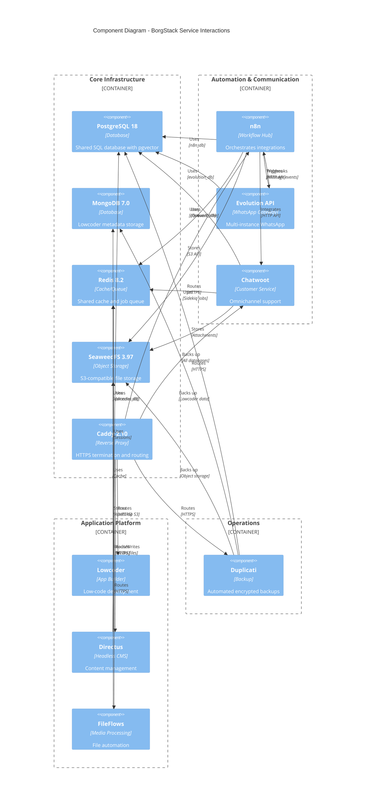

# Components

This section describes the 13 services that comprise BorgStack, organized by architectural layer.

## Core Infrastructure Layer

### PostgreSQL with pgvector
**Responsibility:** Shared relational database serving n8n, Chatwoot, Directus, and Evolution API with vector search capabilities for RAG/LLM integrations.

**Key Interfaces:**
- PostgreSQL wire protocol (port 5432) on `borgstack_internal` network
- Database isolation: `n8n_db`, `chatwoot_db`, `directus_db`, `evolution_db`
- Separate users with role-based permissions per database

**Dependencies:** None (foundational service)

**Technology Stack:**
- Image: `pgvector/pgvector:pg18`
- Extensions: pgvector for vector embeddings
- Volume: `postgresql_data` for persistence
- Health check: `pg_isready` command

---

### MongoDB
**Responsibility:** Dedicated NoSQL database for Lowcoder metadata, configuration, and application storage.

**Key Interfaces:**
- MongoDB wire protocol (port 27017) on `borgstack_internal` network
- Database: `lowcoder` with authentication

**Dependencies:** None (foundational service)

**Technology Stack:**
- Image: `mongo:7.0`
- Volume: `mongodb_data` for persistence
- Health check: `mongosh --eval "db.adminCommand('ping')"`

---

### Redis
**Responsibility:** Shared in-memory cache and message queue for session management, background jobs, and caching across all services.

**Key Interfaces:**
- Redis protocol (port 6379) on `borgstack_internal` network
- Shared by n8n, Chatwoot, Directus, Lowcoder

**Dependencies:** None (foundational service)

**Technology Stack:**
- Image: `redis:8.2-alpine`
- Volume: `redis_data` for AOF persistence
- Configuration: Password protection, memory limits, eviction policies

---

### SeaweedFS
**Responsibility:** S3-compatible object storage for file uploads, media assets, and CMS content.

**Key Interfaces:**
- S3 API (port 8333) on `borgstack_internal` network
- Filer API (port 8888) for direct file operations
- Master/Volume server topology

**Dependencies:** None (foundational service)

**Technology Stack:**
- Image: `chrislusf/seaweedfs:3.97`
- Volumes: `seaweedfs_master`, `seaweedfs_volume`, `seaweedfs_filer`
- Configuration: Replication strategy, storage quotas

---

### Caddy
**Responsibility:** Reverse proxy with automatic HTTPS/SSL certificate generation and renewal for all web services.

**Key Interfaces:**
- HTTPS (port 443) and HTTP (port 80) on host network
- Proxies to application services on `borgstack_internal` network
- Routes based on domain/subdomain configuration

**Dependencies:** All application services (routing target)

**Technology Stack:**
- Image: `caddy:2.10-alpine`
- Volume: `caddy_data` for certificates and `caddy_config`
- Configuration: `Caddyfile` with automatic SSL via Let's Encrypt

---

## Application Services Layer

### n8n (Workflow Automation Hub)
**Responsibility:** Central workflow orchestration platform connecting all services via HTTP nodes and webhooks.

**Key Interfaces:**
- Web UI (port 5678) exposed via Caddy
- REST API for workflow management
- Webhook endpoints for external triggers
- HTTP Request nodes for service integration

**Dependencies:**
- PostgreSQL (`n8n_db`)
- Redis (session/queue management)
- Evolution API, Chatwoot, Directus, SeaweedFS (integration targets)

**Technology Stack:**
- Image: `n8nio/n8n:1.112.6`
- Volume: `n8n_data` for credentials and custom nodes
- Environment: Database connection, Redis, webhook URL

---

### Evolution API (WhatsApp Integration)
**Responsibility:** Multi-instance WhatsApp Business API gateway for sending/receiving messages and managing connections.

**Key Interfaces:**
- REST API (port 8080) on `borgstack_internal` network
- Webhook delivery to n8n for incoming messages
- Instance management API

**Dependencies:**
- PostgreSQL (`evolution_db`)
- Redis (session management)

**Technology Stack:**
- Image: `atendai/evolution-api:v2.2.3`
- Volume: `evolution_instances` for WhatsApp session data
- Configuration: Database, Redis, webhook URLs to n8n

---

### Chatwoot (Customer Service Platform)
**Responsibility:** Omnichannel customer communication platform with agent management and conversation tracking.

**Key Interfaces:**
- Web UI (port 3000) exposed via Caddy
- REST API for conversation management
- Webhook configuration for Evolution API integration
- Agent dashboard and customer-facing widget

**Dependencies:**
- PostgreSQL (`chatwoot_db`)
- Redis (Sidekiq background jobs)
- Evolution API (WhatsApp channel integration via n8n)
- SeaweedFS (attachment storage)

**Technology Stack:**
- Image: `chatwoot/chatwoot:v4.6.0-ce`
- Volumes: `chatwoot_storage`, `chatwoot_public`
- Services: Web, worker (Sidekiq), rails console

---

### Lowcoder (Low-Code Application Builder)
**Responsibility:** Optional low-code platform for building custom internal business applications.

**Key Interfaces:**
- Web UI (port 3000) exposed via Caddy
- Application runtime for deployed apps
- API query builder connecting to PostgreSQL and other services

**Dependencies:**
- MongoDB (`lowcoder` database via LOWCODER_MONGODB_URL)
- Redis (via LOWCODER_REDIS_URL)
- PostgreSQL (optional, for custom applications connecting to SQL data)

**Technology Stack:**
- Image: `lowcoderorg/lowcoder-ce:2.7.4`
- Volume: `lowcoder_stacks` for application definitions
- Configuration: MongoDB and Redis connection strings

---

### Directus (Headless CMS)
**Responsibility:** Data management and content delivery platform with REST/GraphQL APIs.

**Key Interfaces:**
- Web UI (port 8055) exposed via Caddy
- REST API and GraphQL API for content delivery
- Asset management with SeaweedFS integration

**Dependencies:**
- PostgreSQL (`directus_db`)
- Redis (caching)
- SeaweedFS (file storage via S3 configuration)

**Technology Stack:**
- Image: `directus/directus:11`
- Volume: `directus_uploads` (local cache before S3 upload)
- Configuration: Database, Redis, S3 credentials for SeaweedFS

---

### FileFlows (Media Processing)
**Responsibility:** Automated media file conversion and processing workflows.

**Key Interfaces:**
- Web UI (port 5000) exposed via Caddy
- File processing engine watching input directories
- Output to SeaweedFS or local storage

**Dependencies:**
- SeaweedFS (input/output file storage)

**Technology Stack:**
- Image: `revenz/fileflows:25.09`
- Volumes: `fileflows_data`, `fileflows_logs`, `fileflows_temp`
- Configuration: Processing nodes, library paths

---

### Duplicati (Backup System)
**Responsibility:** Automated encrypted backup of all persistent data with scheduling and external storage support.

**Key Interfaces:**
- Web UI (port 8200) exposed via Caddy
- Backup job scheduler
- External storage connectors (S3, FTP, local)

**Dependencies:**
- Access to all Docker volumes (PostgreSQL, MongoDB, SeaweedFS, etc.)

**Technology Stack:**
- Image: `duplicati/duplicati:2.1.1.102`
- Volume: `duplicati_config` for backup definitions
- Configuration: Backup sources (volumes), destinations, schedules

---

## Component Diagrams

---
