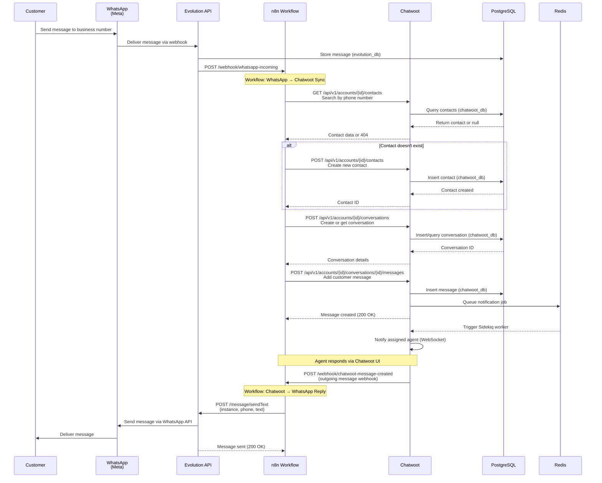
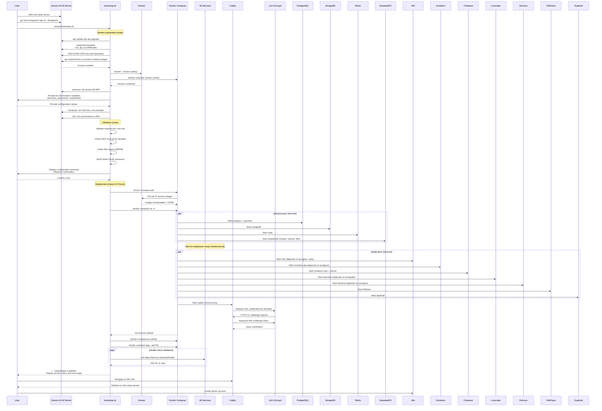
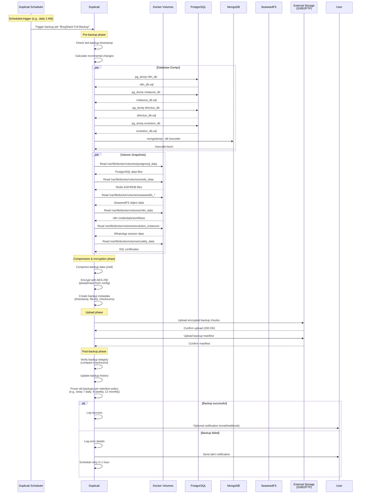
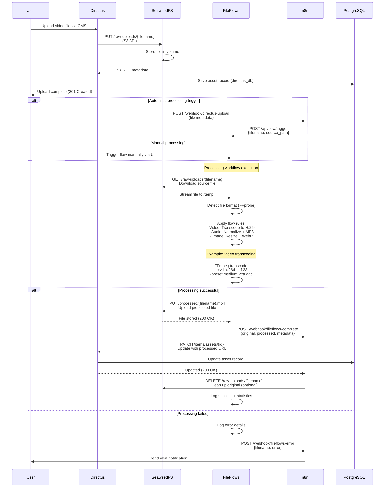

# Core Workflows

This section illustrates key system workflows using sequence diagrams to show component interactions and integration patterns.

## Workflow 1: WhatsApp to Chatwoot Customer Service Integration

This workflow demonstrates the core integration pattern connecting Evolution API, n8n, and Chatwoot for automated customer service.

**Key Integration Points:**
- **Webhook triggers**: Evolution API and Chatwoot both webhook to n8n to initiate workflows
- **Bi-directional sync**: n8n maintains contact/conversation state between platforms
- **Async communication**: Redis queues enable background processing in Chatwoot
- **Error handling**: n8n workflows should include error nodes for API failures (retry logic, alert notifications)

**Error Handling Scenarios:**

**Scenario 1: Chatwoot API Returns 500 Error**
- **Trigger**: Chatwoot database connection pool exhausted or internal server error
- **Detection**: n8n HTTP Request node receives 500 status code
- **Response**:
  1. Retry 3 times with exponential backoff (1s, 2s, 4s)
  2. If all retries fail: Log to PostgreSQL `n8n_db.error_queue` table with payload and timestamp
  3. Send alert email to `admin@${BORGSTACK_DOMAIN}` using n8n Send Email node
  4. Continue workflow execution (don't block other messages)
  5. Manual recovery: Admin reviews error_queue and replays failed messages
- **Prevention**: Monitor Chatwoot connection pool usage, scale PostgreSQL max_connections if needed

**Scenario 2: Contact Creation Race Condition**
- **Trigger**: Two simultaneous messages from same WhatsApp number arrive within 100ms
- **Detection**: Both n8n workflow instances attempt to create contact, second receives 422 Unprocessable Entity (duplicate phone number)
- **Response**:
  1. Catch 422 error in n8n workflow
  2. Re-query Chatwoot contacts API to fetch existing contact (GET /api/v1/accounts/{id}/contacts)
  3. Use retrieved contact ID to continue conversation creation
  4. Log race condition occurrence to n8n execution logs
- **Prevention**: Implement distributed lock in Redis before contact creation (SET NX with 5s TTL on key `contact:create:{phone}`)

**Scenario 3: Evolution API Webhook Delivery Failure**
- **Trigger**: n8n server temporarily unavailable (restart, deployment, OOM)
- **Detection**: Evolution API receives connection timeout or 503 from n8n webhook endpoint
- **Response**:
  1. Evolution API retries webhook delivery 5 times over 10 minutes (exponential backoff)
  2. If all retries fail: Message remains in Evolution API database but not synced to Chatwoot
  3. n8n scheduled workflow runs every 15 minutes: Query Evolution API `/message/list` endpoint for messages created in last 30 minutes
  4. Compare against Chatwoot conversation history to identify missing messages
  5. Sync missing messages to Chatwoot
- **Prevention**: Implement n8n high-availability (run 2 instances behind load balancer) or use message queue (RabbitMQ/Redis Streams)

**Scenario 4: WhatsApp Message Send Failure (Rate Limit)**
- **Trigger**: Too many messages sent to WhatsApp API, Meta returns 429 Too Many Requests
- **Detection**: Evolution API receives 429 from Meta Cloud API, returns error to n8n
- **Response**:
  1. n8n workflow catches 429 status code
  2. Wait for time specified in Retry-After header (typically 60s)
  3. Retry message send once after wait period
  4. If retry fails: Log to `n8n_db.failed_messages` table with `status='rate_limited'`
  5. Display warning in Chatwoot conversation: "Message delayed due to WhatsApp rate limits"
  6. n8n scheduled workflow retries rate-limited messages every 5 minutes
- **Prevention**: Implement rate limiting in n8n workflow (max 80 messages/hour per instance using Redis counter)

**Scenario 5: Redis Connection Loss**
- **Trigger**: Redis container restart, network partition, or memory eviction
- **Detection**: Chatwoot Sidekiq workers cannot connect to Redis, jobs fail with connection errors
- **Response**:
  1. Chatwoot logs error to `log/production.log`: "Redis::CannotConnectError"
  2. Sidekiq jobs remain in Redis queue (persist to disk if AOF enabled)
  3. When Redis recovers: Sidekiq workers automatically reconnect and process queued jobs
  4. For new messages during outage: n8n workflow calls Chatwoot API directly (synchronous), bypassing Redis queue
  5. Monitor Redis availability using `/health` endpoint, alert if down > 2 minutes
- **Prevention**: Configure Redis persistence (AOF with everysec fsync), set maxmemory-policy to allkeys-lru to prevent OOM

---

## Workflow 2: Initial Deployment and Bootstrap

This workflow shows the deployment process from clean Ubuntu server to running BorgStack installation.

**Deployment Timing Breakdown:**
- **System prep**: 5-10 minutes (apt updates, Docker install)
- **Image pull**: 30-60 minutes (depends on network speed)
- **Service startup**: 10-20 minutes (database initialization, healthchecks)
- **SSL certificate generation**: 2-5 minutes per domain
- **Initial configuration**: 2-3 hours (user setup of each service)
- **Total**: 4-6 hours per NFR1 requirement

---

## Workflow 3: Automated Backup Process

This workflow demonstrates Duplicati's automated backup protecting all persistent data.

**Backup Strategy Details:**
- **Incremental backups**: Only changed data backed up after initial full backup
- **Encryption at rest**: AES-256 encryption ensures data sovereignty even on third-party storage
- **Retention policy**: Configurable (default: 7 daily, 4 weekly, 12 monthly, 5 yearly)
- **Backup size estimation**: ~50GB for full backup (depends on data volume)
- **Network transfer time**: 30-120 minutes depending on bandwidth

---

## Workflow 4: Media File Processing Pipeline

This workflow shows FileFlows processing media files with SeaweedFS storage integration.

**Processing Capabilities:**
- **Video transcoding**: H.264/H.265 encoding, resolution scaling, bitrate optimization
- **Audio processing**: Normalization, format conversion, silence removal
- **Image optimization**: WebP conversion, resizing, compression
- **Batch processing**: Queue multiple files with priority scheduling

---
