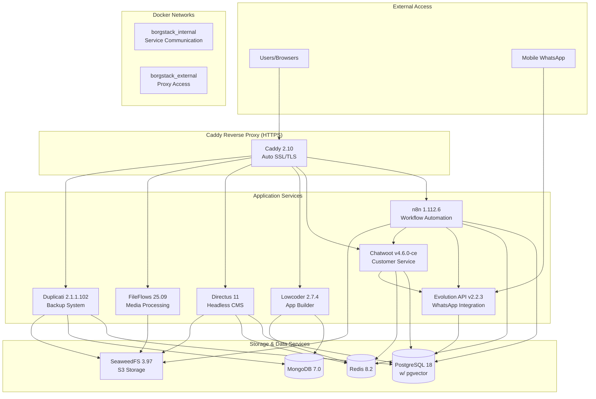

# High Level Architecture

## Technical Summary

BorgStack is a **containerized microservices infrastructure** deployed via Docker Compose on GNU/Linux. The architecture integrates 13 open source components into a unified automation and customer service platform for Brazilian businesses seeking data sovereignty and zero licensing costs.

The system uses **Docker networks for service isolation**, with an internal network (`borgstack_internal`) for secure inter-service communication and Caddy reverse proxy handling external HTTPS access with automatic SSL certificate management. Core infrastructure components include PostgreSQL 18 with pgvector extension (shared by n8n, Chatwoot, Directus, Evolution API), MongoDB 7.0 (dedicated to Lowcoder), Redis 8.2 (shared caching/queuing), and SeaweedFS (S3-compatible object storage).

Integration occurs through **HTTP APIs and webhooks** between services, with n8n serving as the workflow orchestration hub connecting Evolution API (WhatsApp), Chatwoot (customer service), and other components. Each service maintains its own authentication system with no centralized SSO. The architecture prioritizes **single-server deployment with container-level high availability** through Docker's automatic restart policies, targeting 4-6 hour deployment time on properly configured hardware.

## Platform and Infrastructure Choice

**Platform:** Self-Hosted Docker Infrastructure on GNU/Linux

**Key Services:**
- **Orchestration:** Docker Compose v2
- **Reverse Proxy:** Caddy 2.10 (automatic HTTPS/SSL)
- **Networking:** Docker bridge networks with isolation
- **Storage:** Local volumes for persistence + SeaweedFS for object storage
- **Backup:** Duplicati for automated encrypted backups
- **Monitoring:** Docker logs with centralized access via `docker compose logs`

**Deployment Host and Regions:**
- **Deployment Model:** Single-server VPS or dedicated server
- **Minimum Specs:** 4 vCPUs, 16GB RAM, 200GB SSD (testing)
- **Recommended Specs:** 8 vCPUs, 36GB RAM, 500GB SSD (production)
- **Geographic Hosting:** Customer-controlled (Brazilian data sovereignty requirement)
- **Scalability:** Horizontal scaling supported for n8n and Chatwoot within single-server limits

## Repository Structure

**Structure:** Monorepo

**Monorepo Tool:** Not applicable (simple directory structure)

**Package Organization:**
```
borgstack/
├── docker-compose.yml          # Centerpiece orchestration file
├── .env.example                # Environment variable template
├── Caddyfile                   # Reverse proxy configuration
├── scripts/
│   ├── bootstrap.sh            # GNU/Linux setup automation
│   └── healthcheck.sh          # Deployment verification
├── config/                     # Service-specific configurations
│   ├── postgresql/
│   ├── redis/
│   ├── seaweedfs/
│   └── ...
├── docs/                       # Documentation (Portuguese)
│   ├── prd.md
│   ├── architecture.md
│   ├── installation.md
│   ├── integration-guides/
│   └── troubleshooting.md
└── tests/
    ├── integration/
    └── deployment/
```

## High Level Architecture Diagram



## Architectural Patterns

- **Microservices Architecture:** Each component runs as an independent Docker container with its own lifecycle - _Rationale:_ Enables independent updates, failure isolation, and resource scaling per service
- **Reverse Proxy Pattern:** Caddy as single entry point for all HTTPS traffic - _Rationale:_ Centralizes SSL management, simplifies DNS configuration, and provides consistent access control
- **Shared Database with Isolation:** PostgreSQL serves multiple apps with separate databases per service (n8n_db, chatwoot_db, directus_db, evolution_db) - _Rationale:_ Reduces infrastructure complexity while maintaining data isolation and schema independence
- **Service Discovery via DNS:** Services communicate using Docker service names (e.g., `http://n8n:5678`) - _Rationale:_ Eliminates hardcoded IPs and simplifies container replacement
- **Orchestrator Pattern:** n8n acts as workflow hub coordinating actions across services - _Rationale:_ Provides no-code integration layer matching target user technical capabilities
- **Event-Driven Integration:** Webhook-based communication between Evolution API, n8n, and Chatwoot - _Rationale:_ Loose coupling enables flexible workflow customization
- **Backup-as-Code:** Duplicati automated schedules for all persistent data - _Rationale:_ Protects intellectual property (workflows, configurations) per FR13
- **Single-Server High Availability:** Container restart policies with volume persistence - _Rationale:_ Balances reliability with deployment simplicity (multi-server HA explicitly out of scope per NFR2)

---
