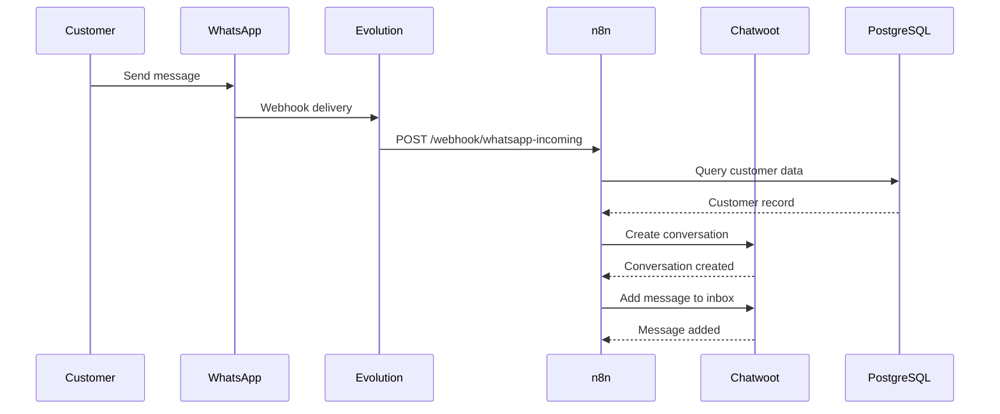
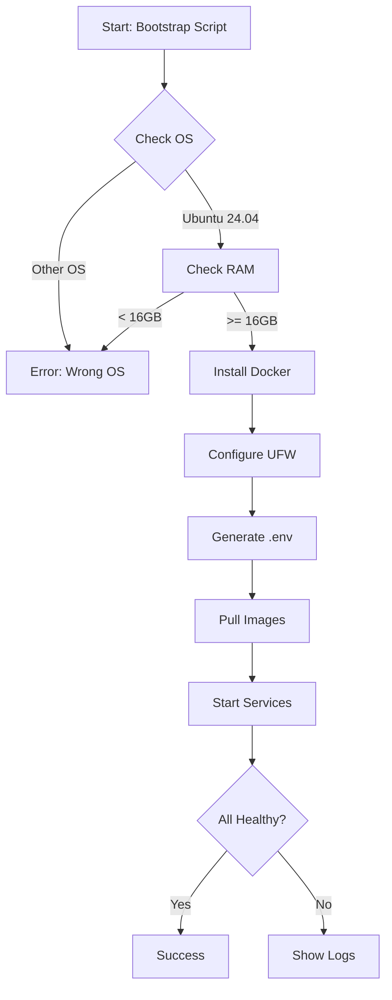
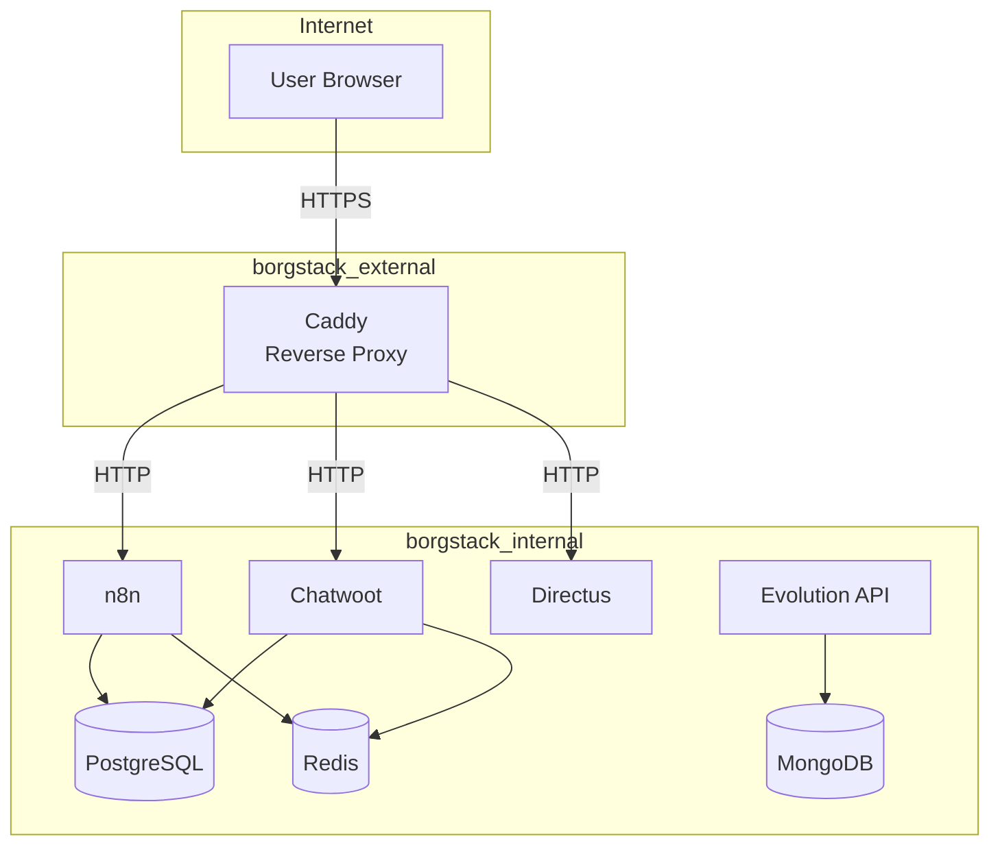

# Story 6.2: Portuguese Documentation

## Status
Approved

## Story
**As a** technical writer,
**I want** comprehensive Portuguese documentation covering all aspects of the system,
**so that** Brazilian users can successfully deploy and use BorgStack.

## Acceptance Criteria
1. Installation guide for Ubuntu 24.04 LTS
2. Configuration documentation for all components
3. Integration guides for common workflows
4. Troubleshooting section with common issues
5. Security and maintenance guidelines
6. Performance optimization recommendations
7. Logging and troubleshooting guide with docker compose logs examples

## Tasks / Subtasks

- [ ] **Task 0: Audit Existing Documentation** (AC: 1, 2, 3)
  - [ ] Review all 66 existing markdown files in docs/
  - [ ] Identify which ACs are already met by existing docs
  - [ ] Create documentation gap analysis showing what needs to be created vs. what exists
  - [ ] Document existing Portuguese docs: 5 service guides (directus, duplicati, fileflows, lowcoder, seaweedfs)
  - [ ] Document existing Portuguese integration guides: 5 files (backup-strategy, directus-fileflows, restore-benchmarks, seaweedfs APIs)
  - [ ] **CHECKPOINT:** Present gap analysis to user before proceeding with documentation creation
  - [ ] **HALT:** Wait for explicit user approval before proceeding to Task 1

- [ ] **Task 1: Create Installation Guide** (AC: 1)
  - [ ] Create `docs/01-instalacao.md` (Portuguese installation guide)
  - [ ] **Section 1.1: Requisitos do Sistema**
    - [ ] Document hardware requirements (8 vCPU, 36GB RAM, 500GB SSD)
    - [ ] Document Ubuntu 24.04 LTS requirement with rationale
    - [ ] Document network requirements (public IP, ports 80/443/22)
    - [ ] Document DNS configuration prerequisites
  - [ ] **Section 1.2: Instalação Automatizada (Recomendado)**
    - [ ] Explain bootstrap script workflow step-by-step
    - [ ] Document script validation checks (OS, RAM, CPU, disk)
    - [ ] Document automatic Docker installation process
    - [ ] Document UFW firewall configuration
    - [ ] Document .env file generation with strong passwords
    - [ ] Document health check validation
    - [ ] Include expected output examples in Portuguese
  - [ ] **Section 1.3: Instalação Manual (Alternativa)**
    - [ ] Document manual Docker Engine installation on Ubuntu 24.04
    - [ ] Document Docker Compose v2 plugin installation
    - [ ] Document manual .env file creation from .env.example
    - [ ] Document manual service deployment commands
    - [ ] Include troubleshooting for common installation errors
  - [ ] **Section 1.4: Configuração Pós-Instalação**
    - [ ] Document DNS A record configuration for all services
    - [ ] Explain Let's Encrypt automatic SSL certificate generation via Caddy
    - [ ] Document first-time access to each service web UI
    - [ ] Document initial admin account setup for each service
    - [ ] Include DNS propagation troubleshooting tips
  - [ ] **Section 1.5: Verificação da Instalação**
    - [ ] Document how to check all 14 containers are healthy: `docker compose ps`
    - [ ] Document how to verify volumes: `docker volume ls | grep borgstack`
    - [ ] Document how to verify networks: `docker network ls | grep borgstack`
    - [ ] Document how to run deployment verification scripts: `./tests/deployment/verify-*.sh`
    - [ ] Include expected success output examples
  - [ ] Translate technical terms appropriately (e.g., "bootstrap" → "inicialização automática")
  - [ ] Include Mermaid diagram showing installation workflow
  - [ ] Add troubleshooting subsection for common installation failures

- [ ] **Task 2: Create Configuration Documentation** (AC: 2)
  - [ ] Create `docs/02-configuracao.md` (Main configuration guide)
  - [ ] **Section 2.1: Visão Geral do Arquivo .env**
    - [ ] Explain .env file purpose and security (chmod 600)
    - [ ] Document all required environment variables by category
    - [ ] Explain password generation strategy (32-character strong passwords)
    - [ ] Document how to regenerate .env: `./scripts/generate-env.sh`
  - [ ] **Section 2.2: Configuração de Domínios**
    - [ ] Document domain/subdomain strategy for each service
    - [ ] Explain DNS A record requirements
    - [ ] Document Caddyfile domain configuration
    - [ ] Include example domain configurations for common scenarios
  - [ ] **Section 2.3: Configuração de Bancos de Dados**
    - [ ] Document PostgreSQL configuration (4 databases, connection strings)
    - [ ] Document MongoDB configuration (lowcoder database)
    - [ ] Document Redis configuration (shared cache/queue)
    - [ ] Include database isolation strategy explanation
  - [ ] **Section 2.4: Configuração de Redes Docker**
    - [ ] Explain borgstack_internal network (service-to-service, isolated)
    - [ ] Explain borgstack_external network (Caddy only, public-facing)
    - [ ] Document network security policy and isolation
    - [ ] Include network diagram showing service connectivity
  - [ ] **Section 2.5: Configuração de Volumes**
    - [ ] Document all 15+ Docker volumes and their purposes
    - [ ] Explain volume naming convention (borgstack_ prefix)
    - [ ] Document volume backup considerations
    - [ ] Include volume location on host filesystem
  - [ ] **Section 2.6: Configurações Avançadas**
    - [ ] Document how to modify service-specific configs (Caddyfile, postgresql.conf, redis.conf)
    - [ ] Document how to apply configuration changes: `docker compose restart <service>`
    - [ ] Document configuration validation: `docker compose config`
    - [ ] Include examples of common configuration customizations
  - [ ] Add references to architecture docs for deeper technical details

- [ ] **Task 3: Create Service-Specific Guides** (AC: 2)
  - [ ] **SKIP: 5 service guides already exist in Portuguese** (directus, duplicati, fileflows, lowcoder, seaweedfs)
  - [ ] Create `docs/03-services/n8n.md` (n8n workflow automation guide)
    - [ ] Document initial n8n login and admin account creation
    - [ ] Explain workflow concepts (nodes, connections, triggers, webhooks)
    - [ ] Document how to import example workflows from `config/n8n/workflows/`
    - [ ] Document common n8n nodes for BorgStack integrations (HTTP Request, Webhook, PostgreSQL)
    - [ ] Include example workflow: "WhatsApp → Chatwoot Sync"
    - [ ] Document credential management in n8n (API keys, database connections)
    - [ ] Document execution logs and troubleshooting failed workflows
    - [ ] Add security best practices (webhook authentication, credential encryption)
  - [ ] Create `docs/03-services/chatwoot.md` (Chatwoot customer service guide)
    - [ ] Document initial Chatwoot setup (admin user, account creation)
    - [ ] Document inbox creation and channel configuration
    - [ ] Document agent management (roles, assignments)
    - [ ] Document how to integrate WhatsApp channel via Evolution API + n8n
    - [ ] Document conversation management and customer contact creation
    - [ ] Document canned responses and automation rules
    - [ ] Include examples of common customer service workflows
    - [ ] Add performance optimization tips (Redis caching, Sidekiq worker scaling)
  - [ ] Create `docs/03-services/evolution-api.md` (Evolution API WhatsApp integration)
    - [ ] Document WhatsApp Business account requirements
    - [ ] Document Evolution API instance creation
    - [ ] Document QR code scanning process for WhatsApp connection
    - [ ] Document how to send messages via API: `POST /message/sendText`
    - [ ] Document webhook configuration to n8n
    - [ ] Document multi-instance support (multiple WhatsApp accounts)
    - [ ] Include API authentication and security best practices
    - [ ] Add troubleshooting for common WhatsApp connection issues
  - [ ] Create `docs/03-services/caddy.md` (Caddy reverse proxy guide)
    - [ ] Document Caddyfile structure and syntax
    - [ ] Document how to add new service routes
    - [ ] Document automatic SSL certificate generation via Let's Encrypt
    - [ ] Document HTTP → HTTPS redirect configuration
    - [ ] Document CORS policy configuration for APIs
    - [ ] Include example configurations for custom domains
    - [ ] Add troubleshooting for SSL certificate failures
  - [ ] Create `docs/03-services/postgresql.md` (PostgreSQL database guide)
    - [ ] Document database organization (4 databases, isolation strategy)
    - [ ] Document how to connect to PostgreSQL: `docker compose exec postgresql psql -U postgres`
    - [ ] Document backup procedures: `pg_dump` commands for each database
    - [ ] Document restore procedures: `pg_restore` examples
    - [ ] Document performance tuning configuration (postgresql.conf parameters)
    - [ ] Include common SQL queries for monitoring and troubleshooting
    - [ ] Add database security best practices (user permissions, connection limits)
  - [ ] Create `docs/03-services/mongodb.md` (MongoDB database guide)
    - [ ] Document Lowcoder database structure
    - [ ] Document how to connect to MongoDB: `docker compose exec mongodb mongosh`
    - [ ] Document backup procedures: `mongodump` for lowcoder database
    - [ ] Document restore procedures: `mongorestore` examples
    - [ ] Include common MongoDB queries for monitoring
    - [ ] Add MongoDB security best practices
  - [ ] Create `docs/03-services/redis.md` (Redis cache guide)
    - [ ] Document Redis shared usage across services (n8n, Chatwoot, Directus, Lowcoder)
    - [ ] Document how to connect to Redis: `docker compose exec redis redis-cli`
    - [ ] Document monitoring Redis performance: `INFO stats`, `MONITOR`
    - [ ] Document Redis persistence configuration (AOF)
    - [ ] Document memory eviction policies and configuration
    - [ ] Include common Redis commands for troubleshooting
    - [ ] Add cache optimization best practices
  - [ ] Follow Diátaxis framework structure for each guide:
    - [ ] Tutorial section (getting started, first-time setup)
    - [ ] How-to guides (common tasks, goal-focused)
    - [ ] Reference section (API endpoints, configuration options)
    - [ ] Explanation section (architecture, design decisions)
  - [ ] Ensure all service guides include troubleshooting subsections
  - [ ] Use consistent Portuguese terminology across all guides

- [ ] **Task 4: Create Integration Guides** (AC: 3)
  - [ ] **SKIP: 5 integration guides already exist** (backup-strategy, directus-fileflows, restore-benchmarks, seaweedfs APIs)
  - [ ] Create `docs/04-integrations/whatsapp-chatwoot.md` (WhatsApp → Chatwoot via n8n)
    - [ ] Document complete integration architecture with Mermaid sequence diagram
    - [ ] **Step 1: Evolution API Configuration**
      - [ ] Create WhatsApp instance in Evolution API
      - [ ] Scan QR code to connect WhatsApp Business account
      - [ ] Configure webhook URL pointing to n8n: `https://n8n.example.com/webhook/whatsapp-incoming`
      - [ ] Test message reception with webhook delivery
    - [ ] **Step 2: Chatwoot Configuration**
      - [ ] Create Chatwoot account and inbox
      - [ ] Create API key for n8n integration
      - [ ] Configure outgoing webhook to n8n: `https://n8n.example.com/webhook/chatwoot-message-created`
      - [ ] Test inbox and agent assignment
    - [ ] **Step 3: n8n Workflow Setup**
      - [ ] Import "WhatsApp → Chatwoot Sync" workflow from `config/n8n/workflows/`
      - [ ] Configure Evolution API credentials (API key, base URL)
      - [ ] Configure Chatwoot credentials (API key, account ID)
      - [ ] Configure PostgreSQL connection to `chatwoot_db`
      - [ ] Test workflow execution with test message
    - [ ] **Step 4: Error Handling Configuration**
      - [ ] Document error scenarios from architecture (500 errors, race conditions, webhook failures, rate limits)
      - [ ] Configure retry logic in n8n workflow (exponential backoff)
      - [ ] Configure error notification (email alerts to admin)
      - [ ] Test error recovery mechanisms
    - [ ] **Step 5: End-to-End Testing**
      - [ ] Send test message from WhatsApp to business number
      - [ ] Verify message appears in Chatwoot inbox
      - [ ] Reply from Chatwoot as agent
      - [ ] Verify reply delivered to WhatsApp customer
      - [ ] Check n8n execution logs for any errors
    - [ ] Include troubleshooting guide for common integration issues
    - [ ] Add performance optimization tips (webhook timeout, concurrent execution)
  - [ ] Create `docs/04-integrations/n8n-services.md` (n8n integrations with all services)
    - [ ] Document n8n → PostgreSQL integration (all 4 databases)
    - [ ] Document n8n → Redis integration (cache/queue operations)
    - [ ] Document n8n → SeaweedFS Filer API (file upload/download)
    - [ ] Document n8n → Directus API (content management operations)
    - [ ] Document n8n → FileFlows API (trigger media processing)
    - [ ] Include authentication examples for each service
    - [ ] Add common n8n node configurations for each integration
  - [ ] Ensure all integration guides include:
    - [ ] Prerequisites checklist (services configured, credentials available)
    - [ ] Step-by-step instructions with screenshots where helpful
    - [ ] Expected output examples at each step
    - [ ] Troubleshooting subsection
    - [ ] Performance considerations
  - [ ] Use Mermaid diagrams to illustrate data flows
  - [ ] Cross-reference with service-specific guides (docs/03-services/)

- [ ] **Task 5: Create Troubleshooting Guide** (AC: 4, 7)
  - [ ] Create `docs/05-solucao-de-problemas.md` (Troubleshooting guide)
  - [ ] **Section 5.1: Verificação Rápida do Sistema**
    - [ ] Document `docker compose ps` to check container health
    - [ ] Document `docker compose logs <service>` to view logs
    - [ ] Document `docker stats` to check resource usage
    - [ ] Document `./tests/run-all-tests.sh` to run integration tests
    - [ ] Include expected output examples for healthy system
  - [ ] **Section 5.2: Problemas Comuns de Instalação**
    - [ ] **Issue:** Bootstrap script fails with "Insufficient RAM"
      - [ ] Cause: Server has < 16GB RAM
      - [ ] Solution: Upgrade server or reduce services in docker-compose.yml
    - [ ] **Issue:** Docker installation fails on Ubuntu 22.04
      - [ ] Cause: Wrong Ubuntu version
      - [ ] Solution: Upgrade to Ubuntu 24.04 LTS (script requirement)
    - [ ] **Issue:** Permission denied when running docker commands
      - [ ] Cause: User not in docker group
      - [ ] Solution: `sudo usermod -aG docker $USER && newgrp docker`
    - [ ] **Issue:** Ports 80/443 already in use
      - [ ] Cause: Another web server running (Apache/Nginx)
      - [ ] Solution: Stop conflicting service or change Caddy ports
    - [ ] Include step-by-step troubleshooting commands for each issue
  - [ ] **Section 5.3: Problemas de Containers**
    - [ ] **Issue:** Container not starting (status: Restarting)
      - [ ] Command: `docker compose logs <service> --tail 100`
      - [ ] Common causes: Missing env var, port conflict, dependency not healthy
      - [ ] Solution: Check logs for error message, verify .env file, check depends_on
    - [ ] **Issue:** Container unhealthy after startup
      - [ ] Command: `docker inspect --format='{{json .State.Health}}' <container>`
      - [ ] Common causes: Database connection failure, missing volume, wrong configuration
      - [ ] Solution: Verify database credentials, check volume mounts, review service logs
    - [ ] **Issue:** Out of memory errors
      - [ ] Command: `docker stats` to identify memory-hungry containers
      - [ ] Solution: Increase server RAM, reduce concurrent executions, configure memory limits
    - [ ] **Issue:** Disk space exhausted
      - [ ] Command: `df -h` to check disk usage, `docker system df` for Docker disk usage
      - [ ] Solution: `docker system prune -a --volumes` (WARNING: deletes unused data)
  - [ ] **Section 5.4: Problemas de Rede**
    - [ ] **Issue:** SSL certificate generation fails
      - [ ] Command: `docker compose logs caddy | grep "acme"`
      - [ ] Common causes: DNS not propagated, ports 80/443 blocked, domain pointing to wrong IP
      - [ ] Solution: Verify DNS with `dig <domain>`, check firewall rules, wait for DNS propagation
    - [ ] **Issue:** Service cannot reach PostgreSQL
      - [ ] Command: `docker compose exec <service> ping postgresql`
      - [ ] Common cause: Service not on borgstack_internal network
      - [ ] Solution: Verify networks in docker-compose.yml, restart service
    - [ ] **Issue:** Cannot access service web UI
      - [ ] Commands: `curl -I https://<domain>`, `docker compose logs caddy`
      - [ ] Common causes: DNS misconfigured, Caddy not running, service not healthy
      - [ ] Solution: Check DNS, verify Caddy health, check service logs
  - [ ] **Section 5.5: Problemas de Banco de Dados**
    - [ ] **Issue:** PostgreSQL connection pool exhausted
      - [ ] Command: `docker compose exec postgresql psql -U postgres -c "SELECT count(*) FROM pg_stat_activity;"`
      - [ ] Cause: Too many concurrent connections (max_connections limit)
      - [ ] Solution: Increase max_connections in config/postgresql/postgresql.conf, restart PostgreSQL
    - [ ] **Issue:** Redis out of memory
      - [ ] Command: `docker compose exec redis redis-cli INFO memory`
      - [ ] Cause: Redis maxmemory limit reached
      - [ ] Solution: Increase maxmemory in config/redis/redis.conf, configure eviction policy
    - [ ] **Issue:** MongoDB authentication failed
      - [ ] Command: `docker compose logs mongodb | grep "authentication"`
      - [ ] Cause: Wrong credentials in LOWCODER_MONGODB_URL
      - [ ] Solution: Verify .env file, check MongoDB user creation
  - [ ] **Section 5.6: Problemas de Integração**
    - [ ] **Issue:** n8n webhook not receiving Evolution API messages
      - [ ] Commands: `docker compose logs n8n | grep "webhook"`, `docker compose logs evolution | grep "webhook"`
      - [ ] Common causes: Wrong webhook URL, n8n not accessible, webhook authentication failed
      - [ ] Solution: Verify webhook URL in Evolution API settings, test with `curl`, check n8n webhook authentication
    - [ ] **Issue:** Chatwoot not creating contacts from WhatsApp messages
      - [ ] Command: `docker compose logs n8n | grep "chatwoot"`
      - [ ] Common causes: Wrong Chatwoot API key, account ID mismatch, n8n workflow not active
      - [ ] Solution: Verify Chatwoot credentials in n8n, check workflow execution logs, activate workflow
    - [ ] **Issue:** FileFlows not processing files
      - [ ] Commands: `docker compose logs fileflows`, check FileFlows web UI
      - [ ] Common causes: Flow not enabled, input directory not monitored, FFmpeg error
      - [ ] Solution: Enable flow in FileFlows UI, verify volume mounts, check processing logs
  - [ ] **Section 5.7: Comandos Úteis de Diagnóstico**
    - [ ] Document `docker compose ps --format json | jq` for structured output
    - [ ] Document `docker compose top` to see running processes
    - [ ] Document `docker compose exec postgresql pg_isready` to test PostgreSQL
    - [ ] Document `docker compose exec redis redis-cli PING` to test Redis
    - [ ] Document `curl -f http://localhost:<port>/health` to test service health checks
    - [ ] Include examples of log filtering: `docker compose logs <service> | grep ERROR`
  - [ ] **Section 5.8: Recuperação de Desastres**
    - [ ] Document how to restore from Duplicati backup
    - [ ] Document how to recover from corrupted PostgreSQL database
    - [ ] Document how to recreate all containers: `docker compose down && docker compose up -d`
    - [ ] Document how to reset to clean state (WARNING: deletes all data)
    - [ ] Include backup verification checklist before disaster recovery
  - [ ] Organize issues by severity (Critical, High, Medium, Low)
  - [ ] Include links to relevant sections in other docs (installation, configuration)
  - [ ] Add FAQ section for frequently asked questions

- [ ] **Task 6: Create Security and Maintenance Guides** (AC: 5)
  - [ ] Create `docs/06-manutencao.md` (Maintenance guide)
    - [ ] **Section 6.1: Manutenção Preventiva**
      - [ ] Document weekly checks: disk space, log size, backup success
      - [ ] Document monthly checks: SSL certificate renewal, security updates
      - [ ] Document quarterly checks: password rotation, configuration review
      - [ ] Include maintenance checklist template
    - [ ] **Section 6.2: Atualizações de Serviços**
      - [ ] Document version pinning strategy (exact versions in docker-compose.yml)
      - [ ] Document update procedure: backup → pull → test → rollback if needed
      - [ ] Document how to update single service: `./scripts/update-service.sh <service>`
      - [ ] Document how to check for available updates
      - [ ] Include testing checklist after updates
    - [ ] **Section 6.3: Gerenciamento de Backups**
      - [ ] Document Duplicati backup schedule configuration
      - [ ] Document how to manually trigger backup: `./scripts/backup-now.sh`
      - [ ] Document how to verify backup integrity in Duplicati UI
      - [ ] Document backup retention policy (7 daily, 4 weekly, 12 monthly, 5 yearly)
      - [ ] Include restore testing procedure (test restore on staging server)
    - [ ] **Section 6.4: Monitoramento e Logs**
      - [ ] Document log rotation configuration for Docker
      - [ ] Document how to archive logs: `docker compose logs > logs-$(date +%Y%m%d).txt`
      - [ ] Document how to monitor disk usage: `docker system df`
      - [ ] Document how to clean up unused resources: `docker system prune`
      - [ ] Include log retention recommendations
    - [ ] **Section 6.5: Rotação de Credenciais**
      - [ ] Document password rotation procedure (every 90 days recommended)
      - [ ] Document how to change PostgreSQL passwords
      - [ ] Document how to change Redis password
      - [ ] Document how to regenerate API keys (n8n, Chatwoot, Evolution API)
      - [ ] Include credential update checklist (update .env, restart services, test)
    - [ ] **Section 6.6: Scaling e Otimização**
      - [ ] Document vertical scaling: increase server resources
      - [ ] Document horizontal scaling: add worker containers for n8n/Chatwoot
      - [ ] Document how to identify bottlenecks: `docker stats`, PostgreSQL query analysis
      - [ ] Include resource allocation recommendations per service
  - [ ] Create `docs/07-seguranca.md` (Security hardening guide)
    - [ ] **Section 7.1: Segurança de Rede**
      - [ ] Document UFW firewall configuration (ports 22/80/443 only)
      - [ ] Document Docker network isolation strategy (internal vs. external)
      - [ ] Document how to verify network isolation: `docker network inspect borgstack_internal`
      - [ ] Document SSH hardening (key-only auth, disable root login)
      - [ ] Include network security audit checklist
    - [ ] **Section 7.2: Segurança de Dados**
      - [ ] Document .env file security (chmod 600, never commit to git)
      - [ ] Document Duplicati backup encryption (AES-256, strong passphrase)
      - [ ] Document database encryption at rest options (LUKS for production)
      - [ ] Document PostgreSQL sensitive column encryption with pgcrypto
      - [ ] Include data security checklist
    - [ ] **Section 7.3: Segurança de Aplicações**
      - [ ] Document strong password policy (12+ characters, mixed case, symbols)
      - [ ] Document API authentication for all services
      - [ ] Document webhook authentication for n8n webhooks
      - [ ] Document CORS policy configuration in Caddy
      - [ ] Include application security audit checklist
    - [ ] **Section 7.4: Segurança de Containers**
      - [ ] Document Docker security best practices (non-root users, read-only filesystems)
      - [ ] Document how to scan images for vulnerabilities (Trivy)
      - [ ] Document resource limits for containers (memory, CPU)
      - [ ] Document health check configuration for all services
      - [ ] Include container security checklist
    - [ ] **Section 7.5: Conformidade e Auditoria**
      - [ ] Document LGPD compliance considerations (Brazilian data protection law)
      - [ ] Document audit log configuration for critical operations
      - [ ] Document access control and user management best practices
      - [ ] Document incident response procedure
      - [ ] Include compliance checklist for Brazilian businesses
    - [ ] **Section 7.6: Segurança SSL/TLS**
      - [ ] Document Let's Encrypt certificate management via Caddy
      - [ ] Document certificate renewal monitoring
      - [ ] Document TLS 1.3 configuration in Caddyfile
      - [ ] Document HTTPS enforcement (HTTP → HTTPS redirect)
      - [ ] Include SSL/TLS security audit checklist
  - [ ] Cross-reference security docs with architecture/security-and-performance.md
  - [ ] Include references to external security resources (OWASP, CIS Benchmarks)

- [ ] **Task 7: Create Performance Optimization Guide** (AC: 6)
  - [ ] Create `docs/08-desempenho.md` (Performance optimization guide)
    - [ ] **Section 8.1: Linhas de Base de Desempenho**
      - [ ] Document performance targets from architecture/testing-strategy.md
      - [ ] Include performance baseline table: API response time, webhook throughput, DB connections, Redis ops/s, disk I/O, memory/CPU usage
      - [ ] Document how to measure current performance
      - [ ] Include performance monitoring commands
    - [ ] **Section 8.2: Otimização de PostgreSQL**
      - [ ] Document postgresql.conf tuning parameters for 36GB RAM server
      - [ ] Explain shared_buffers, effective_cache_size, work_mem configuration
      - [ ] Document connection pooling optimization
      - [ ] Document query performance analysis: `EXPLAIN ANALYZE`
      - [ ] Include PostgreSQL performance tuning checklist
    - [ ] **Section 8.3: Otimização de Redis**
      - [ ] Document Redis memory management (maxmemory, eviction policies)
      - [ ] Document Redis persistence configuration (AOF vs. RDB trade-offs)
      - [ ] Document cache hit ratio monitoring: `INFO stats`
      - [ ] Document Redis performance optimization tips
      - [ ] Include Redis tuning checklist
    - [ ] **Section 8.4: Otimização de Aplicações**
      - [ ] Document n8n workflow optimization (reduce polling, use webhooks)
      - [ ] Document Chatwoot Sidekiq worker scaling
      - [ ] Document Directus caching configuration (Redis cache, schema cache)
      - [ ] Document FileFlows concurrent processing configuration
      - [ ] Include application-specific optimization tips
    - [ ] **Section 8.5: Otimização de Rede**
      - [ ] Document Caddy HTTP/2 and HTTP/3 configuration
      - [ ] Document compression configuration in Caddyfile
      - [ ] Document reverse proxy caching strategies
      - [ ] Document network latency troubleshooting
      - [ ] Include network optimization checklist
    - [ ] **Section 8.6: Otimização de Armazenamento**
      - [ ] Document SeaweedFS replication and caching configuration
      - [ ] Document volume performance optimization (SSD, I/O scheduler)
      - [ ] Document log rotation to prevent disk space issues
      - [ ] Document backup compression strategies (zstd)
      - [ ] Include storage optimization checklist
    - [ ] **Section 8.7: Monitoramento de Desempenho**
      - [ ] Document how to use `docker stats` for real-time monitoring
      - [ ] Document how to use `htop` for system monitoring
      - [ ] Document how to use `iostat` for disk I/O monitoring
      - [ ] Document performance bottleneck identification process
      - [ ] Include performance monitoring dashboard template
    - [ ] **Section 8.8: Scaling Strategies**
      - [ ] Document vertical scaling recommendations (when to upgrade server)
      - [ ] Document horizontal scaling for n8n (multiple worker containers)
      - [ ] Document database read replica configuration (PostgreSQL)
      - [ ] Document load balancing strategies for high-traffic deployments
      - [ ] Include scaling decision matrix
  - [ ] Cross-reference with architecture/security-and-performance.md
  - [ ] Include real-world performance test results from Story 6.1 integration tests

- [ ] **Task 8: Create Documentation Index and Navigation** (AC: 1-7)
  - [ ] Update main README.md with Portuguese documentation section
    - [ ] Add comprehensive documentation index in Portuguese
    - [ ] Link to all 8 main documentation files (01-instalacao through 08-desempenho)
    - [ ] Link to service-specific guides (docs/03-services/)
    - [ ] Link to integration guides (docs/04-integrations/)
    - [ ] Add "Getting Started" quick links for new users
    - [ ] Include contribution guidelines for documentation
  - [ ] Create `docs/README.md` as documentation hub
    - [ ] Organize documentation by Diátaxis framework categories
    - [ ] **Tutorial section**: Point to 01-instalacao.md, getting started guides
    - [ ] **How-to guides section**: Point to 02-configuracao.md, 03-services/, 04-integrations/, 05-solucao-de-problemas.md
    - [ ] **Reference section**: Point to service reference docs, API documentation
    - [ ] **Explanation section**: Point to 07-seguranca.md, 08-desempenho.md, architecture docs
    - [ ] Add search tips for finding documentation
    - [ ] Include documentation versioning information
  - [ ] Add navigation footer to each documentation file
    - [ ] "Previous" link to previous doc in sequence
    - [ ] "Next" link to next doc in sequence
    - [ ] "Home" link back to docs/README.md
    - [ ] Last updated timestamp
  - [ ] Verify all internal links work correctly
  - [ ] Verify all cross-references to architecture docs are accurate

- [ ] **Task 9: Documentation Quality Assurance** (AC: 1-7)
  - [ ] Review all documentation for technical accuracy
    - [ ] Verify all commands are correct and tested
    - [ ] Verify all environment variables match .env.example
    - [ ] Verify all file paths match actual project structure
    - [ ] Verify all service names match docker-compose.yml
  - [ ] Review documentation for completeness
    - [ ] Verify each AC is fully covered by at least one documentation file
    - [ ] Verify no gaps in installation → configuration → operation workflow
    - [ ] Verify troubleshooting covers all common issues from integration tests
    - [ ] Verify all 14 services have documentation (service guide or reference)
  - [ ] Review documentation for clarity and readability
    - [ ] Ensure Portuguese translations are natural and technically accurate
    - [ ] Ensure consistent terminology across all docs
    - [ ] Ensure all technical jargon is explained or linked to glossary
    - [ ] Ensure examples are clear and reproducible
  - [ ] Verify Diátaxis framework compliance
    - [ ] Tutorial docs are learning-oriented with step-by-step lessons
    - [ ] How-to guides are problem-oriented with goal-focused instructions
    - [ ] Reference docs are information-oriented with technical descriptions
    - [ ] Explanation docs are understanding-oriented with background context
  - [ ] Run documentation through Markdown linter
    - [ ] Fix any formatting issues
    - [ ] Ensure consistent heading hierarchy
    - [ ] Ensure all code blocks have language identifiers
  - [ ] Test all commands in documentation on clean Ubuntu 24.04 server
    - [ ] Create testing checklist with all documented commands
    - [ ] Execute commands and verify expected output matches documentation
    - [ ] Update documentation with any discrepancies found
  - [ ] **REQUIRED:** Peer review by native Portuguese speaker (mandatory for Brazilian audience)
    - [ ] Review for language quality and clarity
    - [ ] Review for cultural appropriateness (Brazilian context)
    - [ ] Suggest improvements for user experience
    - [ ] **BLOCKING:** Story cannot be marked as complete without native speaker approval

## Dev Notes

### Previous Story Insights

**From Story 6.1 (Integration Testing Suite):**
[Source: docs/stories/6.1.integration-testing-suite.story.md#dev-agent-record]

- **Documentation Best Practice**: Story 6.1 created comprehensive `tests/README.md` with 390 lines covering test execution, troubleshooting, contribution guidelines, and best practices. This demonstrates the level of detail expected for user-facing documentation.
- **Test Coverage Matrix Pattern**: Component × Test Type grid proved valuable for understanding system coverage. Similar documentation matrix could be useful (Component × Documentation Type).
- **Known Limitations Documentation**: Explicitly documenting limitations and manual configuration requirements (19 manual-config tests skipped) increased user confidence. Portuguese docs should similarly document known limitations and post-MVP features.
- **Mermaid Diagrams**: Integration test docs use Mermaid extensively for architecture visualization. Portuguese docs should leverage this for workflow illustrations.
- **Troubleshooting Structure**: Integration tests documented failure scenarios with clear cause → solution mappings. Troubleshooting guide (Task 5) should follow this pattern.

### Architecture Context

**Documentation Structure:**
[Source: docs/architecture/unified-project-structure.md]

**Planned Portuguese Documentation Structure:**
```
docs/
├── 01-instalacao.md          # Installation guide (NEW)
├── 02-configuracao.md         # Configuration guide (NEW)
├── 03-services/               # Service-specific guides
│   ├── n8n.md                 # n8n workflow platform (NEW)
│   ├── chatwoot.md            # Chatwoot customer service (NEW)
│   ├── evolution-api.md       # Evolution API WhatsApp (NEW)
│   ├── caddy.md               # Caddy reverse proxy (NEW)
│   ├── postgresql.md          # PostgreSQL database (NEW)
│   ├── mongodb.md             # MongoDB database (NEW)
│   ├── redis.md               # Redis cache (NEW)
│   ├── lowcoder.md            # Lowcoder (EXISTS)
│   ├── directus.md            # Directus CMS (EXISTS)
│   ├── fileflows.md           # FileFlows (EXISTS)
│   ├── duplicati.md           # Duplicati backup (EXISTS)
│   └── seaweedfs.md           # SeaweedFS storage (EXISTS)
├── 04-integrations/           # Integration tutorials
│   ├── whatsapp-chatwoot.md   # WhatsApp → Chatwoot via n8n (NEW)
│   ├── n8n-services.md        # n8n integrations with all services (NEW)
│   ├── directus-fileflows.md  # CMS → Media processing (EXISTS)
│   ├── backup-strategy.md     # Backup strategy (EXISTS)
│   ├── restore-benchmarks.md  # Restore benchmarks (EXISTS)
│   ├── seaweedfs-filer-api-testing.md  # Storage testing (EXISTS)
│   └── seaweedfs-filer-api-n8n.md      # Storage n8n integration (EXISTS)
├── 05-solucao-de-problemas.md # Troubleshooting (NEW)
├── 06-manutencao.md           # Maintenance (NEW)
├── 07-seguranca.md            # Security hardening (NEW)
└── 08-desempenho.md           # Performance optimization (NEW)
```

**Existing Documentation Assets:**
- **README.md**: Bilingual quick start (EN/PT-BR), system requirements, bootstrap script details [Source: README.md]
- **5 Portuguese service guides**: lowcoder, directus, fileflows, duplicati, seaweedfs [Source: docs/03-services/]
- **5 Portuguese integration guides**: backup-strategy, directus-fileflows, restore-benchmarks, seaweedfs APIs [Source: docs/04-integrations/]
- **Comprehensive English architecture docs**: 23 files covering all technical aspects [Source: docs/architecture/]

**Documentation Gap Analysis:**
- **Installation (AC1)**: Quick start exists in README, need comprehensive `01-instalacao.md`
- **Configuration (AC2)**: Scattered info in architecture, need unified `02-configuracao.md` + 7 new service guides
- **Integration (AC3)**: 5 guides exist, need 2 new guides (whatsapp-chatwoot, n8n-services)
- **Troubleshooting (AC4)**: No dedicated guide, need `05-solucao-de-problemas.md`
- **Security/Maintenance (AC5)**: Architecture has English docs, need Portuguese `06-manutencao.md` + `07-seguranca.md`
- **Performance (AC6)**: Architecture has English docs, need Portuguese `08-desempenho.md`
- **Logging (AC7)**: No dedicated guide, include in troubleshooting (`05-solucao-de-problemas.md`)

**Diátaxis Documentation Framework:**
[Source: Context7 /evildmp/diataxis-documentation-framework]

**Four Documentation Types:**
1. **Tutorial** (Learning-oriented): Step-by-step lessons for beginners
   - Example: Installation guide (01-instalacao.md), first-time service setup sections
2. **How-to Guide** (Problem-oriented): Goal-focused instructions for specific tasks
   - Example: Configuration guide (02-configuracao.md), integration guides (04-integrations/)
3. **Reference** (Information-oriented): Technical descriptions, API endpoints, options
   - Example: Service reference sections, command reference in troubleshooting
4. **Explanation** (Understanding-oriented): Background, context, design decisions
   - Example: Security guide (07-seguranca.md), performance guide (08-desempenho.md)

**Documentation Hierarchy Pattern:**
```
Home (docs/README.md)                    <- landing page
    Tutorial                              <- installation, getting started
        01-instalacao.md
        Getting Started sections in service guides
    How-to guides                         <- landing page
        02-configuracao.md
        03-services/                      <- 12 service guides
        04-integrations/                  <- 7 integration guides
        05-solucao-de-problemas.md
    Reference                             <- landing page
        Command reference
        API endpoints (service guides)
        Configuration options (service guides)
    Explanation                           <- landing page
        06-manutencao.md
        07-seguranca.md
        08-desempenho.md
        Architecture docs (link to English)
```

### Tech Stack Context

**All Services Requiring Documentation:**
[Source: docs/architecture/tech-stack.md]

**Core Infrastructure (5 services):**
1. PostgreSQL 18.0 with pgvector - Shared database (n8n, Chatwoot, Directus, Evolution API)
2. MongoDB 7.0 - Lowcoder metadata database
3. Redis 8.2 - Shared cache/queue (all services)
4. SeaweedFS 3.97 - S3-compatible object storage
5. Caddy 2.10 - Reverse proxy with automatic SSL

**Application Services (9 services, 14 containers total):**
6. n8n 1.112.6 - Workflow automation hub
7. Evolution API v2.2.3 - WhatsApp Business API gateway
8. Chatwoot v4.6.0-ce - Customer service platform
9. Lowcoder 2.7.4 - Low-code application builder (3 containers: api-service, node-service, frontend)
10. Directus 11 - Headless CMS
11. FileFlows 25.09 - Media processing automation
12. Duplicati 2.1.1.102 - Backup system

**Documentation Coverage:**
- ✅ **5 services with Portuguese guides**: lowcoder, directus, fileflows, duplicati, seaweedfs
- ❌ **7 services needing Portuguese guides**: n8n, chatwoot, evolution-api, caddy, postgresql, mongodb, redis

### Core Workflows Context

**Four Main Integration Workflows to Document:**
[Source: docs/architecture/core-workflows.md]

**Workflow 1: WhatsApp → Chatwoot Customer Service Integration**
- Components: Customer → WhatsApp (Meta) → Evolution API → n8n → Chatwoot → PostgreSQL → Redis
- Key integration points: Webhook triggers, bi-directional sync, async communication via Redis
- Error scenarios: API 500 errors, race conditions, webhook delivery failures, rate limits, Redis connection loss
- **Documentation required**: Integration guide (docs/04-integrations/whatsapp-chatwoot.md)

**Workflow 2: Initial Deployment and Bootstrap**
- Steps: System prep → Docker install → .env generation → DNS validation → Image pull → Service startup → SSL generation → Health checks
- Total time: 4-6 hours (NFR1 requirement)
- **Documentation required**: Installation guide (docs/01-instalacao.md)

**Workflow 3: Automated Backup Process**
- Components: PostgreSQL dumps (4 databases) → MongoDB dump → Volume snapshots → Duplicati compression/encryption → External storage
- Retention: 7 daily, 4 weekly, 12 monthly, 5 yearly
- Estimated size: ~50GB full backup
- **Documentation required**: Maintenance guide backup section (docs/06-manutencao.md)

**Workflow 4: Media File Processing Pipeline**
- Components: User → Directus (upload) → n8n (webhook) → FileFlows (FFmpeg processing) → n8n (completion webhook) → Directus (update)
- Processing: Format detection (FFprobe) → Transcoding (FFmpeg: libx264, AAC) → Output
- **Documentation required**: Integration guide (docs/04-integrations/directus-fileflows.md - already exists)

### System Requirements Context

**Hardware and Software Requirements:**
[Source: docs/architecture/deployment-architecture.md, README.md]

**Minimum Requirements:**
- OS: Ubuntu Server 24.04 LTS (long-term support until 2029)
- CPU: 8 vCPU cores minimum (for 14 concurrent containers)
- RAM: 36 GB minimum (16GB absolute minimum, 36GB recommended for production)
- Storage: 500 GB SSD recommended (minimum 200GB)
- Network: Public IP, ports 80/443/22 accessible, DNS A records for all service domains

**Software Dependencies:**
- Docker Engine (latest stable, installed by bootstrap script)
- Docker Compose v2 plugin (installed by bootstrap script)
- Git (for cloning repository)
- UFW firewall (configured by bootstrap script: allow 22/80/443, deny all others)
- System utilities: curl, wget, dig, htop, sysstat (installed by bootstrap script)

**Deployment Checklist:**
[Source: docs/architecture/deployment-architecture.md#deployment-checklist]
- Pre-deployment: Server provisioned, DNS configured, firewall configured, SSH keys, non-root user with docker group, backup destination configured
- Deployment: Clone repo, run bootstrap or manual install, pull images, generate .env, start services, verify SSL, check health
- Post-deployment: Access each service UI, configure admin accounts, set up first workflow, configure backups, test restore, document credentials, configure monitoring, security review, user training

### Security Context

**Security Requirements to Document:**
[Source: docs/architecture/security-and-performance.md]

**Network Security:**
- UFW firewall: default deny incoming, allow 22/80/443
- Docker network isolation: `borgstack_internal` (service-to-service, not exposed to host), `borgstack_external` (Caddy only, public-facing)
- Database ports NEVER exposed to host in production (5432, 27017, 6379, 8333)

**Data Security:**
- **Mandatory (MVP)**: Duplicati AES-256 backup encryption, .env file chmod 600
- **Recommended (Production)**: PostgreSQL pgcrypto for sensitive columns, LUKS full disk encryption, Redis persistence on encrypted volume
- **Key Management**: Development uses .env (600 permissions), production should use HashiCorp Vault or AWS Secrets Manager
- **Rotation Policy**: Rotate encryption keys every 90 days

**Authentication Security:**
- JWTs in httpOnly cookies (Chatwoot, Directus)
- Session tokens in Redis with expiration (default 7 days)
- API keys encrypted in PostgreSQL (n8n credentials)
- Password policy: minimum 12 characters, mixed case/numbers/symbols, bcrypt hashing

**Application Security:**
- CSP headers via Caddy for all services
- XSS prevention: X-Content-Type-Options: nosniff, X-Frame-Options: SAMEORIGIN
- CORS policy configured per service in Caddyfile
- Rate limiting at application level (n8n, Chatwoot, Evolution API)
- Input validation by each service (Rails validators, Express middleware)

### Performance Context

**Performance Targets and Optimization:**
[Source: docs/architecture/security-and-performance.md, docs/architecture/testing-strategy.md]

**Performance Baselines (36GB RAM, 8 vCPU Server):**

| Metric | Target (p95) | Acceptable (p99) | Critical Threshold |
|--------|--------------|------------------|--------------------|
| API Response Time | < 200ms | < 500ms | > 1000ms |
| Webhook Throughput | 100 req/s | 50 req/s | < 25 req/s |
| Database Connections | < 150 concurrent | < 180 concurrent | > 200 (pool exhausted) |
| Redis Operations | > 10,000 ops/s | > 5,000 ops/s | < 1,000 ops/s |
| Disk I/O (SSD) | > 100 MB/s | > 50 MB/s | < 20 MB/s |
| Memory Usage | < 75% | < 85% | > 90% (swap risk) |
| CPU Usage | < 70% avg | < 85% avg | > 95% sustained |

**PostgreSQL Tuning (36GB RAM server):**
```conf
shared_buffers = 8GB
effective_cache_size = 24GB
maintenance_work_mem = 2GB
max_connections = 200
work_mem = 20MB
random_page_cost = 1.1  # SSD optimization
```

**Redis Caching Strategy:**
- n8n: Workflow definitions cached (TTL 300s)
- Chatwoot: Conversation metadata cached (TTL 600s)
- Directus: Collection schemas cached (TTL 3600s)
- Lowcoder: Application definitions cached (TTL 1800s)
- Cache hit ratio target: > 80%

### Troubleshooting Context

**Common Issues from Integration Tests:**
[Source: docs/stories/6.1.integration-testing-suite.story.md, tests/README.md]

**Known Limitations (from Story 6.1):**
- 19 manual-config tests require user setup (WhatsApp QR scan, n8n workflow import, Chatwoot inbox creation, API tokens)
- 2 destructive tests skipped in CI (disk space exhaustion, invalid config)

**Failure Scenarios Tested:**
1. Database connection loss (PostgreSQL stop/restart, services reconnect automatically)
2. Redis connection loss (Redis stop/restart, services reconnect, queued jobs resume)
3. Network partition (n8n isolation/reconnection, recovery within 30-60s)
4. Service restart under load (n8n restart, in-flight requests fail gracefully, recovery within 30s)

**Common Test Failures:**
- Container not healthy: Check logs with `docker compose logs <service>`, verify env vars, check dependencies
- Network connectivity: Verify services on correct networks, use `docker compose exec <service> ping <target>`
- SSL certificate failures: Check DNS propagation with `dig <domain>`, verify ports 80/443 accessible
- Integration failures: Verify webhooks configured, check API keys, review n8n execution logs

### Coding Standards Context

**Documentation Naming Conventions:**
[Source: docs/architecture/coding-standards.md]

**Documentation Files:**
- Format: Numbered, kebab-case.md (e.g., `01-instalacao.md`, `02-configuracao.md`)
- Rationale: Sequential reading order, language-specific
- Service guides: kebab-case.md (e.g., `n8n.md`, `evolution-api.md`)
- Integration guides: kebab-case.md describing integration (e.g., `whatsapp-chatwoot.md`)

**Portuguese Translation Guidelines:**
- Technical terms: Use Portuguese where natural (e.g., "configuração", "instalação"), keep English for proper nouns (PostgreSQL, n8n, Docker)
- Commands: Keep command syntax in English (e.g., `docker compose up -d`), explain in Portuguese
- Examples: Use Brazilian context where applicable (e.g., LGPD compliance, Brazilian domains .com.br)

**Markdown Best Practices:**
- Use proper heading hierarchy (# for title, ## for sections, ### for subsections)
- Code blocks must specify language (```bash, ```yaml, ```json)
- Use Mermaid for diagrams (```mermaid)
- Use tables for structured data
- Use numbered lists for sequential steps, bullet lists for non-sequential items
- Use blockquotes for important notes: `> **Note:** Important information`

### Mermaid Diagram Examples

**Example 1: Sequence Diagram (for Integration Guides)**
Use this pattern for workflow integrations like WhatsApp → Chatwoot:



**Example 2: Flowchart (for Installation/Configuration Workflows)**
Use this pattern for step-by-step processes:



**Example 3: Network Architecture Diagram**
Use this pattern for network topology documentation:



**Sourcing Diagram Content:**
- Use architecture documents for technical accuracy
- Reference existing integration guides for workflow patterns
- Use docker-compose.yml for network and service relationships
- Consult tests/README.md for error handling flows

### Project Structure Alignment

**No Conflicts Detected:**

All documentation file paths align with defined project structure:
[Source: docs/architecture/unified-project-structure.md]

- Main guides in `docs/` (01-instalacao.md through 08-desempenho.md)
- Service guides in `docs/03-services/`
- Integration guides in `docs/04-integrations/`
- Architecture docs in `docs/architecture/` (English, maintained separately)
- Test documentation in `tests/README.md` (already created in Story 6.1)

**Cross-References Required:**
- Portuguese docs should link to English architecture docs for deep technical details
- Service guides should cross-reference integration guides
- Troubleshooting guide should link to relevant service/configuration docs
- All docs should link back to main documentation hub (docs/README.md)

## Testing

### Test Requirements

**Documentation Quality Validation:**
[Source: docs/architecture/testing-strategy.md, Story 6.2 requirements]

**No Unit Tests Required:**
- Documentation is not code, doesn't require automated tests
- Focus on manual review and validation

**Documentation Testing Approach:**
1. **Technical Accuracy Testing:**
   - Execute all commands in documentation on clean Ubuntu 24.04 server
   - Verify expected output matches documented output
   - Test all configuration examples work as documented
   - Verify all file paths and service names are correct

2. **Completeness Testing:**
   - Create acceptance criteria coverage matrix (AC × Documentation File)
   - Verify each AC is covered by at least one documentation file
   - Check for gaps in user journey (installation → configuration → operation)
   - Verify all 14 services have documentation

3. **Clarity and Readability Testing:**
   - Native Portuguese speaker review (if available)
   - Test documentation with users unfamiliar with BorgStack
   - Verify technical terms are explained or linked
   - Check examples are clear and reproducible

4. **Navigation Testing:**
   - Verify all internal links work correctly
   - Verify all cross-references are accurate
   - Test "Previous/Next" navigation flow
   - Verify table of contents matches document structure

**Validation Checklist:**
```bash
# Test all commands in documentation
./tests/validate-docs.sh

# Check Markdown formatting
markdownlint docs/*.md docs/**/*.md

# Verify all links
markdown-link-check docs/*.md docs/**/*.md

# Count documentation coverage
./tests/count-documentation-coverage.sh
```

**Expected Documentation Metrics:**
- Total Portuguese documentation files: 20+ (8 main guides + 12 service guides + integration guides)
- Total lines of documentation: 5,000+ lines
- Acceptance criteria coverage: 100% (all 7 ACs covered)
- Service documentation coverage: 100% (all 14 services documented)

## Change Log

| Date | Version | Description | Author |
|------|---------|-------------|--------|
| 2025-10-08 | 1.0 | Initial story creation | Bob (Scrum Master) |
| 2025-10-08 | 1.1 | Applied should-fix corrections from validation: (1) Added explicit HALT instruction to Task 0 CHECKPOINT, (2) Made native Portuguese speaker review mandatory in Task 9, (3) Added Mermaid diagram examples to Dev Notes | Sarah (Product Owner) |

## Dev Agent Record

*This section will be populated by the development agent during implementation.*

### Agent Model Used

### Debug Log References

### Completion Notes List

### File List

## QA Results

*This section will be populated by the QA agent during review.*
